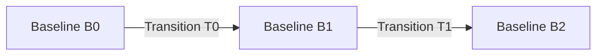
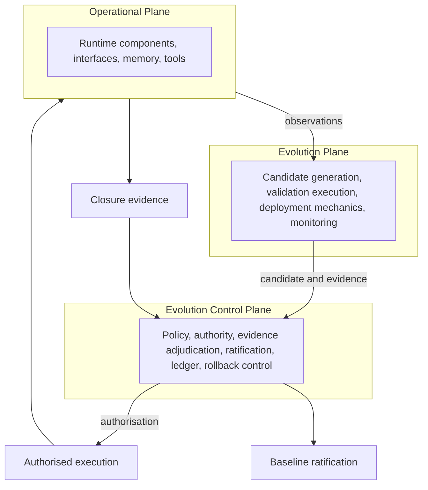

<!-- ages:seed v0.2.0 — exploratory scaffold; supersede through the RFC process. -->

# AGES — Artificial General Evolutive Systems

> An open engineering paradigm for artificial systems that evolve through
> governed, traceable and reconstructable states.

**Status:** Exploratory · **Document class:** Informative · **Repository:** AGES

## 1. Overview

AGES studies artificial engineered systems whose identity extends across
multiple governed configurations. Such a system is not defined by a single
configuration: it is defined by the continuity that connects its ratified
configurations across time — a continuity that is authorised, evidenced
and reconstructable.

## 2. Why AGES

Existing concepts are each insufficient to describe the complete lifecycle
identity of a system that may modify its capabilities, knowledge, tools,
policies and infrastructures. A *software version* captures code but not
memory, knowledge or authority. A *model checkpoint* captures parameters
but not the surrounding cognitive configuration. An *adaptive system*
changes, but its changes need not be identifiable states. An *autonomous
agent* acts, but action is not evolution. *Continuous deployment* moves
artefacts without establishing configuration identity. A *self-learning
system* accumulates change without necessarily preserving reconstructable
continuity. AGES names what these concepts miss: the governed succession
of complete system states.

## 3. Foundational proposition

> An artificial evolutive system is not a photograph of one
> configuration. It is the governed continuity of its ratified states.

## 4. What "General" means

*General* qualifies the applicability of the evolutive paradigm across
different classes of artificial systems. It does not claim human-level
general intelligence, universal capability or AGI.

## 5. What "Artificial" means

AGES concerns systems resulting from human design, engineering,
manufacture, programming or institutional construction. Natural
biological evolution is outside the project's primary scope.

## 6. What "Evolutive" means

*Evolutive* is stronger than adaptive or changeable. Evolution, in this
paradigm, must involve identifiable states and reconstructable
transitions. A system does not qualify merely because it changes, learns,
updates or adapts.

## 7. Core conceptual model

| Object | Definition |
|---|---|
| Baseline | The complete, canonical, uniquely identifiable configuration of the system at a declared point of ratification. |
| Age | The validity interval during which a ratified baseline remains the canonical identity of the system. |
| Candidate change | A proposed modification that may — or may not — produce a successor baseline. |
| Evolution transition | The completed, ratified event through which the canonical configuration changes from one baseline to another. |
| Evidence | Observations, test results, analyses, attestations and trace records supporting or opposing a candidate. |
| Authority | Who or what may propose, validate, adjudicate, authorise, deploy, ratify, suspend or reverse a transition. |
| Effectivity | Where, when and to which instances, jurisdictions, contexts or lifecycle stages a baseline or transition applies. |
| Invariant | A property that must remain true across one or more transition classes for identity to be preserved. |
| Governed continuity | The verifiable relation connecting two ratified baselines through an authorised, evidence-supported, reconstructable transition. |

Full definitions: [`GLOSSARY.md`](GLOSSARY.md) and
[`theory/`](theory/README.md).

## 8. Baselines, ages and transitions



Each ratified baseline opens a new age and remains the canonical identity
of the system until the next baseline is ratified:

$$
\text{Age}_n = [\, \mathrm{ratify}(B_n),\ \mathrm{ratify}(B_{n+1}) \,)
$$

The currently active age remains open until a successor is ratified.
Baseline, ratification and age are distinct: configuration identity,
lifecycle event, validity interval.

## 9. The three architectural planes

| Plane | Function | Question |
|---|---|---|
| Operational Plane | Performs current authorised functions | What does the system do now? |
| Evolution Plane | Produces and evaluates candidate configurations | What could the system become? |
| Evolution Control Plane | Adjudicates and authorises transitions | What is the system permitted to become? |



$$
\mathrm{AGES} := \langle\, O,\ E,\ C_E \,\rangle
$$

This tuple is an architectural decomposition — coordinated planes, not an
arithmetic sum, and not a completed mathematical theory. The control
plane is not part of the runtime datapath unless a specific
implementation requires it.

## 10. Proposed functional engines: GENTILE and GTL

Two proposed functional engines are under exploration within AGES:

| Engine | Primary transformation | Core question | Primary output |
|---|---|---|---|
| **GENTILE — Generative Engine for Neural Transformation through Interactive Language Exchange** | Intent and interactive language exchange → negotiated structured representation | What is intended? | Semantic or structural artefact |
| **GTL — Generative Transitive Language** | Structured semantic artefact → grounded transitive action candidate | What operation could realise it? | Technically executable, not-yet-authorised action candidate |

The term *Neural* identifies GENTILE's principal AI-oriented
implementation domain; it does not prescribe an exclusively neural
implementation. GENTILE-compatible engines may be neural, symbolic,
neuro-symbolic, rule-based or human-in-the-loop, provided that they
preserve interactive co-construction, provenance and structured
semantic closure.

In the evolutionary case: intent → GENTILE → negotiated semantic
artefact → intent classification → candidate change → GTL → grounded
action candidate → validation and adjudication → authorised execution →
closure evidence → ratified baseline. The candidate change carries
governance metadata — baseline source, expected baseline impact,
affected invariants, effectivity, authority requirements, evidence plan
and rollback target — that does not necessarily belong to the semantic
artefact itself. Operational uses of GENTILE and GTL do not necessarily
create a new baseline. Neither engine is an authority: semantic
agreement is not governance authorisation, and technical executability
is not permission to execute.

As a conceptual sketch, not a completed mathematical definition:

$$
S = \mathrm{GENTILE}(I, C, X)
$$

$$
A_c = \mathrm{GTL}(S, O, E, K)
$$

Where: $I$ is declared intent; $C$ is contextual information; $X$ is
the interactive exchange history; $S$ is the negotiated semantic
artefact; $O$ is the identified direct object; $E$ is the assigned
executor; $K$ is the set of operational constraints; $A_c$ is the
grounded action candidate. GENTILE co-constructs what is meant; GTL
specifies how that meaning could be grounded into a bounded operation;
AGES determines how such operations participate in the governed
continuity of an artificial system. See
[`architecture/06-GENTILE.md`](architecture/06-GENTILE.md),
[`architecture/07-GTL.md`](architecture/07-GTL.md) and
[`architecture/08-gentile-gtl-integration.md`](architecture/08-gentile-gtl-integration.md).

## 11. Governed continuity

System identity depends on the ability to reconstruct why and how each
ratified state followed from the previous one: which candidate was
proposed, what evidence supported it, who authorised it, under which
effectivity, and what would restore the predecessor. Continuity that
cannot be reconstructed is not governed; it is merely history.

## 12. AGES is not

AGES is not a foundation model, an AGI claim, a machine-learning
framework, an autonomous agent platform, a biological theory of
evolution, a single implementation, a certification authority, or a claim
that unrestricted autonomous self-modification is desirable.

## 13. AGES · AI-II · SAI-AUT-OS

| Level | Role | Question |
|---|---|---|
| AGES | Theoretical and engineering paradigm | What is an artificial system that evolves through governed states? |
| AI-II | Reference architecture | How are evolutionary states, interfaces and infrastructures represented and connected? |
| SAI-AUT-OS | Operational method and open standard | How are AI evolution transitions governed, verified and controlled? |

This stack is an ecosystem outlook, not a conformance dependency. Neither
the AI-II reference architecture nor the SAI-AUT-OS open standard is
required to study, implement or conform to AGES — and the converse holds
equally. See [`positioning/`](positioning/README.md).

## 14. Repository map

| Path | Contents |
|---|---|
| [`theory/`](theory/README.md) | Foundational theory: evolutive systems, identity, baselines, transitions, continuity, invariants |
| [`architecture/`](architecture/README.md) | Architectural planes, state and transition model, evidence and authority, effectivity, provenance, GENTILE, GTL, GENTILE–GTL integration, AI-II sketch |
| [`models/`](models/README.md) | Minimal conceptual, temporal, transition and identity-continuity models |
| [`schemas/`](schemas/README.md) | Exploratory, non-normative YAML examples of core objects, including GENTILE semantic artefact, GTL action candidate and closure evidence |
| [`positioning/`](positioning/README.md) | Relationship of AI-II and SAI-AUT-OS to AGES |
| [`research/`](research/README.md) | Open questions, terminological issues, bibliography |
| [`rfcs/`](rfcs/README.md) | The RFC process governing changes to foundational definitions; draft RFCs for GENTILE, GTL and their integration lifecycle |
| [`examples/`](examples/README.md) | Illustrative applications: AI-centred, aerospace, cyber-physical; worked GENTILE–GTL examples |
| [`tools/`](tools/README.md) | Deterministic repository generator (single source of truth for structure) |

## 15. Current status

```text
Status: Exploratory research and pre-specification
```

Terminology, formal models and boundaries are expected to evolve through
RFCs ([`rfcs/0000-rfc-process.md`](rfcs/0000-rfc-process.md)).

## 16. Open research questions

See [`research/open-questions.md`](research/open-questions.md). Among
them: what establishes system identity across substantial change; which
invariants are constitutive; when an update creates a new age rather
than a minor revision; whether multiple baselines may coexist under
different effectivities; how branching and merging are represented; how
rollback is modelled when a transition is physically irreversible; how
human and delegated machine authority interact; what evidence suffices to
ratify; how continuity is treated under progressive component
replacement; whether one system may contain multiple asynchronous
evolutionary timelines; and who authorises — and for how long — the
operation of a deployed but not yet ratified configuration.

## 17. Contributing

Contributions are invited from systems engineering, AI architecture,
configuration management, safety engineering, formal methods, software
architecture, cyber-physical systems, philosophy of technology,
governance, certification and lifecycle management. See
[`CONTRIBUTING.md`](CONTRIBUTING.md) and [`GOVERNANCE.md`](GOVERNANCE.md).

Licensing is under review and will be declared before the first formal
release ([`LICENSE`](LICENSE)).

## 18. Closing statement

> **AGES treats artificial evolution not as uncontrolled change, but as
> an engineered continuity of governed states.**
