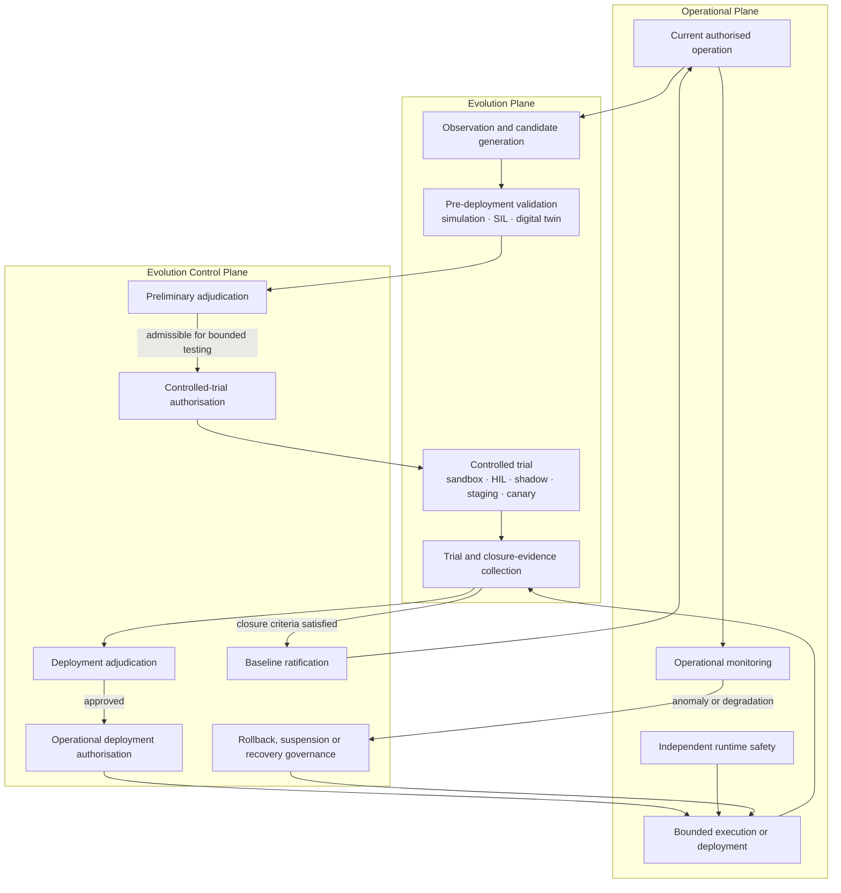

<!-- ages:seed v0.2.0 — exploratory scaffold; supersede through the RFC process. -->

# Architectural Planes

**Status:** Exploratory · **Document class:** Informative · **Repository:** AGES

**Purpose.** Decompose an artificial evolutive system into three coordinated
architectural planes and define the principal boundaries among operational
execution, candidate evolution and evolution governance.

$$
\mathrm{AGES} := \langle\, O,\ E,\ C_E \,\rangle
$$

This is an architectural decomposition: the planes are coordinated and
interdependent, not an arithmetic sum and not a completed mathematical
theory.

| Plane | Answers | Possible contents |
|---|---|---|
| Operational Plane ($O$) | What does the system do under its current baseline and authorised operational envelope? | Runtime components, models and agents, interfaces, memory and knowledge, tools, infrastructure, actuators, real-time control, operational policies, runtime safety mechanisms, authorised adaptation |
| Evolution Plane ($E$) | What could the system become, and how can candidate configurations be generated and tested? | Observation, candidate generation, training, tuning, assembly, simulation, model-in-the-loop and software-in-the-loop testing, digital-twin evaluation, hardware-in-the-loop testing, controlled trials, validation execution, deployment mechanics, closure-evidence collection, probation monitoring |
| Evolution Control Plane ($C_E$) | What is the system permitted to become, under which authority and effectivity, and when may the result become canonical? | Configuration identification, change classification, scope and effectivity control, policy evaluation, authority evaluation, evidence adjudication, risk adjudication, controlled-trial authorisation, deployment authorisation, baseline ratification, ledger management, rollback and recovery governance, conformance assessment |

The planes describe responsibilities rather than mandatory implementation
boundaries. A concrete system may distribute functions across services,
organisations or assurance domains, provided that the required separation of
responsibility remains explicit and auditable.

The Evolution Control Plane is not normally part of the hard real-time
runtime datapath. A specific implementation may place selected control-plane
functions closer to execution, but doing so must not collapse governance,
validation and operational authority into an unreviewable runtime mechanism.

## Coordinated interaction

The diagram is conceptual. It does not imply that all systems require every
test modality or that every monitoring signal enters the same governance
path. Profiles and policies may define proportionate subsets, provided that
authority, evidence and ratification remain explicit.

## Operational Plane

The Operational Plane performs the functions authorised by the active
baseline.

It may include:

- hard real-time and soft real-time control;
- runtime models, agents and services;
- perception, planning and decision execution;
- interfaces, tools, actuators and external services;
- operational memory and knowledge;
- runtime safety guards and independent safe-state mechanisms;
- adaptations already permitted inside a delegated operational envelope;
- execution of an authorised deployment or recovery action.

Operational autonomy is not unrestricted evolutionary authority.

A runtime decision may remain wholly operational when it:

- stays inside the active baseline;
- remains inside declared limits;
- does not modify canonical configuration identity;
- does not expand its own authority or effectivity;
- preserves applicable invariants.

When an adaptation changes a baseline-controlled component, capability,
policy, authority, model, calibration state or operational envelope, it may
need to be reclassified as a candidate change and transferred to the
Evolution Plane.

## Evolution Plane

The Evolution Plane creates, structures and evaluates possible successor
configurations.

It may:

- observe operational performance and anomalies;
- formulate or refine candidate changes;
- generate models, parameters, policies or configuration deltas;
- construct GENTILE semantic artefacts and GTL action candidates;
- run static, schema and interface checks;
- execute regression suites;
- perform model-in-the-loop or software-in-the-loop testing;
- use simulation and digital twins;
- execute hardware-in-the-loop testing;
- operate bounded sandbox, staging, shadow-mode or canary trials;
- collect technical, operational and closure evidence;
- operate authorised deployment infrastructure.

The Evolution Plane owns execution of validation activities, but not the
final judgement that the resulting evidence is sufficient.

A controlled trial is not equivalent to operational deployment. It is a
bounded evidence-generating activity performed under limited effectivity and
explicit trial authority.

## Evolution Control Plane

The Evolution Control Plane evaluates whether a proposed change, trial,
deployment or recovery path is legitimate.

It may:

- identify the source baseline and candidate configuration;
- classify the change and its baseline impact;
- determine applicable invariants;
- evaluate authority and delegated authority;
- determine trial and operational effectivity;
- adjudicate simulation, test and trial evidence;
- evaluate risk and uncertainty;
- authorise, block, warn, defer or escalate;
- authorise a controlled trial;
- authorise operational deployment;
- approve bounded alternatives and fallback policies;
- verify whether closure criteria have been satisfied;
- ratify the successor baseline;
- suspend a baseline;
- govern rollback, compensation, containment or a recovery baseline;
- maintain the authoritative ledger and provenance chain.

Ratification is distinct from authorisation.

Authorisation permits a bounded action to proceed. Ratification occurs only
after execution, resulting-state verification and sufficient closure evidence
establish that the resulting configuration may become the canonical successor
baseline.

## Execution versus adjudication

The boundary between the Evolution Plane and the Evolution Control Plane is
the boundary between **execution** and **adjudication**.

The Evolution Plane may:

- run validation suites;
- execute simulations and controlled trials;
- collect measurements;
- produce reports;
- operate deployment infrastructure.

The Evolution Control Plane must:

- interpret the evidence;
- compare it with declared policy;
- assess authority, effectivity, risk and invariants;
- issue or record the governance verdict.

> **The subsystem that executes validation does not automatically own the
> authority to adjudicate its sufficiency.**

The same separation applies to trial and deployment decisions:

> **The subsystem that generates or executes a candidate action does not
> automatically own the authority to approve that action for operational
> use.**

## Two authorisation gates

Where a controlled trial is technically applicable, AGES distinguishes two
authority gates.

### Controlled-trial authorisation

This gate determines whether the candidate may be tested under bounded
experimental conditions.

It should define:

- permitted test environment;
- permitted hardware, data or instances;
- effectivity;
- duration;
- safety limits;
- evidence to be collected;
- abort and restoration conditions;
- responsible authority.

Purely virtual validation may precede this gate where it does not affect
governed operational resources. Hardware-in-the-loop, laboratory, staging,
shadow-mode or canary trials may themselves require explicit authorisation.

### Operational deployment authorisation

This gate determines whether the candidate may enter its declared operational
scope.

It should consider:

- initial evidence;
- virtual-validation results;
- controlled-trial results;
- residual risk;
- operational effectivity;
- rollback, compensation or safe-state provisions;
- post-deployment closure criteria;
- probation conditions.

Approval for controlled testing does not imply approval for operational
deployment.

## Deployment, probation and ratification

Deployment belongs to the execution path, while ratification belongs to the
governance path.

A deployed candidate may temporarily operate under bounded probation
authority while the system collects evidence about:

- successful installation or activation;
- resulting configuration identity;
- postconditions;
- invariant preservation;
- deviations;
- performance and safety;
- rollback or compensation activation;
- correspondence with the candidate baseline.

During probation, the deployed configuration is not yet the canonical
successor baseline.

A failed, inconclusive or non-conforming deployment must not automatically
create a new baseline.

Ratification occurs only when the resulting configuration has been verified
and accepted as canonical. Ratification closes the preceding age and opens
the next.

## Monitoring and recovery

Monitoring occurs in two distinct contexts:

### Probation monitoring

Probation monitoring occurs after deployment but before ratification. Its
evidence informs the ratification decision.

### Active-baseline monitoring

Active-baseline monitoring occurs after ratification. It may reveal:

- anomalies;
- degradation;
- previously unknown hazards;
- invalidated assumptions;
- effectivity violations;
- evidence that an invariant no longer holds.

Such signals may trigger:

- a new adjudication;
- an emergency policy path;
- suspension of the current baseline;
- rollback previously authorised by policy;
- compensation;
- containment;
- transition to a safe state;
- creation of a recovery baseline.

Rollback remains governed. An automatic rollback may be operationally
immediate while still being constitutionally governed through prior,
bounded and traceable authorisation.

## Cross-plane functional engines

GENTILE and GTL may support more than one plane.

### GENTILE

GENTILE may structure:

- operational intent;
- evolutionary intent;
- evidentiary statements;
- governance requests;
- incident and monitoring reports.

It co-constructs semantic artefacts but does not issue governance authority.

### GTL

GTL may represent:

- ordinary operational actions;
- validation and trial procedures;
- deployment actions;
- rollback or compensation actions;
- safe-state transitions.

It produces grounded action candidates but does not itself authorise
execution.

The classification, effectivity and authority attached to the artefact
determine which plane may execute it and whether it affects the canonical
baseline.

## Ordering constraints

The architectural planes must preserve the following lifecycle constraints
unless an approved profile defines a justified equivalent sequence:

1. Pre-deployment validation precedes preliminary adjudication.
2. Preliminary adjudication precedes controlled-trial authorisation.
3. Controlled-trial evidence precedes deployment adjudication where a trial
   is required.
4. Deployment adjudication precedes operational authorisation.
5. Operational authorisation precedes deployment.
6. Deployment precedes closure verification.
7. Closure verification precedes baseline ratification.
8. A failed or inconclusive deployment does not establish a successor
   baseline.
9. Post-ratification anomalies create a new governance event rather than
   retroactively erasing the transition history.

The condensed principle is:

> **No operational deployment without proportionate prior validation and
> bounded evidence where technically applicable; no baseline ratification
> without verified execution and sufficient closure evidence.**

## Open architectural questions

- Which functions must remain organisationally independent?
- Which validation activities may be performed without trial authority?
- Under what conditions may virtual validation substitute for a controlled
  trial?
- How should trial effectivity differ from operational effectivity?
- How long may a deployed but unratified configuration remain in probation?
- Which runtime adaptations remain inside the delegated operational envelope?
- When must an operational adaptation be promoted to a candidate change?
- How should distributed systems coordinate plane-level authority?
- How are multi-component transitions made atomic or compensable?
- How should emergency authority be bounded, delegated and time-limited?
- Which monitoring evidence may trigger automatic suspension or rollback?
- How should systems behave when the Control Plane is unavailable?

## Related

- [`02-state-and-transition-model.md`](02-state-and-transition-model.md)
- [`03-evidence-and-authority.md`](03-evidence-and-authority.md)
- [`06-GENTILE.md`](06-GENTILE.md)
- [`07-GTL.md`](07-GTL.md)
- [`08-gentile-gtl-integration.md`](08-gentile-gtl-integration.md)
- [`../models/minimal-conceptual-model.md`](../models/minimal-conceptual-model.md)
- [`../models/transition-model.md`](../models/transition-model.md)

