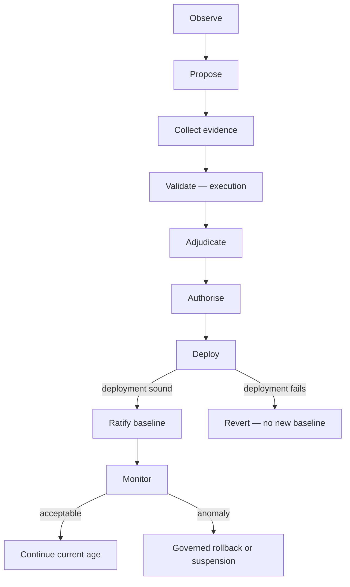

<!-- ages:seed v0.2.0 — exploratory scaffold; supersede through the RFC process. -->

# State and Transition Model

**Status:** Exploratory · **Document class:** Informative · **Repository:** AGES
**Purpose.** Fix the candidate-to-ratified-baseline lifecycle.

Ordering rules: validation execution precedes adjudication; deployment
precedes baseline ratification; a failed deployment must not
automatically create a new baseline. Monitoring also operates inside the
probation window between deployment and ratification, where it informs
the ratification decision
([`../models/transition-model.md`](../models/transition-model.md)).

**Key questions.** Which states may be skipped, and under whose policy?
How are multi-component transitions kept atomic?

**Related.**
[`../theory/04-evolution-transitions.md`](../theory/04-evolution-transitions.md)
