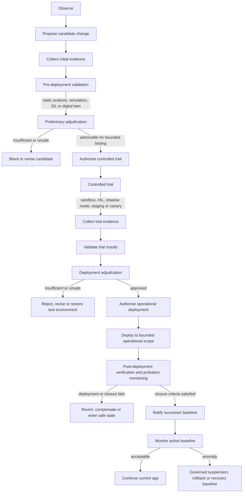

<!-- ages:seed v0.2.0 — exploratory scaffold; supersede through the RFC process. -->

# State and Transition Model

**Status:** Exploratory · **Document class:** Informative · **Repository:** AGES

**Purpose.** Define the lifecycle through which an observed need becomes a
candidate change, is tested under progressively stronger evidence and
authority, and may ultimately establish a ratified successor baseline.



## Lifecycle interpretation

The lifecycle separates four different evidentiary and authority stages.

### 1. Pre-deployment validation

Pre-deployment validation evaluates the candidate without modifying the
current operational baseline. Depending on the system and domain, it may
include:

- static analysis;
- schema and interface validation;
- invariant checking;
- model-in-the-loop testing;
- software-in-the-loop testing;
- simulation;
- digital-twin evaluation;
- regression testing.

Where technically applicable, virtual validation should precede any trial
that affects governed hardware, operational data, physical assets or
deployed infrastructure.

### 2. Preliminary adjudication and controlled-trial authority

Preliminary adjudication determines whether the available evidence is
sufficient to permit bounded experimentation. It does not authorise
operational deployment.

A controlled trial may include:

- sandbox execution;
- hardware-in-the-loop testing;
- shadow mode;
- staging;
- canary deployment;
- laboratory operation;
- limited instance or cohort effectivity.

A trial that uses governed resources or produces physical, organisational
or operational effects requires its own explicit, bounded and traceable
authority.

### 3. Deployment adjudication and operational authorisation

Evidence produced during the controlled trial is validated and adjudicated
together with the initial evidence, applicable authority, effectivity,
risk, invariants, rollback provisions and closure criteria.

Only after this adjudication may the candidate receive operational
deployment authority.

The authorisation must identify the approved candidate or bounded candidate
set, the applicable effectivity, the deployment envelope and the permitted
fallback or recovery actions.

### 4. Deployment, probation and ratification

Operational deployment precedes baseline ratification.

After deployment, the resulting system enters a bounded probation period
during which post-deployment verification and monitoring determine whether:

- the authorised change was executed;
- the resulting configuration matches the candidate baseline;
- declared postconditions were achieved;
- applicable invariants remain satisfied;
- execution remained within the authorised envelope;
- closure evidence is sufficient;
- rollback, compensation or safe-state action was required.

A deployment that fails, remains inconclusive or does not satisfy closure
criteria must not automatically create a new baseline.

Ratification occurs only when the resulting configuration has been
successfully verified and accepted as the canonical successor baseline.
Ratification closes the preceding age and opens the next.

Continuous monitoring continues after ratification. A later anomaly may
trigger governed suspension, rollback, compensation, containment or a
recovery-baseline process.

## Ordering rules

The following ordering rules apply unless an explicitly approved profile or
policy defines a justified equivalent sequence:

1. Candidate proposal precedes candidate-specific evidence collection.
2. Pre-deployment validation precedes preliminary adjudication.
3. Preliminary adjudication precedes controlled-trial authorisation.
4. A governed controlled trial precedes operational deployment where such a
   trial is technically applicable and proportionate to risk.
5. Trial evidence validation precedes deployment adjudication.
6. Deployment adjudication precedes operational authorisation.
7. Operational authorisation precedes deployment.
8. Deployment precedes closure verification.
9. Closure verification precedes baseline ratification.
10. A failed or inconclusive deployment does not create a new baseline.
11. Post-ratification monitoring may trigger a new governed transition but
    does not retroactively erase the ratification record.

The condensed principle is:

> **No operational deployment without prior validation and bounded evidence
> where technically applicable; no baseline ratification without verified
> execution and sufficient closure evidence.**

## State distinctions

The following objects and lifecycle states must not be treated as
equivalent:

```text
Candidate change
≠ validated candidate
≠ trial-authorised candidate
≠ operationally authorised transition
≠ completed deployment
≠ closure-verified resulting state
≠ ratified baseline
```

A controlled trial may generate evidence without changing the canonical
baseline. A deployed configuration may operate temporarily under bounded
probation authority without yet becoming the canonical system identity.

## Key questions

- Which validation or trial stages may be skipped, combined or repeated, and
  under whose policy?
- What minimum evidence is required before bounded physical testing?
- How is trial effectivity separated from operational effectivity?
- How long may a deployed but unratified configuration remain in probation?
- Which authority may extend, suspend or terminate probation?
- How are multi-component transitions kept atomic?
- How are partial deployment, compensation and recovery baselines represented?
- When is virtual validation technically inapplicable or insufficient?
- How are alternative action candidates and fallback candidates authorised?
- Which closure criteria are mandatory for ratification?

## Related

- [`../theory/04-evolution-transitions.md`](../theory/04-evolution-transitions.md)
- [`../models/transition-model.md`](../models/transition-model.md)
- [`03-evidence-and-authority.md`](03-evidence-and-authority.md)
- [`07-GTL.md`](07-GTL.md)
- [`08-gentile-gtl-integration.md`](08-gentile-gtl-integration.md)
