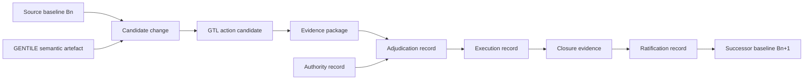

<!-- ages:seed v0.2.0 — exploratory scaffold; supersede through the RFC process. -->

# Identity and Provenance

**Status:** Exploratory · **Document class:** Informative · **Repository:** AGES

**Purpose.** Define how baselines, transitions, authorities, evidence and
resulting states are uniquely identified and made reconstructable across time,
repositories, organisations and custodians.

## Position

AGES treats identity as more than a version label.

A baseline must be uniquely identifiable, and every transition must preserve a
verifiable provenance chain showing:

- the source baseline;
- the candidate change;
- who or what proposed it;
- the semantic and executable artefacts that described it;
- the evidence collected;
- who validated and adjudicated that evidence;
- the applicable authority and effectivity;
- what was executed;
- the closure evidence produced;
- who ratified the result;
- whether the successor baseline became canonical.

Identity anchors are candidate constitutive invariants. See
[`../theory/06-evolutionary-invariants.md`](../theory/06-evolutionary-invariants.md).

## Baseline identity

A baseline is the complete canonical configuration identity of the governed
system under declared effectivity.

It may contain, or immutably reference:

- source-code revisions;
- executable artefacts;
- model checkpoints;
- parameters;
- memory and knowledge snapshots;
- policies and permissions;
- authority assignments;
- tools and interfaces;
- infrastructure configuration;
- hardware manifests;
- calibration records;
- safety constraints;
- invariants;
- evidence packages;
- recovery targets;
- ratification records.

AGES does not need to duplicate content already held in Git repositories,
model registries, package registries, configuration databases, evidence
systems or hardware records. It may bind immutable references, digests,
attestations and provenance into one canonical baseline.

> **Repository location is not system identity.**

A repository migration does not create a new baseline unless it changes
identity-relevant content, authority, effectivity, integrity guarantees or
reconstructability.

## Canonical representation

Where a configuration digest is used, it should be calculated over a canonical
representation.

Canonicalisation should define:

- field ordering;
- encoding;
- whitespace treatment;
- identifier normalisation;
- optional-field handling;
- timestamp treatment;
- external-reference representation;
- canonicalisation-scheme version;
- non-identity metadata exclusions.

Without canonicalisation, logically equivalent baseline records may produce
different digests.

A conceptual identity record may contain:

```text
Baseline identity :=
    Baseline identifier
    + Canonicalisation version
    + Configuration digest
    + External immutable references
    + Effectivity
    + Provenance root
    + Ratification record
```

This is a conceptual model, not a normative schema.

## Identity anchors

Possible identity anchors include:

- system, product and instance identifiers;
- baseline identifiers;
- component and hardware serial identifiers;
- model and policy identifiers;
- authority-domain identifiers;
- cryptographic digests;
- provenance roots;
- ledger sequence identifiers;
- ratification records.

AGES should distinguish:

- **constitutive anchors** — their loss or replacement may alter identity;
- **supporting anchors** — they improve traceability but may be replaced;
- **location anchors** — they indicate where a record is stored;
- **authority anchors** — they identify the competent governance domain.

Which anchors are constitutive is profile- and domain-dependent.

## Transition provenance

Every evolution transition should preserve a provenance record connecting the
source baseline with the ratified successor baseline.

At minimum, transition provenance should identify:

- transition identifier;
- source baseline;
- candidate baseline;
- candidate-change identifier;
- proposer;
- GENTILE semantic artefact or equivalent intent record;
- GTL action candidate or equivalent execution specification;
- evidence package;
- validation activities;
- preliminary adjudication;
- controlled-trial authority and outcome, where applicable;
- deployment adjudication;
- deployment authority;
- execution record;
- closure evidence;
- deviations;
- rollback, compensation or safe-state actions;
- ratification decision;
- successor baseline;
- effectivity;
- timestamps;
- integrity protection.

The relation:

```text
B_n → B_(n+1)
```

must be reconstructable as an authorised, evidenced and ratified chain, not
merely inferred from the existence of two snapshots.

## Provenance graph



The successor baseline is legitimate only because the intermediate provenance
chain exists and can be verified.

## Provenance classes

### Artefact provenance

Tracks the origin and transformation of identity-relevant artefacts, such as:

- source commits;
- build records;
- model-training runs;
- generated configurations;
- hardware replacement records;
- calibration procedures.

### Evidence provenance

Tracks:

- evidence producer;
- collection method;
- test environment;
- tools and versions;
- datasets;
- simulation models;
- assumptions;
- limitations;
- integrity digests;
- attestations.

### Authority provenance

Tracks:

- authority identity and role;
- mandate;
- delegation chain;
- effectivity;
- validity period;
- policy basis;
- revocation status;
- conflicts of interest;
- signature or integrity proof.

### Execution provenance

Tracks:

- executor;
- authorised action;
- environment;
- direct object;
- actual parameters;
- start and end states;
- deviations;
- fallback, compensation or rollback;
- resulting state.

### Ratification provenance

Tracks:

- ratification authority;
- evidence considered;
- decision criteria;
- unresolved risk;
- effectivity;
- successor baseline identifier;
- reservations or dissent.

## Integrity and authenticity

Provenance records should support verification of:

- integrity;
- authenticity;
- ordering;
- authorship or attestation;
- authority;
- temporal relation;
- non-silent modification.

Possible mechanisms include:

- cryptographic hashes;
- digital signatures;
- trusted timestamps;
- append-only logs;
- transparency ledgers;
- signed manifests;
- hardware-backed attestations;
- archival attestations.

AGES does not prescribe one universal cryptographic infrastructure. Profiles
may select mechanisms proportionate to risk and lifecycle duration.

## Time and ordering

A timestamp alone does not establish authority or causal ordering.

Records should distinguish:

- event time;
- observation time;
- recording time;
- authorisation time;
- deployment time;
- ratification time;
- effective-from time;
- ingestion time.

Disconnected operation, clock uncertainty and delayed evidence submission may
require logical ordering, signed event chains or sequence identifiers.

## Chain of custody

Long-lived systems may outlive repositories, vendors, maintainers and
organisations.

A custody-transfer record should preserve:

- previous custodian;
- new custodian;
- transferred records;
- integrity verification;
- unresolved gaps;
- transfer authority;
- date and effectivity;
- archival location.

Custodian transfer must not silently alter historical provenance.

A repository or custodian change becomes baseline-relevant only if it changes:

- canonical content;
- execution or access authority;
- integrity guarantees;
- policy;
- effectivity;
- identity anchors;
- reconstruction capability.

## Durable external references

A durable external reference should preferably include:

- persistent object identifier;
- content digest;
- object type;
- repository or registry type;
- retrieval location;
- expected custodian;
- archival fallback;
- verification method.

If an object cannot be retrieved, provenance should distinguish:

- temporarily unavailable;
- permanently unavailable;
- integrity unverifiable;
- superseded;
- intentionally redacted;
- legally inaccessible;
- lost.

Unavailability must not be treated as successful verification.

## Physical identity and provenance

AGES does not attempt to encode the complete physical state of the world.

For cyber-physical systems, identity and provenance may include relevant:

- hardware identity;
- assembly configuration;
- component serial numbers;
- calibration state;
- environmental assumptions;
- inspection results;
- irreversible effects;
- compensation status;
- safe-state status;
- digital–physical closure evidence.

Physical provenance should establish the relation among:

1. the authorised digital specification;
2. actual physical execution;
3. the observed resulting state.

Sensor data alone does not establish provenance unless its source, integrity,
scope and interpretation are known.

## Hardware replacement

Hardware replacement may be:

- identity-preserving maintenance;
- equivalent substitution;
- configuration change;
- baseline change;
- creation of a new system identity.

Classification may depend on:

- component criticality;
- serialised identity;
- calibration;
- effectivity;
- invariant impact;
- authority policy;
- system identity rules.

Profiles should define which physical anchors are constitutive.

## Memory, knowledge, policy and authority

For AI-centred systems, not every memory or knowledge change creates a new
baseline.

AGES should distinguish:

- transient operational memory;
- persistent non-canonical memory;
- governed knowledge stores;
- baseline-controlled memory;
- learned state;
- external knowledge references.

A change becomes baseline-relevant when policy declares that it affects
canonical capability, behaviour, authority, safety or reconstructability.

Likewise, a system with unchanged code and models but changed permissions,
policies, delegated authority, effectivity or invariants may represent a new
canonical baseline.

## GENTILE provenance

GENTILE semantic artefacts should preserve:

- participants;
- source statements;
- interaction history;
- contextual inputs;
- interpretations;
- revisions;
- rejected interpretations;
- unresolved ambiguity;
- semantic-closure criteria;
- authority claims;
- integrity protection.

The record should distinguish what was:

- supplied by a human;
- supplied by a system;
- inferred;
- negotiated;
- revised;
- left unresolved.

GENTILE provenance does not establish governance authority.

## GTL provenance

A GTL action candidate should preserve:

- source semantic artefact;
- generator and version;
- grammar and schema version;
- executor;
- operation;
- direct object;
- operational context;
- preconditions;
- limits;
- expected effects;
- invariants;
- fallback and recovery provisions;
- closure-evidence requirements;
- effectivity;
- authority references;
- independent validation results.

If a neural or hybrid system generated the candidate, provenance should
identify the generator configuration and the independent checks applied.

## Trials, probation and recovery

A controlled-trial record should identify:

- candidate;
- trial authority;
- trial effectivity;
- environment;
- hardware and software configuration;
- instruments;
- start and end state;
- deviations;
- aborts;
- restoration or compensation;
- outcome.

A deployed but unratified configuration should carry a probation record with:

- provisional configuration;
- deployment authority;
- probation effectivity;
- monitoring requirements;
- closure criteria;
- maximum duration;
- rollback or fallback target;
- ratification authority;
- current status.

Recovery provenance should record:

- triggering anomaly;
- active baseline;
- authority invoked;
- recovery action;
- reversible and irreversible effects;
- safe-state outcome;
- closure evidence;
- resulting configuration;
- recovery-baseline decision.

Recovery must not erase the provenance of the failed or anomalous transition.

## Identity conflicts

Identity conflicts may arise when:

- two records claim the same baseline identifier;
- allegedly equivalent records have different digests;
- external references resolve to different content;
- custodians disagree;
- hardware identity is ambiguous;
- effectivities overlap;
- two successors claim canonicality;
- authority records conflict;
- provenance is incomplete.

A conflict should result in an explicit state such as:

- unresolved;
- quarantined;
- disputed;
- superseded;
- invalid;
- restricted effectivity;
- pending adjudication.

Ambiguous identity must not be treated as canonical by default.

## Redaction and confidentiality

Provenance may contain personal, proprietary, security-sensitive or
export-controlled information.

Controlled redaction should preserve:

- existence of the record;
- integrity of the unredacted source;
- redaction authority;
- reason;
- scope;
- date;
- verification method;
- authorised access path.

Redaction must not silently remove evidence material to a governance decision.

## Minimal provenance for reconstructability

A minimally reconstructable transition should identify:

1. source baseline;
2. candidate change;
3. proposer;
4. evidence package;
5. validation record;
6. adjudication record;
7. competent authority;
8. effectivity;
9. executed action;
10. closure evidence;
11. ratification decision;
12. successor baseline;
13. integrity and provenance links.

Profiles may require additional fields.

## Conceptual identity relation

```math
\mathrm{Identity}(t) =
\left\langle
B_n,\;
\mathcal{T}_{0:n},\;
\mathcal{I}_n,\;
E_f,\;
P_n
\right\rangle
```

Where:

- $B_n$ is the active canonical baseline;
- $\mathcal{T}_{0:n}$ is the ratified transition history;
- $\mathcal{I}_n$ is the applicable invariant set;
- $E_f$ is active effectivity;
- $P_n$ is the relevant provenance state.

This is an exploratory conceptual expression, not a completed mathematical
definition.

## Key questions

- Which identification scheme survives repository and custodian changes?
- What minimum provenance makes a transition reconstructable?
- Which identity anchors are constitutive?
- When does hardware replacement alter system identity?
- Which memory and knowledge changes are baseline-relevant?
- How should identity survive organisational transfer?
- What happens when external references become unavailable?
- How should conflicting canonical-baseline claims be adjudicated?
- Can several baselines be canonical under different effectivities?
- How should provenance gaps affect ratification?
- How should redacted evidence remain verifiable?
- Can a recovery baseline preserve identity after an irreversible event?
- How should distributed systems maintain a common provenance graph?

## Unresolved issues

- long-term cryptographic agility;
- canonicalisation across schema versions;
- provenance across repository and custodian changes;
- distributed and disconnected identity;
- progressive hardware replacement;
- unavailable external records;
- conflicting custodians;
- privacy-preserving provenance;
- concurrent canonical baselines;
- disputed ratification records;
- recovery after ledger compromise.

## Related

- [`01-architectural-planes.md`](01-architectural-planes.md)
- [`02-state-and-transition-model.md`](02-state-and-transition-model.md)
- [`03-evidence-and-authority.md`](03-evidence-and-authority.md)
- [`04-effectivity.md`](04-effectivity.md)
- [`06-GENTILE.md`](06-GENTILE.md)
- [`07-GTL.md`](07-GTL.md)
- [`08-gentile-gtl-integration.md`](08-gentile-gtl-integration.md)
- [`../theory/02-system-identity.md`](../theory/02-system-identity.md)
- [`../theory/05-governed-continuity.md`](../theory/05-governed-continuity.md)
- [`../theory/06-evolutionary-invariants.md`](../theory/06-evolutionary-invariants.md)
- [`../models/identity-continuity-model.md`](../models/identity-continuity-model.md)
- [`../schemas/examples/baseline.example.yaml`](../schemas/examples/baseline.example.yaml)
