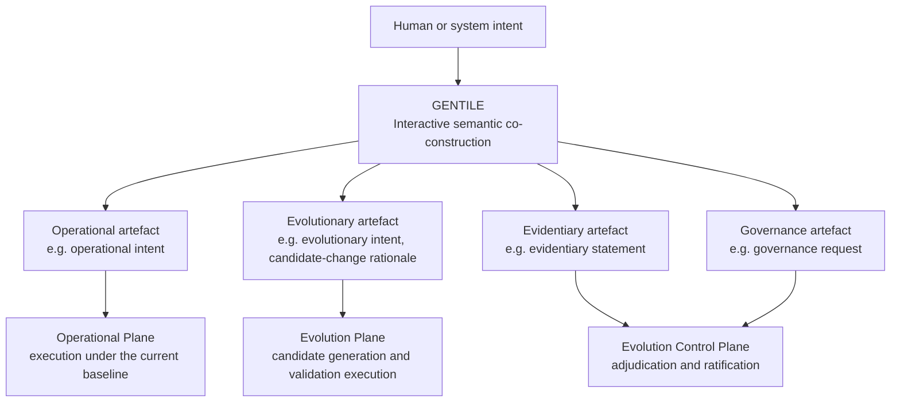

<!-- ages:authored — informative. This document does not define conformance requirements. -->

# GENTILE — Generative Engine for Neural Transformation through Interactive Language Exchange

**Status:** Exploratory · **Document class:** Informative · **Repository:** AGES
**Purpose.** Describe GENTILE, a proposed functional engine within AGES,
as a conceptual model and draft architecture. GENTILE is not a normative
standard at this stage; it is a pre-specification construct subject to
research, experimentation and RFC review
([`../rfcs/0009-gentile.md`](../rfcs/0009-gentile.md)).

## 1. Definition

GENTILE is an interactive and co-constructive transformation engine. It
transforms human or system intent, contextual information and iterative
language exchanges into negotiated, structured and machine-interpretable
semantic artefacts.

The core question answered by GENTILE is:

> **What is intended, and how can that intent be represented in a
> shared, structured and reviewable form?**

The term *Neural* in the long form identifies GENTILE's principal
AI-oriented implementation domain; it does not prescribe an exclusively
neural implementation. GENTILE-compatible engines may be neural,
symbolic, neuro-symbolic, rule-based or human-in-the-loop, provided
that they preserve interactive co-construction, provenance and
structured semantic closure.

Its function is not limited to parsing or one-way language generation.
GENTILE supports a co-constructive process in which the involved human
and artificial participants may progressively:

- express intent;
- interpret context;
- expose assumptions;
- identify ambiguity;
- request clarification;
- negotiate terminology;
- revise constraints;
- identify invariants;
- establish acceptance criteria;
- validate a shared semantic representation.

## 2. Semantic artefact classes

GENTILE may produce different classes of semantic artefact, including:

- operational intent;
- evolutionary intent;
- informational intent;
- procedural representation;
- requirement;
- candidate-change rationale;
- evidentiary statement;
- governance request;
- underspecified intent requiring further interaction.

A semantic artefact is a structured and reviewable representation of
intent, context, assumptions, constraints, objectives, unresolved
ambiguity and acceptance criteria. Semantic closure is reached when an
artefact is sufficiently explicit, structured and reviewed to support
classification, validation or downstream operationalisation, while
preserving declared uncertainty and unresolved issues
([`../GLOSSARY.md`](../GLOSSARY.md)).

## 3. Authority boundary

GENTILE does not automatically authorise anything.

> Semantic agreement is not governance authorisation.

A GENTILE artefact — whatever its class — carries declared authority
claims that must be evaluated by the Evolution Control Plane. GENTILE is
not an intrinsic authority and is not part of the authority chain; it
produces inputs to adjudication, never verdicts
([`03-evidence-and-authority.md`](03-evidence-and-authority.md)).

## 4. Cross-plane use

GENTILE may serve all three architectural planes
([`01-architectural-planes.md`](01-architectural-planes.md)):

| Artefact class | Typical plane of consumption | Baseline impact |
|---|---|---|
| Operational intent | Operational Plane | None by default |
| Evolutionary intent, candidate-change rationale | Evolution Plane | Potential, via candidate change |
| Evidentiary statement | Evolution Control Plane | Input to adjudication |
| Governance request | Evolution Control Plane | Input to adjudication |

Not every GENTILE interaction modifies the system baseline. Operational,
informational and evidentiary uses proceed under the current ratified
baseline and do not, by themselves, open a new age.

## 5. Relation to GTL

Where a semantic artefact calls for a bounded operation on an identified
object of the world or system, GTL grounds it into an executable action
candidate ([`07-GTL.md`](07-GTL.md)). The handoff, lifecycle and formal
sketch are described in
[`08-gentile-gtl-integration.md`](08-gentile-gtl-integration.md).

**Related.**
[`07-GTL.md`](07-GTL.md) ·
[`08-gentile-gtl-integration.md`](08-gentile-gtl-integration.md) ·
[`01-architectural-planes.md`](01-architectural-planes.md) ·
[`../GLOSSARY.md`](../GLOSSARY.md) ·
[`../rfcs/0009-gentile.md`](../rfcs/0009-gentile.md)
