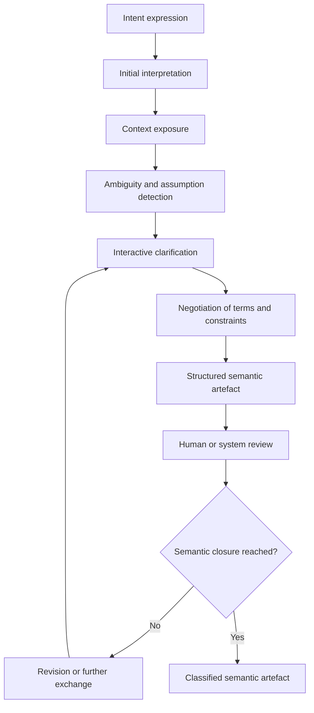
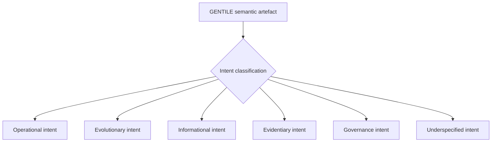
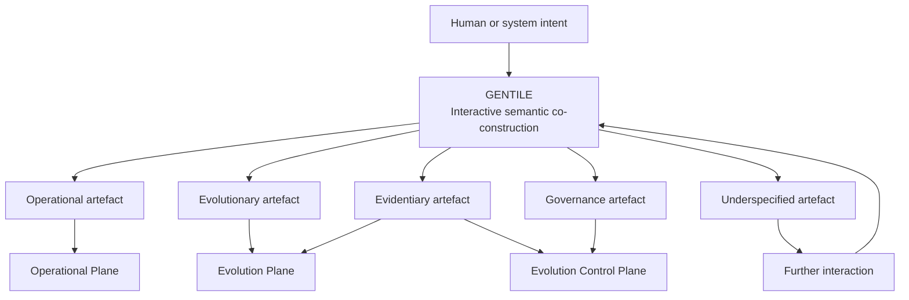

<!-- ages:authored — informative. This document does not define conformance requirements. -->

# GENTILE — Generative Engine for Neural Transformation through Interactive Language Exchange

**Status:** Exploratory · **Document class:** Informative · **Repository:** AGES

**Purpose.** Describe GENTILE, a proposed functional engine within AGES, as
a conceptual model and draft architecture for transforming human or system
intent into negotiated, structured and machine-interpretable semantic
artefacts.

GENTILE is not a normative standard at this stage. It is a
pre-specification construct subject to research, experimentation and RFC
review
([`../rfcs/0009-gentile.md`](../rfcs/0009-gentile.md)).

## 1. Definition

GENTILE is an interactive and co-constructive transformation engine.

It transforms:

```text
Intent
+ context
+ interactive language exchange
+ revision
+ declared constraints
```

into:

```text
A negotiated, structured and reviewable semantic artefact
```

The core question answered by GENTILE is:

> **What is intended, and how can that intent be represented in a shared,
> structured and reviewable form?**

GENTILE is not limited to parsing, summarisation or one-way generation. It
supports an iterative process in which human and artificial participants may
progressively:

- express intent;
- interpret context;
- expose assumptions;
- identify ambiguity;
- request clarification;
- negotiate terminology;
- revise constraints;
- identify invariants;
- define effectivity;
- establish acceptance criteria;
- record disagreement;
- validate a shared semantic representation.

The resulting artefact is not assumed to be complete merely because it is
grammatically well formed.

## 2. Meaning of “Neural”

The term *Neural* identifies GENTILE’s principal AI-oriented implementation
domain. It does not prescribe an exclusively neural implementation.

A GENTILE-compatible engine may be:

- neural;
- symbolic;
- neuro-symbolic;
- rule-based;
- model-driven;
- multi-agent;
- human-in-the-loop;
- hybrid.

The architectural requirement is not the internal computational technique,
but the preservation of:

- interactive co-construction;
- provenance;
- explicit ambiguity;
- revision history;
- structured semantic closure;
- separation from governance authority.

## 3. Co-constructive transformation cycle

GENTILE should be modelled as an iterative process rather than a single
input–output operation.



The cycle may be abbreviated for simple, low-risk or already structured
inputs. High-impact or ambiguous intents may require several rounds of
interaction.

## 4. Semantic artefact

A **semantic artefact** is a structured and reviewable representation of:

- declared intent;
- objective;
- rationale;
- context;
- participants;
- controlled terminology;
- assumptions;
- constraints;
- affected objects;
- expected effects;
- invariants;
- effectivity;
- authority claims;
- unresolved ambiguity;
- acceptance criteria;
- provenance.

A semantic artefact may reference other records instead of embedding them.

It should distinguish between information that was:

- explicitly declared;
- inferred;
- negotiated;
- calculated;
- imported from context;
- disputed;
- unresolved.

The artefact should not silently convert an inference into a user-approved
statement.

## 5. Semantic artefact classes

GENTILE may produce different classes of semantic artefact.

| Artefact class | Purpose | Typical downstream use |
|---|---|---|
| Operational intent | Represents an action requested under the active baseline | Operational planning or GTL grounding |
| Evolutionary intent | Represents a desired change to system configuration or capability | Candidate-change formation |
| Informational intent | Represents a request for information, explanation or analysis | Information retrieval or response generation |
| Procedural representation | Structures a procedure, workflow or method | Review, training, GTL grounding or execution planning |
| Requirement | States a required property, behaviour or constraint | Architecture, validation or candidate generation |
| Candidate-change rationale | Explains why a baseline-relevant change is proposed | Evolution Plane |
| Evidentiary statement | Represents an observation, claim, test result or attestation | Evidence package |
| Governance request | Requests adjudication, authority, exception or escalation | Evolution Control Plane |
| Incident representation | Structures an anomaly, failure or deviation | Monitoring, evidence and recovery |
| Underspecified intent | Records that the current representation is not sufficient | Further interaction |

A semantic artefact may belong to more than one class, but the classification
and its consequences must remain explicit.

## 6. Intent classification

Not every GENTILE output is a candidate change.

The semantic artefact should be classified before entering a downstream
lifecycle.



Only an artefact classified as evolutionary, and enriched with the required
baseline, evidence, authority and effectivity metadata, may become a formal
candidate change.

Use the distinction:

```text
GENTILE semantic artefact
≠ candidate change
≠ GTL action candidate
≠ authorised transition
≠ ratified baseline
```

## 7. Semantic closure

**Semantic closure** is reached when the artefact is sufficiently explicit,
structured and reviewed to support classification, validation or downstream
operationalisation.

Semantic closure does not mean:

- that all uncertainty has disappeared;
- that all participants agree ideologically;
- that governance approval has been granted;
- that the artefact is executable;
- that the representation is guaranteed to match physical reality.

Semantic closure should require, as applicable:

- a declared objective;
- identified participants;
- controlled terminology;
- explicit assumptions;
- explicit constraints;
- identified affected objects;
- known unresolved issues;
- acceptance criteria;
- declared authority claims;
- effectivity;
- sufficient provenance;
- review status.

A semantically closed artefact may still be blocked, revised or rejected by
downstream governance.

## 8. Ambiguity and uncertainty

GENTILE should preserve ambiguity rather than conceal it.

Ambiguity may concern:

- object identity;
- actor identity;
- terminology;
- temporal scope;
- physical location;
- authority;
- effectivity;
- expected outcome;
- risk;
- acceptance criteria;
- causal assumptions.

An ambiguity record should indicate:

- the ambiguous expression;
- candidate interpretations;
- selected interpretation, if any;
- selecting participant;
- confidence or uncertainty;
- rejected interpretations;
- unresolved consequences.

Where ambiguity could materially affect safety, authority, effectivity or
system identity, semantic closure should remain blocked until the issue is
resolved or explicitly accepted by competent authority.

## 9. Provenance

GENTILE provenance should preserve the history of semantic construction.

It may include:

- artefact identifier;
- participants;
- source statements;
- interaction references;
- contextual sources;
- revisions;
- rejected interpretations;
- unresolved ambiguity;
- terminology decisions;
- constraint changes;
- authority claims;
- review events;
- semantic-closure decision;
- integrity protection.

The provenance should make clear which content was:

- supplied by a human;
- supplied by a system;
- inferred by a model;
- retrieved from an external source;
- negotiated;
- revised;
- accepted;
- rejected.

See
[`05-identity-and-provenance.md`](05-identity-and-provenance.md).

## 10. Authority boundary

GENTILE does not automatically authorise anything.

> **Semantic agreement is not governance authorisation.**

A GENTILE artefact may carry:

- declared authority claims;
- requested authority;
- participant roles;
- proposed approvers;
- delegation references;
- unresolved authority questions.

Those claims must be evaluated by the Evolution Control Plane.

GENTILE is not an intrinsic authority and does not acquire authority merely
because it:

- conducted the interaction;
- generated the final wording;
- detected consensus;
- identified a technically feasible action;
- produced a structured artefact.

GENTILE may help identify competent authorities, collect attestations or
structure an authorisation request, but it produces inputs to adjudication,
not governance verdicts.

See
[`03-evidence-and-authority.md`](03-evidence-and-authority.md).

## 11. Effectivity

A semantic artefact should state where and when its meaning is intended to
apply.

GENTILE may help identify or negotiate:

- target systems;
- organisations;
- instances or cohorts;
- environments;
- jurisdictions;
- operating modes;
- lifecycle stages;
- temporal validity;
- exclusions.

Unresolved effectivity must be preserved explicitly.

GENTILE must not silently generalise a narrow intent into a global one.

See [`04-effectivity.md`](04-effectivity.md).

## 12. Cross-plane use

GENTILE may support all three AGES architectural planes
([`01-architectural-planes.md`](01-architectural-planes.md)).

| Artefact class | Typical plane of consumption | Baseline impact |
|---|---|---|
| Operational intent | Operational Plane | None by default |
| Evolutionary intent | Evolution Plane | Potential, after candidate-change formation |
| Candidate-change rationale | Evolution Plane | Potential |
| Evidentiary statement | Evolution Plane or Evolution Control Plane | Evidentiary input |
| Governance request | Evolution Control Plane | Governance input |
| Incident representation | Operational, Evolution or Control Plane | Depends on classification |
| Underspecified intent | No execution plane | Requires further interaction |



Not every GENTILE interaction modifies the system baseline.

Operational, informational and evidentiary uses may proceed under the current
ratified baseline and do not, by themselves, open a new age.

## 13. GENTILE in the evolutionary lifecycle

For a baseline-relevant change, GENTILE participates early in the lifecycle.

```mermaid
flowchart LR
    I["Intent"]
    G["GENTILE"]
    S["Negotiated semantic artefact"]
    C["Intent classification"]
    CC["Candidate change"]
    T["GTL action candidate"]
    V["Validation"]
    A["Adjudication"]
    X["Authorised execution"]
    E["Closure evidence"]
    R["Baseline ratification"]

    I --> G
    G --> S
    S --> C
    C -->|evolutionary| CC
    CC --> T
    T --> V
    V --> A
    A -->|authorised| X
    X --> E
    E --> R
```



GENTILE defines what is intended and why. It does not by itself define the
complete executable realisation or authorise the transition.

## 14. Relation to GTL

Where a semantic artefact calls for a bounded operation on an identified
object of the world or system, GTL may ground it into an executable action
candidate.

The relationship is:

> **GENTILE co-constructs meaning. GTL grounds meaning into action.**

GENTILE should provide GTL with:

- semantic objective;
- identified objects;
- affected properties;
- context;
- assumptions;
- constraints;
- invariants;
- acceptance criteria;
- effectivity;
- authority claims;
- unresolved uncertainty.

GTL should return, or reference:

- executor;
- transitive operation;
- direct object;
- preconditions;
- operational limits;
- expected effects;
- abort conditions;
- rollback or compensation;
- closure-evidence requirements.

The handoff is described in
[`08-gentile-gtl-integration.md`](08-gentile-gtl-integration.md).

## 15. Operational use

GENTILE may support ordinary operational requests without creating a new
baseline.

For example:

```text
“Inspect the forward sensor assembly and report visible damage.”
```

GENTILE may clarify:

- which assembly;
- inspection method;
- operating environment;
- permitted access;
- acceptance criteria;
- reporting format.

The result may then be grounded through GTL and executed under the active
baseline and delegated operational envelope.

No new age is created unless the request modifies canonical configuration
identity.

## 16. Evolutionary use

An evolutionary request may begin with a broad objective such as:

```text
“Improve perception robustness in low-light conditions.”
```

GENTILE may structure:

- target capability;
- affected components;
- operating context;
- current limitation;
- intended improvement;
- safety invariants;
- evaluation criteria;
- effectivity;
- authority requirements;
- unresolved trade-offs.

After classification, the artefact may support formation of a candidate
change. GTL may then generate one or more bounded implementation or deployment
candidates.

## 17. Evidentiary use

GENTILE may structure observations and claims into evidence-ready artefacts.

It should distinguish:

- observation;
- interpretation;
- causal hypothesis;
- measured result;
- limitation;
- confidence;
- attestation.

A structured evidentiary statement is not automatically valid evidence. Its
source, integrity, method and applicability must still be assessed.

## 18. Governance use

GENTILE may structure:

- requests for authority;
- exception requests;
- escalation requests;
- dissent;
- adjudication rationale;
- ratification rationale;
- suspension requests;
- recovery proposals.

It may improve clarity and provenance but must not substitute linguistic
coherence for competent authority.

## 19. Failure modes

Potential GENTILE failure modes include:

- premature semantic closure;
- hidden ambiguity;
- fabricated consensus;
- authority inference from conversational dominance;
- omission of dissent;
- loss of source attribution;
- over-generalised effectivity;
- silent assumption insertion;
- terminology drift;
- conflation of objective and implementation;
- conversion of uncertainty into false precision;
- failure to preserve rejected interpretations;
- prompt injection or context contamination;
- manipulation of semantic artefacts.

Profiles should define detection, review and mitigation mechanisms
proportionate to risk.

## 20. Security and integrity considerations

GENTILE implementations should consider:

- participant authentication;
- source integrity;
- context poisoning;
- prompt injection;
- adversarial ambiguity;
- unauthorised context substitution;
- provenance tampering;
- hidden instruction conflicts;
- confidential information leakage;
- coercive or deceptive negotiation.

Security controls should not erase legitimate ambiguity, dissent or
provenance.

## 21. Human participation

Human participation may occur as:

- intent originator;
- domain expert;
- affected stakeholder;
- reviewer;
- authority claimant;
- approver;
- dissenter;
- evidence provider.

Human-in-the-loop does not automatically guarantee correctness or legitimacy.
The participant’s role, competence and authority must be explicit.

GENTILE should support meaningful review rather than merely presenting a
finished artefact for passive confirmation.

## 22. Implementation-neutral interface

A future GENTILE interface may expose functions equivalent to:

```text
create interaction
submit intent
add context
request clarification
record interpretation
record ambiguity
revise constraint
classify artefact
review artefact
declare semantic closure
export semantic artefact
```

This list is illustrative and non-normative.

The architecture should permit different implementations while preserving a
common semantic artefact model and provenance expectations.

## 23. Minimal artefact fields

An exploratory GENTILE artefact may include:

```yaml
artefactId:
artefactClass:
status:

intent:
  source:
  statement:
  objective:
  rationale:

interaction:
  participants:
  exchangeReferences:
  revisions:
  rejectedInterpretations:

context:
  system:
  environment:
  lifecycleStage:

semantics:
  controlledTerms:
  assumptions:
  constraints:
  invariants:
  unresolvedAmbiguities:
  acceptanceCriteria:

effectivity:
  intendedScope:
  exclusions:
  validFrom:
  validUntil:

authority:
  claims:
  requiredReviewers:

classification:
  type:
  baselineImpact:

provenance:
  sourceRecords:
  integrityDigest:
```

This example is non-normative.

## 24. Design principles

GENTILE should follow these principles:

1. **Interaction before assumption.**
2. **Meaning before operationalisation.**
3. **Ambiguity must be preserved until resolved or explicitly accepted.**
4. **Semantic closure must be reviewable.**
5. **Provenance must distinguish source, inference and negotiation.**
6. **Effectivity must not be silently broadened.**
7. **Semantic agreement is not authority.**
8. **Operational feasibility is not permission.**
9. **Not every artefact is a candidate change.**
10. **Downstream systems must be able to inspect the semantic basis of action.**

## 25. Open questions

- What minimum structure constitutes semantic closure?
- Can an artefact be semantically closed while participants retain conflicting
  interpretations?
- Which intent classes require explicit human confirmation?
- How should confidence and uncertainty be represented?
- How should rejected interpretations be preserved?
- When does an operational intent become evolutionary?
- Which artefact fields are mandatory across domains?
- How should GENTILE distinguish clarification from persuasion?
- How can co-construction avoid fabricated consensus?
- How should authority claims be represented without validating them?
- How should semantic artefacts survive model or repository migration?
- How should multilingual exchanges preserve controlled terminology?
- Can several valid semantic artefacts represent the same intent?
- How should conflicting artefacts be reconciled?
- What evidence is required to establish that semantic closure was meaningful?
- How should privacy and confidentiality coexist with reconstructable
  provenance?
- How should GENTILE operate when participants are unavailable or
  asynchronous?
- How should machine-originated intent be attributed and bounded?

## 26. Unresolved issues

- formal semantics for semantic closure;
- minimum provenance requirements;
- conflict and dissent representation;
- multilingual semantic equivalence;
- identity of participants and machine agents;
- resistance to context poisoning;
- long-lived artefact migration;
- privacy-preserving interaction provenance;
- human review burden;
- authority-claim validation;
- interaction among several GENTILE engines;
- semantic drift across ages.

## Related

- [`01-architectural-planes.md`](01-architectural-planes.md)
- [`02-state-and-transition-model.md`](02-state-and-transition-model.md)
- [`03-evidence-and-authority.md`](03-evidence-and-authority.md)
- [`04-effectivity.md`](04-effectivity.md)
- [`05-identity-and-provenance.md`](05-identity-and-provenance.md)
- [`07-GTL.md`](07-GTL.md)
- [`08-gentile-gtl-integration.md`](08-gentile-gtl-integration.md)
- [`../GLOSSARY.md`](../GLOSSARY.md)
- [`../rfcs/0009-gentile.md`](../rfcs/0009-gentile.md)
