<!-- ages:authored — informative. This document does not define conformance requirements. -->

# GTL — Generative Transitive Language

**Status:** Exploratory · **Document class:** Informative · **Repository:** AGES

**Purpose.** Describe GTL, a proposed functional engine and exploratory
language model within AGES for representing bounded, inspectable and
verifiable transitive action candidates.

GTL is not a normative standard at this stage. It is a pre-specification
construct subject to research, experimentation and RFC review
([`../rfcs/0010-gtl.md`](../rfcs/0010-gtl.md)).

## 1. Definition

GTL is a formal or semi-formal language for representing grounded transitive
action candidates.

The core question answered by GTL is:

> **What bounded and verifiable operation could realise the declared intent
> on an identified object of the world or system?**

Architecturally:

> **GTL is the intermediate layer between structured semantic or procedural
> representation and validated cyber-physical, computational, informational
> or organisational execution. Every transitive verb must be anchored to an
> identified executor, direct object, operational context, explicit limits,
> authority and evidence of closure.**

GTL does not define intent by itself. It consumes a structured semantic
artefact, such as one produced by GENTILE, and grounds that artefact into an
inspectable candidate operation.

## 2. Why transitivity matters

A transitive operation acts on an identified object.

Examples include:

```text
inspect component C17
replace model M4
open valve V28
reconfigure network segment N3
activate policy P7
suspend service S2
move container K5
```

Expressions such as:

```text
improve safety
optimise performance
adapt intelligently
fix the system
```

are not yet grounded GTL operations because they do not identify a complete
executor–operation–object relation or the conditions under which the
operation may be performed.

GTL makes the action-bearing structure explicit.

Use the principle:

> **No transitive verb without an identified direct object; no grounded
> operation without context, bounds, authority and closure evidence.**

## 3. Core binding structure

A GTL action candidate binds:

- a unique action-candidate identifier;
- a source semantic artefact;
- an identified executor;
- a transitive operation;
- an identified direct object;
- an operational context;
- explicit preconditions;
- execution constraints;
- an admissible operational envelope;
- expected effects;
- applicable invariants;
- failure semantics;
- abort conditions;
- rollback, compensation or safe-state provisions;
- closure-evidence criteria;
- effectivity;
- authority references;
- provenance.

A conceptual GTL structure may be represented as:

```text
GTL action candidate :=
    Identifier
    + Source semantic artefact
    + Executor
    + Transitive operation
    + Direct object
    + Operational context
    + Preconditions
    + Operational limits
    + Expected effects
    + Invariants
    + Failure and abort behaviour
    + Recovery provisions
    + Closure evidence
    + Effectivity
    + Authority
    + Provenance
```

This is a conceptual model, not a normative grammar.

## 4. Executor

The **executor** is the entity assigned to perform the operation.

It may be:

- a human;
- a software agent;
- a service;
- a controller;
- a robot;
- a machine;
- a workflow engine;
- an organisation;
- a composite system.

The executor declaration should identify:

- executor identity;
- executor type;
- capabilities;
- delegated authority;
- required environment;
- required interfaces;
- qualification or certification references;
- current availability;
- applicable constraints.

Executor capability does not imply authority.

```text
Capability ≠ authority
```

An executor may be technically able to perform an action while remaining
unauthorised to do so.

## 5. Transitive operation

The transitive operation is the verb-like transformation to be applied to the
direct object.

Examples include:

- inspect;
- measure;
- move;
- activate;
- deactivate;
- install;
- replace;
- reconfigure;
- calibrate;
- suspend;
- restore;
- compare;
- verify;
- isolate;
- compensate;
- ratify.

A GTL profile may define a controlled operation vocabulary.

Each operation should declare:

- semantic meaning;
- permitted object classes;
- required executor classes;
- precondition schema;
- expected-effect schema;
- failure semantics;
- closure-evidence schema.

GTL should avoid allowing an operation token to acquire different meanings
silently across domains.

## 6. Direct object

The **direct object** is the identified entity upon which the transitive
operation is intended to act.

It may be:

- physical;
- computational;
- informational;
- configurational;
- organisational;
- procedural.

Examples include:

- a valve;
- a robotic arm;
- a model checkpoint;
- a memory store;
- a policy;
- a software service;
- a network segment;
- a baseline-controlled parameter;
- a maintenance work order;
- a fleet cohort.

The direct object should be resolved strongly enough to prevent action on an
ambiguous or unintended target.

Object resolution may require:

- persistent identifier;
- type;
- current state;
- location;
- active baseline;
- parent system;
- effectivity;
- ownership;
- interface;
- authority domain.

Where object identity remains ambiguous, execution should be blocked or
escalated.

## 7. Operational context

The operational context defines the conditions in which the action is
interpreted and may be executed.

It may include:

- system;
- environment;
- operating mode;
- lifecycle stage;
- jurisdiction;
- mission or task;
- physical location;
- network zone;
- human-supervision level;
- autonomy level;
- external dependencies;
- temporal window;
- relevant baseline;
- current state.

The same verb and object may produce different valid actions under different
contexts.

For example:

```text
open valve V28
```

may have different meaning and limits in:

- laboratory test mode;
- maintenance mode;
- normal operation;
- emergency isolation mode.

Context is therefore part of the action identity.

## 8. Preconditions

Preconditions are facts that must be established before execution begins.

They may concern:

- object state;
- executor state;
- environment;
- authority;
- effectivity;
- resource availability;
- dependency health;
- calibration;
- human presence;
- system mode;
- safety interlocks;
- evidence availability.

A precondition should identify:

- condition;
- evidence source;
- evaluation method;
- validity time;
- failure response.

A precondition that has not been evaluated must not be assumed true.

## 9. Operational envelope

The **operational envelope** is the explicit set of limits within which the
action candidate may be executed.

Limits may be:

- physical;
- temporal;
- computational;
- geographic;
- energetic;
- organisational;
- authority-based;
- jurisdictional.

Examples include:

- maximum force;
- maximum velocity;
- maximum pressure;
- maximum duration;
- permitted data volume;
- permitted memory allocation;
- allowed geographic zone;
- permitted object classes;
- maximum autonomy level;
- authority expiry;
- approved execution count.

An action that exits its envelope should trigger declared abort, fallback,
containment or safe-state behaviour.

## 10. Expected effects and postconditions

A GTL candidate should declare the intended state transformation.

Expected effects may include:

- target object property changes;
- new configuration;
- activated or deactivated capability;
- installed artefact;
- changed calibration;
- changed policy state;
- modified physical position;
- new service status;
- generated evidence.

Expected effects should identify:

- target property;
- expected value or state;
- tolerance;
- observation method;
- deadline;
- acceptable deviation;
- dependency on other effects.

Postconditions must be distinguishable from optimistic predictions.

They become established only through closure evidence.

## 11. Invariants

A GTL candidate must identify the invariants that must remain true during and
after execution.

Examples include:

- human-separation constraints;
- maximum-force limits;
- identity anchors;
- safety-controller independence;
- authority boundaries;
- data-integrity requirements;
- service-availability thresholds;
- policy constraints;
- environmental limits.

Invariant monitoring may occur:

- before execution;
- continuously during execution;
- immediately after execution;
- during probation.

Violation behaviour should be explicit.

## 12. Failure semantics

GTL should represent failure as a first-class part of the action model.

Failure may include:

- precondition failure;
- executor failure;
- object mismatch;
- timeout;
- invariant violation;
- partial completion;
- inconsistent resulting state;
- evidence failure;
- communication loss;
- authority expiry;
- effectivity mismatch;
- irreversible deviation.

Each candidate should distinguish:

- detectable failure;
- latent failure;
- partial success;
- indeterminate outcome;
- abort;
- compensation;
- rollback;
- safe-state transition;
- recovery-baseline requirement.

Failure must not be represented only as a boolean result where richer
recovery semantics are required.

## 13. Abort conditions

Abort conditions define when execution must stop.

They may be triggered by:

- precondition invalidation;
- limit exceedance;
- invariant violation;
- loss of authority;
- loss of communication;
- object-state divergence;
- human-safety condition;
- unexpected environmental change;
- evidence-channel failure.

An abort condition should identify:

- trigger;
- detection method;
- responsible monitor;
- required response;
- safe-state target;
- evidence to preserve;
- authority invoked.

## 14. Recovery semantics

GTL should distinguish:

| Recovery mode | Meaning |
|---|---|
| Rollback | Restore the recoverable prior configuration and state |
| Compensation | Mitigate or neutralise effects without recreating the exact prior state |
| Safe-state transition | Enter a bounded safe condition |
| Containment | Prevent further propagation |
| Recovery action | Establish a stable post-failure condition |
| Recovery baseline | A newly ratified canonical configuration after abnormal execution |
| Declared irreversibility | Record that the prior physical or logical state cannot be restored |

Rollback is not always possible, especially in cyber-physical systems.

A candidate should declare:

- reversibility class;
- rollback feasibility;
- compensation strategy;
- safe-state target;
- irreversible steps;
- authority required for recovery;
- evidence required after recovery.

## 15. Closure evidence

Closure evidence demonstrates whether execution achieved the declared
postconditions within the authorised envelope.

It may include:

- sensor measurements;
- actuator feedback;
- configuration hashes;
- deployed artefact identifiers;
- service-health results;
- hardware identity;
- calibration checks;
- operator attestation;
- inspection records;
- state comparisons;
- policy-state confirmation;
- safety-monitor history;
- digital-twin comparison.

Closure evidence should establish:

1. whether the authorised operation occurred;
2. whether the correct executor acted;
3. whether the correct object was affected;
4. whether execution remained within limits;
5. whether expected effects occurred;
6. whether invariants remained true;
7. whether deviations occurred;
8. whether rollback, compensation or fallback was used;
9. whether the resulting state is sufficiently known;
10. whether the result is eligible for baseline ratification.

Closure evidence is not equivalent to execution logging.

A log may describe activity without proving successful closure.

## 16. Candidate, not command

GTL produces an **action candidate**, not an automatically executable command.

> **Technical executability is not permission to execute.**

A GTL candidate becomes executable only after the applicable:

- syntax validation;
- schema validation;
- type and object resolution;
- precondition analysis;
- static constraint evaluation;
- invariant checking;
- simulation or formal analysis;
- evidence adjudication;
- authority evaluation;
- effectivity evaluation;
- governance authorisation.

Use the distinction:

```text
GTL action candidate
≠ validated candidate
≠ trial-authorised action
≠ operationally authorised action
≠ completed execution
≠ closure-verified result
≠ ratified baseline
```

## 17. Position within the AGES planes

GTL may operate across the AGES architectural planes.

### Evolution Plane

GTL may represent:

- candidate implementation plans;
- controlled-trial procedures;
- deployment plans;
- configuration deltas;
- model updates;
- policy activation;
- rollback plans;
- recovery actions.

The Evolution Plane may generate and validate GTL candidates.

### Evolution Control Plane

The Evolution Control Plane adjudicates:

- candidate completeness;
- evidence;
- authority;
- effectivity;
- risk;
- invariants;
- fallback and recovery provisions;
- closure criteria.

It does not need to execute the action itself.

### Operational Plane

The Operational Plane executes only authorised GTL actions or translated
domain-specific instructions under the active baseline and operational
envelope.

Not every operational GTL action changes the baseline.

See [`01-architectural-planes.md`](01-architectural-planes.md).

## 18. Lifecycle position

For an evolutionary change, GTL is positioned before validation and
adjudication.

```mermaid
flowchart LR
    S["Structured semantic artefact"]
    C["Candidate change"]
    G["GTL action candidate"]
    V["Validation execution"]
    T["Controlled trial"]
    A["Deployment adjudication"]
    U["Operational authorisation"]
    E["Execution or deployment"]
    X["Closure evidence"]
    R["Baseline ratification"]

    S --> C
    C --> G
    G --> V
    V --> T
    T --> A
    A -->|approved| U
    U --> E
    E --> X
    X --> R
```



A controlled trial may be omitted where technically inapplicable or
disproportionate, but any omission must follow declared policy.

GTL must not be generated only after ratification because governance must
evaluate the proposed operational realisation before authorising it.

## 19. Validation stack

Where generative mechanisms produce GTL expressions, generation should remain
separate from independent validation.

A validation sequence may include:

```text
Generative planner
→ GTL candidate
→ Grammar validation
→ Schema validation
→ Object resolution
→ Type checking
→ Static constraint analysis
→ Invariant checking
→ Simulation
→ Controlled trial
→ Governance adjudication
```

Use the principle:

> **GTL may be generatively produced, but its validity and admissibility must
> not depend solely on trust in the generator.**

Validation should identify:

- checks performed;
- tools and versions;
- assumptions;
- limitations;
- evidence produced;
- unresolved issues.

## 20. Formal and semi-formal profiles

GTL may support several profiles.

### Descriptive profile

Human-readable structured representation with controlled fields and explicit
constraints.

### Schema-constrained profile

Machine-readable representation validated against a declared schema.

### Typed profile

Operations, objects, executors and effects are governed by a type system.

### Executable-intermediate profile

The candidate may be compiled or translated into domain-specific execution
artefacts.

### Formally analysable profile

A restricted subset supports formal verification, model checking or
decidable constraint analysis.

Profiles should declare:

- grammar;
- semantics;
- type system;
- supported object classes;
- supported validation;
- execution guarantees;
- unresolved nondeterminism.

GTL should not claim universal formal verification across all domains.

## 21. Action classes

GTL may distinguish action classes such as:

| Action class | Example |
|---|---|
| Physical | Move an object, open a valve, position an actuator |
| Computational | Deploy a service, replace a model, allocate a resource |
| Informational | Update a knowledge record, publish a report |
| Configurational | Modify a parameter, activate a policy |
| Organisational | Assign a task, approve a workflow transition |
| Evidentiary | Measure, inspect, verify, attest |
| Recovery | Roll back, compensate, isolate, enter safe state |

Different action classes may require different evidence, authority and
closure semantics.

## 22. Single candidate and candidate sets

GTL may produce:

- one candidate;
- a bounded set of alternatives;
- a preferred candidate plus fallbacks;
- a compensation candidate;
- a recovery candidate.

A candidate set should identify:

- candidate identifiers;
- selection policy;
- selection authority;
- preference order;
- fallback conditions;
- mutual exclusions;
- evidence required for each candidate.

The Operational Plane must not select an arbitrary unauthorised alternative.

The Control Plane may authorise:

- one specific candidate; or
- a bounded set together with an explicit selection policy.

## 23. Composite actions

A composite GTL action may contain several steps.

It should define:

- step order;
- dependencies;
- parallelisable steps;
- preconditions per step;
- intermediate states;
- checkpoints;
- commit points;
- irreversible steps;
- compensation actions;
- global closure criteria.

A composite plan should distinguish:

- atomic action;
- best-effort sequence;
- transactional group;
- compensating transaction;
- partially orderable graph;
- long-running workflow.

GTL should not claim atomicity where the execution environment cannot provide
it.

## 24. Concurrency

Concurrent actions may conflict through:

- shared objects;
- shared resources;
- overlapping effectivity;
- incompatible target states;
- authority conflicts;
- timing dependencies;
- invariant interaction.

A GTL concurrency model may require:

- locks;
- leases;
- reservations;
- conflict detection;
- dependency graphs;
- serialisation;
- optimistic validation;
- compensation.

The language should represent whether actions are:

- independent;
- ordered;
- mutually exclusive;
- conditionally concurrent;
- safely commutative.

## 25. Temporal semantics

GTL may need to represent:

- earliest start;
- latest start;
- deadline;
- duration;
- timeout;
- recurrence;
- temporal dependency;
- authority expiry;
- validity window;
- monitoring period.

Time constraints should distinguish:

- requested time;
- authorised time;
- execution time;
- observation time;
- closure time.

A candidate that executes after authority or effectivity expiry is not
authorised merely because it was valid when generated.

## 26. Effectivity

Every GTL candidate should declare effectivity.

It may identify:

- organisation;
- programme;
- product;
- instance;
- cohort;
- environment;
- jurisdiction;
- lifecycle stage;
- operating context;
- valid-from;
- valid-until;
- exclusions.

A technically executable action outside its effectivity is not an authorised
operation.

See [`04-effectivity.md`](04-effectivity.md).

## 27. Authority

GTL does not possess intrinsic authority.

It may carry:

- authority claims;
- required authority;
- delegated authority reference;
- trial authority;
- deployment authority;
- recovery authority;
- expiry;
- revocation status.

A GTL validator may establish structural or technical admissibility without
granting permission to execute.

See [`03-evidence-and-authority.md`](03-evidence-and-authority.md).

## 28. Provenance

A GTL candidate should preserve:

- source semantic artefact;
- generator;
- generator version;
- grammar version;
- schema version;
- revisions;
- object-resolution record;
- validation results;
- authority references;
- effectivity;
- execution translation;
- integrity digest.

If the candidate is translated into a behaviour tree, task graph, script,
configuration delta or controller command, provenance should preserve the
relationship between the GTL source and the executed artefact.

See [`05-identity-and-provenance.md`](05-identity-and-provenance.md).

## 29. Relation to GENTILE

GTL consumes negotiated semantic artefacts produced by GENTILE.

The relationship is:

> **GENTILE co-constructs meaning. GTL grounds meaning into action.**

GENTILE should provide:

- objective;
- rationale;
- identified objects;
- context;
- assumptions;
- constraints;
- invariants;
- acceptance criteria;
- effectivity;
- authority claims;
- unresolved uncertainty.

GTL should not silently resolve semantic ambiguity that affects object
identity, authority, safety, effectivity or expected outcome.

Where the semantic artefact remains insufficient, GTL should return a
grounding failure or clarification request rather than inventing missing
operational meaning.

See:

- [`06-GENTILE.md`](06-GENTILE.md)
- [`08-gentile-gtl-integration.md`](08-gentile-gtl-integration.md)

## 30. Example: bounded robotic action

```yaml
actionCandidateId: GTL-ACT-0042
status: proposed
sourceArtefact: GENTILE-ART-0081

executor:
  id: mobile-manipulator-R07
  type: robot
  delegatedAuthority: AUTH-R07-012

operation:
  verb: relocate
  directObject:
    id: container-C17
    type: physical-container
  targetState:
    location: station-S04
    orientation: upright

context:
  system: laboratory-cell-A
  operatingMode: supervised-operation
  sourceBaseline: ROBOT-BL-0042

preconditions:
  - object-identity-confirmed
  - payload-within-rated-capacity
  - destination-clear
  - human-proximity-monitor-active

operationalEnvelope:
  maximumLinearVelocity:
    value: 0.15
    unit: metre-per-second
  minimumHumanDistance:
    value: 1.50
    unit: metre
  permittedZone: laboratory-cell-A

invariants:
  - INV-HUMAN-SEPARATION
  - INV-MAX-END-EFFECTOR-FORCE
  - INV-EMERGENCY-STOP-INDEPENDENCE

abortConditions:
  - human-distance-below-limit
  - object-slip-detected
  - localisation-confidence-below-threshold

recovery:
  safeState: stop-and-hold
  compensationAction: return-object-to-last-stable-pose

closureEvidence:
  required:
    - final-pose-measurement
    - gripper-release-confirmation
    - safety-zone-history
  positionTolerance:
    value: 0.02
    unit: metre

effectivity:
  instances:
    - mobile-manipulator-R07
  environments:
    - laboratory-cell-A

provenance:
  generator: example-gtl-planner
  grammarVersion: exploratory-0.1
  integrityDigest: illustrative-only
```

This example is exploratory and non-normative.

## 31. Example: model deployment action

```yaml
actionCandidateId: GTL-ACT-0094
status: proposed
sourceArtefact: GENTILE-ART-0112

executor:
  id: deployment-service-03
  type: software-service

operation:
  verb: deploy
  directObject:
    id: perception-model-PM-0088
    type: model-checkpoint
  targetState:
    activeSlot: candidate

context:
  sourceBaseline: AI-BL-0017
  environment: staging
  deploymentMode: shadow

preconditions:
  - checkpoint-integrity-verified
  - source-baseline-active
  - rollback-target-available

operationalEnvelope:
  trafficExposureMaximum: 0.10
  writeAccess: disabled
  maximumDuration: PT24H

invariants:
  - INV-PRODUCTION-OUTPUT-UNAFFECTED
  - INV-ROLLBACK-TARGET-AVAILABLE

abortConditions:
  - latency-threshold-exceeded
  - error-rate-threshold-exceeded
  - evidence-channel-unavailable

recovery:
  rollbackTarget: perception-model-PM-0087
  safeState: deactivate-candidate-slot

closureEvidence:
  required:
    - deployed-checkpoint-identifier
    - shadow-evaluation-report
    - invariant-results
    - rollback-readiness-check

effectivity:
  environments:
    - staging
  validUntil: 2026-08-01T00:00:00Z
```

This example is exploratory and non-normative.

## 32. Compilation and adapters

GTL may serve as an intermediate representation translated into domain
artefacts such as:

- behaviour trees;
- task graphs;
- workflow definitions;
- shell scripts;
- infrastructure plans;
- deployment manifests;
- API calls;
- robot service sequences;
- controller requests;
- maintenance procedures.

A compiler or adapter should preserve:

- source candidate identity;
- semantic equivalence;
- constraints;
- object mapping;
- authority;
- effectivity;
- abort behaviour;
- closure requirements;
- provenance.

Compilation success does not imply governance authorisation.

## 33. Runtime verification

Where proportionate to risk, runtime verification may confirm:

- current object identity;
- current authority;
- active effectivity;
- preconditions;
- operational limits;
- invariant status;
- execution progress;
- postconditions;
- closure evidence.

Runtime verification should not replace pre-deployment validation where that
validation is technically applicable.

## 34. Security considerations

Potential threats include:

- object substitution;
- executor spoofing;
- authority forgery;
- effectivity expansion;
- constraint removal;
- closure-evidence fabrication;
- malicious candidate generation;
- compiler or adapter tampering;
- replay of expired actions;
- prompt injection inherited from source artefacts;
- hidden transitive effects;
- ambiguous object references.

GTL implementations should support:

- strong identity resolution;
- integrity protection;
- signed authority references;
- schema validation;
- policy checks;
- replay protection;
- provenance;
- least privilege;
- safe failure.

## 35. Failure modes of the language model

Potential GTL design failures include:

- verb semantics that are too broad;
- incomplete object identity;
- unbounded executor discretion;
- implicit preconditions;
- missing units;
- ambiguous tolerances;
- insufficient failure semantics;
- unrepresentable irreversible effects;
- hidden authority expansion;
- closure criteria that cannot be observed;
- translation loss between GTL and execution artefacts;
- incorrect assumptions of atomicity;
- nondeterminism without bounded selection policy.

These are architectural research concerns, not merely parser errors.

## 36. Design principles

GTL should follow these principles:

1. **Every action has an identified executor.**
2. **Every transitive operation has an identified direct object.**
3. **Context is part of action meaning.**
4. **Preconditions must be explicit and evidenced.**
5. **Operational limits must be machine-inspectable where possible.**
6. **Technical feasibility is not authority.**
7. **Generation must be separable from validation.**
8. **Failure, abort and recovery are first-class semantics.**
9. **Closure evidence must be declared before execution.**
10. **Effectivity must not be silently broadened.**
11. **Translation to domain execution must preserve provenance.**
12. **Physical irreversibility must be represented honestly.**
13. **Operational actions and evolutionary actions must remain distinct.**
14. **A completed action is not automatically a ratified baseline.**

## 37. Open questions

- What is the minimum grammar required for a useful GTL profile?
- Which operation classes should be standardised?
- How should direct objects be resolved across distributed systems?
- Can GTL support multiple direct objects without losing transitive clarity?
- How should composite actions represent atomicity?
- Which concurrency semantics are required?
- How should uncertainty from GENTILE propagate into action limits?
- Which GTL subsets can be formally verified?
- How should physical and computational actions share one core model?
- How should irreversible operations be typed?
- Can closure-evidence criteria be derived automatically from postconditions?
- How should candidate sets and fallback selection be authorised?
- What runtime verification is mandatory?
- How should units and tolerances be represented?
- How should authority expiry during execution be handled?
- How should long-running actions survive baseline changes?
- How should GTL actions interact with delegated operational envelopes?
- Can a GTL action span several AGES effectivity partitions?
- How should adapter correctness be established?
- What constitutes semantic equivalence after compilation?

## 38. Unresolved issues

- formal semantics;
- controlled vocabulary governance;
- type system;
- object identity across domains;
- composite and concurrent action semantics;
- deterministic validation boundaries;
- compiler and adapter assurance;
- representation of physical irreversibility;
- long-running action authority;
- closure-evidence derivation;
- distributed execution;
- unit and tolerance standardisation;
- profile interoperability;
- error and recovery taxonomy;
- multilingual operation vocabularies.

## Related

- [`01-architectural-planes.md`](01-architectural-planes.md)
- [`02-state-and-transition-model.md`](02-state-and-transition-model.md)
- [`03-evidence-and-authority.md`](03-evidence-and-authority.md)
- [`04-effectivity.md`](04-effectivity.md)
- [`05-identity-and-provenance.md`](05-identity-and-provenance.md)
- [`06-GENTILE.md`](06-GENTILE.md)
- [`08-gentile-gtl-integration.md`](08-gentile-gtl-integration.md)
- [`../GLOSSARY.md`](../GLOSSARY.md)
- [`../rfcs/0010-gtl.md`](../rfcs/0010-gtl.md)
