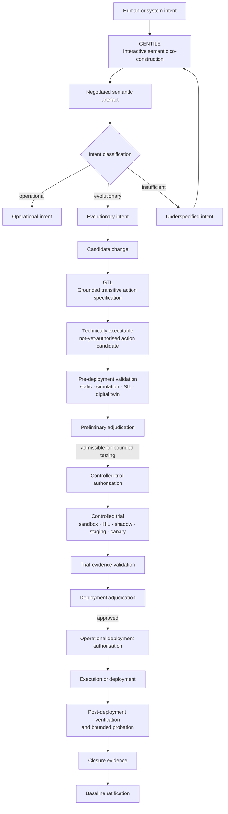
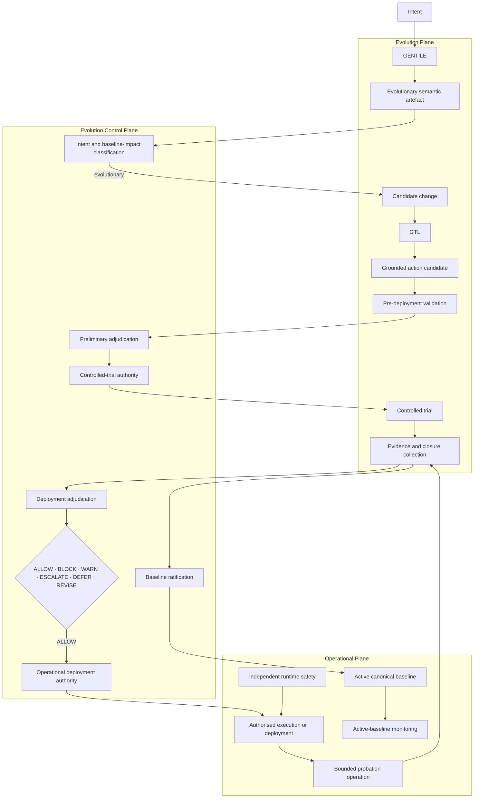
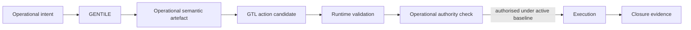
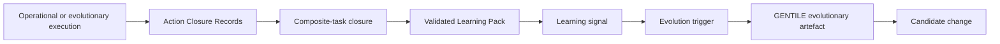

<!-- ages:authored — informative. This document does not define conformance requirements. -->

# GENTILE–GTL Integration within AGES

**Status:** Exploratory · **Document class:** Informative · **Repository:** AGES

**Purpose.** Describe how the two proposed functional engines —
[GENTILE](06-GENTILE.md) and [GTL](07-GTL.md) — integrate with the AGES
architectural planes, state-transition lifecycle and learning mechanics.

This document is a draft architecture and pre-specification. The integration
lifecycle remains subject to RFC review through
[`../rfcs/0011-gentile-gtl-integration-lifecycle.md`](../rfcs/0011-gentile-gtl-integration-lifecycle.md).

## 1. Core distinction

| Engine | Primary transformation | Core question | Primary output |
|---|---|---|---|
| GENTILE | Intent, context and interactive language exchange → negotiated structured representation | What is intended? | Semantic or structural artefact |
| GTL | Structured semantic artefact → grounded transitive action candidate | What bounded operation could realise it? | Technically executable, not-yet-authorised action candidate |

The concise relationship is:

> **GENTILE co-constructs meaning. GTL grounds meaning into action.**

The two engines are complementary but not interchangeable.

GENTILE does not by itself define a complete operational realisation.

GTL does not by itself establish semantic agreement or governance authority.

## 2. Correct evolutionary sequence

For an evolutionary case, the complete sequence is:

```text
Intent
→ GENTILE
→ Negotiated semantic artefact
→ Intent classification
→ Candidate change
→ GTL
→ Grounded action candidate
→ Pre-deployment validation
→ Preliminary adjudication
→ Controlled-trial authorisation
→ Controlled trial
→ Trial-evidence validation
→ Deployment adjudication
→ Operational deployment authorisation
→ Deployment
→ Post-deployment verification and probation
→ Closure evidence
→ Baseline ratification
→ Monitoring
```

This sequence is not mandatory in identical form for every domain.

A controlled trial may be omitted only where an approved profile or policy
declares it technically inapplicable or disproportionate to risk.

Operational uses of GENTILE and GTL do not necessarily create a new baseline.
An authorised operational action may be executed, evidenced and closed under
the current ratified baseline without opening a new age.

## 3. Diagram A — Functional relationship



The operational branch may proceed through GTL grounding, runtime validation
and operational authority under the active baseline, without creating a
candidate change.

## 4. Ordering constraints

The integration preserves these lifecycle constraints:

1. semantic representation precedes grounding;
2. intent classification precedes candidate-change formation;
3. GTL grounding precedes candidate-specific validation;
4. pre-deployment validation precedes preliminary adjudication;
5. preliminary adjudication precedes controlled-trial authorisation;
6. controlled-trial evidence precedes deployment adjudication where a trial
   is required;
7. deployment adjudication precedes operational deployment authorisation;
8. authorisation precedes execution;
9. execution precedes closure verification;
10. closure evidence precedes baseline ratification;
11. failed or inconclusive execution does not automatically create a new
    baseline.

Use the distinctions:

```text
Semantic artefact
≠ candidate change
≠ GTL action candidate
≠ validated candidate
≠ trial-authorised action
≠ operationally authorised action
≠ completed execution
≠ closure-verified resulting state
≠ ratified baseline
```

## 5. Diagram B — Mapping to AGES planes



The Evolution Control Plane receives both:

- the semantic specification: GENTILE artefact, intent classification and
  candidate-change rationale;
- the executable specification: GTL action candidate, validation results,
  trial evidence and recovery provisions.

It adjudicates evidence, authority, policy, risk, effectivity and invariants
before operational execution is authorised.

## 6. GENTILE responsibilities

Within the integration, GENTILE may:

- capture human or machine intent;
- expose context and assumptions;
- detect ambiguity;
- request clarification;
- negotiate terminology;
- identify affected objects;
- identify intended effectivity;
- identify relevant invariants;
- structure acceptance criteria;
- record dissent and unresolved issues;
- classify the semantic artefact;
- preserve interaction provenance.

GENTILE should not:

- silently resolve safety-relevant ambiguity;
- infer authority from linguistic agreement;
- convert every intent into a candidate change;
- broaden effectivity without review;
- authorise execution;
- ratify a baseline.

## 7. GTL responsibilities

Within the integration, GTL may:

- bind an executor;
- identify the transitive operation;
- resolve the direct object;
- declare the operational context;
- define preconditions;
- define the operational envelope;
- define expected effects;
- bind applicable invariants;
- define abort behaviour;
- define rollback, compensation or safe-state provisions;
- define closure-evidence criteria;
- bind effectivity and authority references;
- preserve grounding provenance.

GTL should not:

- invent missing semantic meaning;
- infer permission from technical capability;
- authorise its own execution;
- assume that successful execution implies ratification;
- hide irreversibility or recovery limitations.

## 8. Handoff contract

The GENTILE-to-GTL handoff should contain enough structure to support
grounding without silently introducing new intent.

A semantic artefact supplied to GTL should identify, as applicable:

- artefact identifier;
- artefact class;
- objective;
- rationale;
- identified objects;
- context;
- assumptions;
- constraints;
- invariants;
- acceptance criteria;
- effectivity;
- authority claims;
- unresolved ambiguity;
- provenance.

GTL should return either:

1. one grounded action candidate;
2. a bounded candidate set with explicit alternatives;
3. a clarification request;
4. a grounding failure;
5. a declaration that no transitive action is required.

A grounding failure is preferable to fabricating an executor, object,
constraint or authority.

## 9. Candidate sets

A semantic artefact may admit several valid operational realisations.

GTL may therefore generate:

- one preferred candidate;
- a bounded alternative set;
- fallback candidates;
- compensation candidates;
- recovery candidates.

The candidate set should define:

- candidate identities;
- selection policy;
- selection authority;
- preference order;
- mutual exclusions;
- fallback conditions;
- validation required for each candidate.

The Operational Plane must not choose an arbitrary unauthorised alternative.

## 10. Validation separation

Where generative systems create GENTILE or GTL artefacts, generation should be
separated from independent validation.

A conceptual chain is:

```text
Generative semantic engine
→ GENTILE artefact
→ Semantic validation
→ Intent classification
→ GTL generation
→ Grammar validation
→ Schema and type validation
→ Object resolution
→ Constraint and invariant checking
→ Simulation
→ Controlled trial
→ Governance adjudication
```

The subsystem that generates a candidate does not automatically own the
authority to adjudicate its admissibility.

## 11. Two authority gates

The integration distinguishes two principal execution gates.

### Controlled-trial authorisation

This permits bounded evidence generation in a declared environment.

It should define:

- candidate;
- source baseline;
- trial effectivity;
- environment;
- permitted executor and objects;
- safety limits;
- duration;
- required monitoring;
- abort conditions;
- restoration or compensation;
- evidence to collect.

Approval for a controlled trial does not authorise operational deployment.

### Operational deployment authorisation

This permits the candidate to enter its declared operational scope.

It should define:

- approved candidate or candidate set;
- operational effectivity;
- deployment method;
- residual risk;
- probation conditions;
- rollback, compensation or safe-state provisions;
- closure criteria;
- authority expiry.

Operational deployment authority does not itself ratify the resulting
baseline.

## 12. Execution, probation and ratification

After authorised execution or deployment, the resulting configuration enters
a bounded verification and probation phase.

Probation may assess:

- resulting configuration identity;
- successful activation;
- expected effects;
- invariant preservation;
- performance;
- deviations;
- operational stability;
- rollback readiness;
- closure-evidence sufficiency.

During probation, the deployed configuration is not yet necessarily the
canonical successor baseline.

Ratification occurs only when:

- execution is complete;
- the resulting state is sufficiently known;
- closure criteria are satisfied;
- applicable invariants are verified;
- the resulting configuration matches the candidate baseline;
- competent authority accepts the result as canonical.

## 13. Operational path

An operational use of GENTILE and GTL may follow:



This path does not create a new age when the action:

- stays within the active baseline;
- stays within delegated operational authority;
- remains inside the operational envelope;
- does not modify canonical configuration identity;
- preserves applicable invariants.

## 14. Evolutionary path

An evolutionary use follows the full candidate-change lifecycle.

```mermaid
flowchart LR
    I["Evolutionary intent"]
    G["GENTILE"]
    S["Evolutionary semantic artefact"]
    C["Candidate change"]
    T["GTL action candidate"]
    V["Virtual validation"]
    CT["Controlled trial"]
    AJ["Adjudication"]
    AU["Operational authority"]
    D["Deployment"]
    CE["Closure evidence"]
    R["Ratified baseline"]

    I --> G
    G --> S
    S --> C
    C --> T
    T --> V
    V --> CT
    CT --> AJ
    AJ -->|approved| AU
    AU --> D
    D --> CE
    CE --> R
```



Only this final ratification closes the preceding age and opens the next.

## 15. Learning feedback

Operational and evolutionary executions may produce Action Closure Records
and Learning Packs.

A validated Learning Pack may become an input to GENTILE as new evolutionary
intent.



The feedback relation is governed.

```text
Learning Pack
≠ candidate change
≠ deployment authority
≠ successor baseline
```

SAI-AUT-OS may automate pack catalogue, validation and trigger policy, but the
subsequent candidate still passes through GENTILE, GTL, validation,
adjudication, execution, closure and ratification.

See [`09-learning-mechanics.md`](09-learning-mechanics.md).

## 16. Formal sketch

These expressions are conceptual functions, not complete mathematical
definitions.

### Semantic transformation

```math
S = \mathrm{GENTILE}(I, C, X)
```

Where:

- $I$ is declared intent;
- $C$ is contextual information;
- $X$ is interactive exchange history;
- $S$ is the negotiated semantic artefact.

### Intent classification

```math
K_I = \mathrm{ClassifyIntent}(S, B_n, E_f)
```

Where:

- $S$ is the semantic artefact;
- $B_n$ is the active baseline;
- $E_f$ is intended effectivity;
- $K_I$ is the intent class and baseline-impact classification.

### GTL grounding

```math
A_c = \mathrm{GTL}(S, O, E, K)
```

Where:

- $S$ is the semantic artefact;
- $O$ is the identified direct object;
- $E$ is the assigned executor;
- $K$ is the set of operational constraints;
- $A_c$ is a technically executable, not-yet-authorised action candidate.

### Validation and trial

```math
V_c = \mathrm{Validate}(A_c, B_n, E_f)
```

```math
T_c = \mathrm{Trial}(A_c, V_c, \mathrm{Auth}_{trial})
```

Where:

- $V_c$ is pre-deployment validation evidence;
- $T_c$ is controlled-trial evidence;
- $\mathrm{Auth}_{trial}$ is bounded trial authority.

### Deployment decision

```math
D_c =
\mathrm{Adjudicate}
\left(
S,\;
A_c,\;
V_c,\;
T_c,\;
E_f,\;
\mathcal{I}_n,\;
\mathrm{Auth}_{deploy}
\right)
```

Where:

- $D_c$ is the governance decision;
- $\mathcal{I}_n$ is the applicable invariant set;
- $\mathrm{Auth}_{deploy}$ is competent deployment authority.

### Evolutionary transition

```math
B_n
\xrightarrow{
A_c,\;
V_c,\;
T_c,\;
D_c,\;
E_c
}
B_{n+1}
```

Where:

- $A_c$ is the authorised action candidate;
- $V_c$ is validation evidence;
- $T_c$ is trial evidence where applicable;
- $D_c$ is the governance decision;
- $E_c$ is closure evidence;
- $B_{n+1}$ exists as the canonical successor only after ratification.

## 17. Provenance chain

The integrated provenance chain should preserve:

- source intent;
- interaction history;
- semantic artefact;
- intent classification;
- candidate change;
- GTL candidate;
- validation records;
- trial authority;
- trial evidence;
- deployment authority;
- execution record;
- closure evidence;
- ratification record;
- successor baseline.

A minimal chain is:

```text
Intent
→ semantic provenance
→ grounding provenance
→ validation provenance
→ authority provenance
→ execution provenance
→ closure provenance
→ ratification provenance
```

See [`05-identity-and-provenance.md`](05-identity-and-provenance.md).

## 18. Effectivity propagation

Effectivity should be preserved and refined through the integration.

```text
Semantic intended effectivity
→ candidate effectivity
→ validation effectivity
→ trial effectivity
→ deployment effectivity
→ probation effectivity
→ baseline effectivity
```

Expansion is not automatic.

Evidence produced under narrow trial effectivity does not automatically
justify wider operational effectivity.

See [`04-effectivity.md`](04-effectivity.md).

## 19. Failure paths

The integration should represent explicit failure outcomes.

Possible responses include:

- request clarification;
- revise semantic artefact;
- reject candidate formation;
- reject GTL grounding;
- block validation;
- block or terminate trial;
- restore test environment;
- reject deployment;
- revert deployment;
- compensate irreversible effects;
- enter safe state;
- suspend the active baseline;
- establish a recovery baseline.

Failure must not be collapsed into one generic “not authorised” result.

## 20. Security considerations

The integration may be exposed to:

- prompt injection;
- semantic-context poisoning;
- fabricated consensus;
- object substitution;
- executor spoofing;
- authority forgery;
- constraint removal;
- effectivity expansion;
- evidence fabrication;
- compiler or adapter tampering;
- replay of expired actions;
- provenance manipulation.

Controls may include:

- participant and executor identity;
- source integrity;
- schema and type validation;
- object-resolution checks;
- signed authority records;
- independent validation;
- replay protection;
- least privilege;
- immutable provenance;
- bounded failure behaviour.

## 21. Scope boundaries

This integration does not yet claim:

- a complete natural-language-understanding theory;
- a universal action language;
- autonomous legal authority;
- formal verification of all cyber-physical actions;
- automatic resolution of ambiguous intent;
- guaranteed correspondence between language and physical reality;
- replacement of domain-specific command languages;
- replacement of safety-critical certification;
- unrestricted machine self-modification;
- automatic promotion from Learning Pack to baseline;
- guaranteed rollback of physical effects;
- universal semantic equivalence after compilation.

GENTILE and GTL remain proposed architectural constructs within AGES and are
subject to research, experimentation and RFC review.

## 22. Design principles

1. **Meaning precedes grounding.**
2. **Classification precedes candidate formation.**
3. **Grounding precedes validation and adjudication.**
4. **Semantic agreement is not authority.**
5. **Technical executability is not permission.**
6. **Generation must remain separable from validation.**
7. **Trial authority is distinct from deployment authority.**
8. **Execution is distinct from ratification.**
9. **Closure evidence precedes canonical identity.**
10. **Effectivity must not be silently broadened.**
11. **Failure and recovery must remain explicit.**
12. **Operational use does not automatically create a new age.**
13. **Learning feedback may open evolution but does not complete it.**
14. **The complete semantic-to-physical chain must remain reconstructable.**

## 23. Open questions

- What minimum semantic structure is required before GTL grounding?
- Which ambiguities must block grounding?
- Can one semantic artefact generate several valid GTL candidates?
- How should candidate selection authority be represented?
- Which validation steps are mandatory before controlled trial?
- When may virtual validation replace physical trial?
- How should uncertainty propagate from GENTILE into GTL limits?
- How should semantic and executable artefact versions remain linked?
- How should composite and concurrent GTL actions be adjudicated?
- How should long-running actions behave when the baseline changes?
- When does operational action become evolutionary action?
- Which Learning Pack signals may automatically create candidate changes?
- How should multilingual semantic artefacts map to controlled GTL
  vocabularies?
- How should compiler and adapter correctness be established?
- What minimum provenance makes the full chain reconstructable?

## Related

- [`01-architectural-planes.md`](01-architectural-planes.md)
- [`02-state-and-transition-model.md`](02-state-and-transition-model.md)
- [`03-evidence-and-authority.md`](03-evidence-and-authority.md)
- [`04-effectivity.md`](04-effectivity.md)
- [`05-identity-and-provenance.md`](05-identity-and-provenance.md)
- [`06-GENTILE.md`](06-GENTILE.md)
- [`07-GTL.md`](07-GTL.md)
- [`09-learning-mechanics.md`](09-learning-mechanics.md)
- [`../schemas/README.md`](../schemas/README.md)
- [`../examples/README.md`](../examples/README.md)
- [`../research/open-questions.md`](../research/open-questions.md)
- [`../rfcs/0011-gentile-gtl-integration-lifecycle.md`](../rfcs/0011-gentile-gtl-integration-lifecycle.md)
