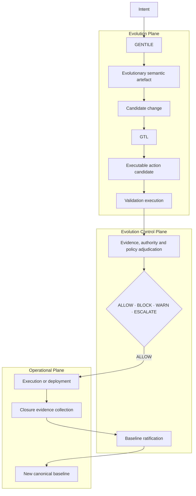
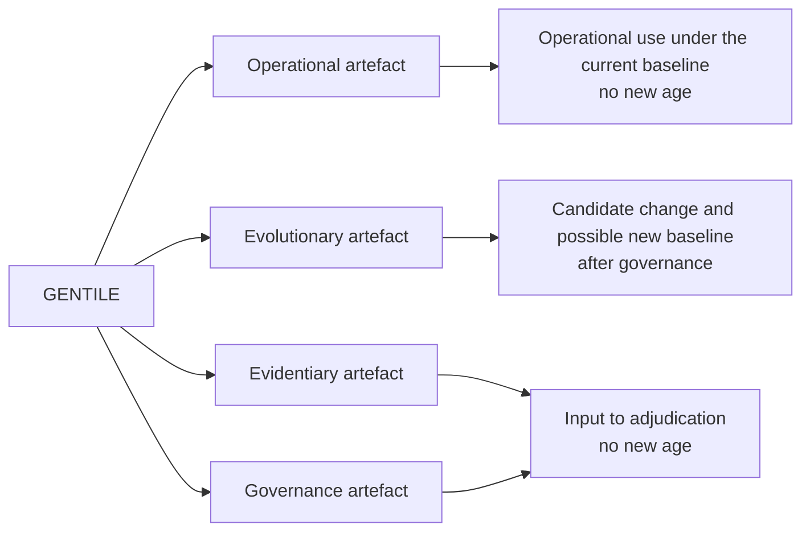

<!-- ages:authored — informative. This document does not define conformance requirements. -->

# GENTILE–GTL Integration within AGES

**Status:** Exploratory · **Document class:** Informative · **Repository:** AGES
**Purpose.** Describe how the two proposed functional engines —
[GENTILE](06-GENTILE.md) and [GTL](07-GTL.md) — integrate with the AGES
architectural planes and lifecycle. This is a draft architecture and
pre-specification; the lifecycle is governed through
[`../rfcs/0011-gentile-gtl-integration-lifecycle.md`](../rfcs/0011-gentile-gtl-integration-lifecycle.md).

## 1. Core distinction

| Engine | Primary transformation | Core question | Primary output |
|---|---|---|---|
| GENTILE | Intent and interactive language exchange → negotiated structured representation | What is intended? | Semantic or structural artefact |
| GTL | Structured semantic artefact → grounded transitive action candidate | What operation could realise it? | Technically executable, not-yet-authorised action candidate |

The concise relationship:

```text
Intent
→ GENTILE
→ Negotiated semantic artefact
→ GTL
→ Grounded action candidate
→ Validation and adjudication
→ Authorised execution
→ Closure evidence
→ Ratified baseline
```

This sequence represents an **evolutionary case**. Operational uses of
GENTILE and GTL do not necessarily create a new baseline: an authorised
operational action is executed, evidenced and closed under the current
ratified baseline without opening a new age.

## 2. Diagram A — Functional relationship

```mermaid
flowchart LR
    INT["Human or system intent"]
    GEN["GENTILE<br/>Interactive semantic co-construction"]
    SEM["Negotiated semantic artefact"]
    GTL["GTL<br/>Grounded transitive action specification"]
    ACT["Executable action candidate"]
    VAL["Validation execution"]
    ADJ["Governance adjudication"]
    EXEC["Authorised execution"]
    EVID["Closure evidence"]
    RAT["Baseline ratification"]

    INT --> GEN
    GEN --> SEM
    SEM --> GTL
    GTL --> ACT
    ACT --> VAL
    VAL --> ADJ
    ADJ -->|authorised| EXEC
    EXEC --> EVID
    EVID --> RAT
```



Ordering constraints preserved from the AGES lifecycle:

1. validation execution precedes governance adjudication;
2. authorisation precedes execution;
3. deployment or execution precedes baseline ratification;
4. closure evidence precedes baseline ratification.

## 3. Diagram B — Mapping to AGES planes



The Evolution Control Plane receives **both** the semantic specification
(the GENTILE artefact and candidate-change rationale) and the executable
specification (the GTL action candidate with its validation record), and
adjudicates evidence, authority and policy before any execution is
authorised.

## 4. Diagram C — Cross-plane use of GENTILE

GENTILE may produce operational, evolutionary, evidentiary and
governance artefacts. Only the evolutionary path may lead — through a
candidate change, GTL grounding, validation, adjudication, authorised
deployment and closure evidence — to a new baseline. No GENTILE
interaction modifies the system baseline by itself.



## 5. Formal sketch

These are conceptual functions, not complete mathematical definitions;
they name transformations for discussion, in the same exploratory spirit
as [`../models/`](../models/README.md).

For the semantic transformation:

$$
S = \mathrm{GENTILE}(I, C, X)
$$

Where: $I$ is declared intent; $C$ is contextual information; $X$ is the
interactive exchange history; $S$ is the negotiated semantic artefact.

For GTL grounding:

$$
A_c = \mathrm{GTL}(S, O, E, K)
$$

Where: $S$ is the semantic artefact; $O$ is the identified direct
object; $E$ is the assigned executor; $K$ is the set of operational
constraints; $A_c$ is a technically executable, not-yet-authorised
action candidate.

For an evolutionary transition:

$$
B_n
\xrightarrow{A_c,\;V,\;D,\;E_c}
B_{n+1}
$$

Where: $A_c$ is the authorised action candidate; $V$ is the validation
record; $D$ is the governance decision; $E_c$ is closure evidence; and
$B_{n+1}$ is ratified only after successful execution and closure
verification.

## 6. Scope boundaries

This integration does not yet claim:

- a complete natural-language understanding theory;
- a universal action language;
- autonomous legal authority;
- formal verification of all cyber-physical actions;
- automatic resolution of ambiguous human intent;
- guaranteed correspondence between language and physical reality;
- replacement of domain-specific command languages;
- replacement of safety-critical certification;
- unrestricted machine self-modification.

GENTILE and GTL are proposed architectural constructs within AGES and
remain subject to research, experimentation and RFC review.

**Related.**
[`06-GENTILE.md`](06-GENTILE.md) ·
[`07-GTL.md`](07-GTL.md) ·
[`01-architectural-planes.md`](01-architectural-planes.md) ·
[`../schemas/README.md`](../schemas/README.md) ·
[`../examples/README.md`](../examples/README.md) ·
[`../research/open-questions.md`](../research/open-questions.md)
