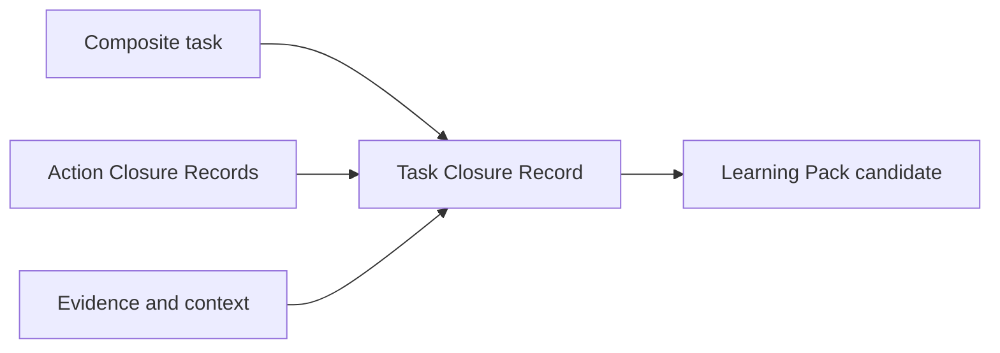
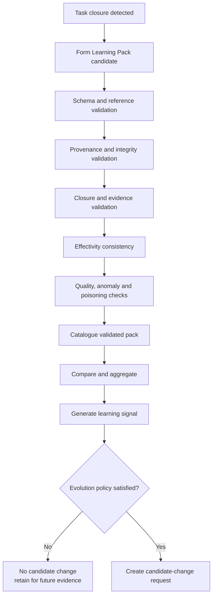

<!-- ages:authored — informative. This document does not define conformance requirements. -->

# Learning Mechanics

**Status:** Exploratory · **Document class:** Informative · **Repository:** AGES

**Purpose.** Define how completed operational experience may be converted into
a governed learning object capable of informing, proposing or selectively
triggering artificial-system evolution.

Learning mechanics do not make every completed task an evolution transition.
They define the evidentiary bridge between successful or otherwise
informative execution and a future candidate change.

## 1. Core proposition

A composite task, inspection, maintenance procedure or other multi-step work
package may generate a structured **Learning Pack** when its execution reaches
a known closure state and the resulting evidence is complete enough to be
reused.

> **A Learning Pack is an immutable, provenance-bound package of operational
> experience created from a closed task and prepared for validation,
> comparison and possible evolutionary use.**

A Learning Pack may record:

- what was intended;
- which baseline governed execution;
- which actions were planned;
- which actions were actually executed;
- which alternatives, retries or fallbacks were used;
- whether the task objective was achieved;
- which invariants remained true;
- which deviations occurred;
- which closure evidence was collected;
- under which context and effectivity the experience is valid;
- what may be learned from the outcome.

A Learning Pack is not itself:

- a candidate change;
- an authorisation;
- a deployment instruction;
- a successor baseline;
- proof that the observed result generalises beyond its effectivity.

Use the distinction:

```text
Closed task
≠ Learning Pack candidate
≠ validated Learning Pack
≠ evolution-eligible Learning Pack
≠ candidate change
≠ authorised transition
≠ ratified baseline
```

## 2. Composite task

A **composite task** is a bounded objective realised through a set of related
actions.

Examples include:

- an aircraft or robot inspection;
- a multi-step maintenance procedure;
- a calibration sequence;
- a staged model evaluation;
- a software migration;
- a physical assembly operation;
- an incident-containment procedure;
- a recovery workflow.

A composite task may be:

- sequential;
- parallel;
- conditional;
- partially ordered;
- iterative;
- transactional;
- compensating;
- long-running.

It should identify:

- task identifier;
- objective;
- source baseline;
- applicable procedure or semantic artefact;
- constituent actions;
- action dependencies;
- mandatory and optional steps;
- effectivity;
- authority;
- task-level invariants;
- task-level closure criteria;
- recovery and compensation provisions.

## 3. Action closure records

Each executed action should produce an **Action Closure Record**.

An Action Closure Record may contain:

- action-candidate identifier;
- executor;
- operation;
- direct object;
- source and resulting state;
- start and completion time;
- precondition results;
- operational-envelope history;
- invariant results;
- actual parameters;
- deviations;
- retries;
- fallback or compensation;
- outcome;
- closure evidence;
- provenance.

An action may close as:

- successful;
- successful with deviation;
- successful through fallback;
- compensated;
- aborted safely;
- failed with known resulting state;
- inconclusive;
- unrecoverable.

Learning value is not limited to nominal success.

A safely aborted or compensated action may be more informative than an
uneventful success.

## 4. Task closure

A composite task is closed when its task-level outcome is known and its
closure criteria have been evaluated.

Task closure should not require every constituent action to report nominal
success. Optional branches, retries, compensation and approved fallback paths
may still produce valid closure.

A conceptual closure condition is:

```math
\mathrm{Close}(M_k)
:=
G_k
\land
S_k
\land
I_k
\land
E_k
\land
O_k
```

Where:

- $G_k$ means the task goal is achieved or its terminal outcome is known;
- $S_k$ means mandatory steps or authorised alternatives are accounted for;
- $I_k$ means applicable invariants were evaluated;
- $E_k$ means required closure evidence is available;
- $O_k$ means the resulting state is sufficiently observable and identified.

Task closure does not imply that the task should be used for learning.

## 5. Learning Pack

A Learning Pack is created from one closed composite task.

A conceptual representation is:

```math
LP_k
=
\left\langle
M_k,\;
B_n,\;
A_k,\;
C_k,\;
E_f,\;
E_k,\;
D_k,\;
Q_k,\;
P_k
\right\rangle
```

Where:

- $M_k$ is the closed composite task;
- $B_n$ is the source baseline;
- $A_k$ is the set of Action Closure Records;
- $C_k$ is execution context;
- $E_f$ is effectivity;
- $E_k$ is the evidence package;
- $D_k$ is the deviation and recovery record;
- $Q_k$ is the pack-quality assessment;
- $P_k$ is provenance.

This is an exploratory conceptual relation, not a normative mathematical
definition.

## 6. Learning Pack classes

Learning Packs may be classified by outcome.

| Class | Meaning |
|---|---|
| Nominal-success pack | Goal achieved through the expected path |
| Degraded-success pack | Goal achieved with reduced performance or bounded deviation |
| Fallback-success pack | Goal achieved through an authorised alternative |
| Compensation pack | Exact prior state was not restored, but effects were mitigated |
| Recovery pack | A stable state was established after abnormal execution |
| Safe-abort pack | Execution stopped safely before task completion |
| Failure pack | Goal not achieved and failure state is known |
| Inconclusive pack | Resulting state or evidence is insufficient |
| Anomaly pack | Unexpected behaviour occurred independently of nominal task success |

All classes may contribute to learning, but they should not share identical
validation or promotion rules.

## 7. Pack formation

Pack formation should bind the task, action and evidence records into an
immutable or integrity-protected object.



Formation should verify at least:

- task identifier uniqueness;
- source-baseline identity;
- action-set completeness;
- closure status;
- effectivity;
- evidence references;
- authority references;
- provenance integrity;
- unresolved gaps.

A formed pack remains a **Learning Pack candidate** until validated.

## 8. Learning Pack validation

Learning Pack validation determines whether the package is reliable enough
for comparison, aggregation or evolutionary use.

Validation may include:

1. schema validation;
2. identifier and reference resolution;
3. provenance verification;
4. integrity verification;
5. task-closure verification;
6. action-set completeness;
7. evidence sufficiency;
8. invariant-result completeness;
9. effectivity consistency;
10. context completeness;
11. deviation and recovery assessment;
12. duplicate and replay detection;
13. privacy and confidentiality checks;
14. poisoning and manipulation checks;
15. representativeness assessment.

A conceptual validity predicate is:

```math
\mathrm{ValidLP}(LP_k)
:=
S_k
\land
I_k
\land
P_k
\land
C_k
\land
E_k
\land
F_k
\land
R_k
```

Where:

- $S_k$ is structural validity;
- $I_k$ is integrity;
- $P_k$ is provenance validity;
- $C_k$ is closure completeness;
- $E_k$ is evidence sufficiency;
- $F_k$ is effectivity consistency;
- $R_k$ is representativeness or declared applicability.

The exact predicate is profile-specific.

## 9. Validation is not learning approval

A valid pack is not automatically evolution-eligible.

Validation answers:

> **Is this pack internally coherent, authentic and sufficiently evidenced?**

Learning adjudication answers:

> **Is this experience relevant, representative and useful enough to inform
> or trigger a candidate change?**

The distinction prevents a single successful task from being overgeneralised.

## 10. Learning Pack catalogue

Validated packs may be entered into a **Learning Pack Catalogue**.

The catalogue should support:

- unique pack identity;
- source baseline;
- task class;
- object and executor classes;
- effectivity;
- outcome class;
- evidence quality;
- deviations;
- recurrence;
- similarity;
- novelty;
- risk;
- privacy restrictions;
- supersession;
- aggregation links;
- candidate-change links;
- retention status.

The catalogue is not merely a log. It is a governed index of reusable
operational experience.

## 11. Pack comparison and aggregation

One pack may reveal a local improvement or anomaly. Repeated packs may reveal
a stable pattern.

Validated packs may be grouped into a **Learning Aggregate** when they share
compatible:

- task class;
- baseline family;
- object type;
- executor type;
- environment;
- effectivity;
- procedure;
- outcome;
- deviation pattern;
- evidence semantics.

A conceptual aggregate is:

```math
LA_j
=
\bigoplus_{k \in K_j} LP_k
```

The aggregation operator $\bigoplus$ is profile-specific and must preserve:

- pack identities;
- individual provenance;
- effectivity differences;
- dissenting evidence;
- outliers;
- failure cases;
- uncertainty.

Aggregation must not erase negative or contradictory experience.

## 12. Learning signal

A Learning Pack or Learning Aggregate may produce a **Learning Signal**.

The signal may express:

- recurring success;
- recurring failure;
- performance improvement;
- unnecessary action;
- procedure inefficiency;
- calibration drift;
- environmental sensitivity;
- model degradation;
- useful fallback;
- unsafe ambiguity;
- missing invariant;
- insufficient closure evidence;
- opportunity for automation.

A conceptual score may combine:

```math
\mathrm{Score}(LP)
=
w_n N
+
w_r R
+
w_i I
+
w_c C
+
w_b B
-
w_u U
-
w_h H
```

Where, illustratively:

- $N$ is novelty;
- $R$ is recurrence;
- $I$ is operational impact;
- $C$ is confidence;
- $B$ is breadth of applicable evidence;
- $U$ is uncertainty;
- $H$ is hazard or evolutionary risk.

This score is illustrative. AGES does not prescribe universal weights or one
scalar decision model.

## 13. Evolution eligibility

A validated pack becomes **evolution-eligible** only when declared policy
permits it to influence candidate generation.

Eligibility may depend on:

- pack class;
- evidence quality;
- recurrence threshold;
- novelty;
- risk;
- representativeness;
- effectivity;
- baseline age;
- absence of unresolved contradiction;
- privacy and legal constraints;
- competent authority;
- availability of validation and recovery paths.

A conceptual trigger condition is:

```math
\mathrm{TriggerEvolution}(LP_k)
:=
\mathrm{ValidLP}(LP_k)
\land
\mathrm{Eligible}(LP_k)
\land
\mathrm{ThresholdSatisfied}(LP_k)
\land
\mathrm{AuthorityAllowsTrigger}(LP_k)
```

The output of this trigger should normally be a **candidate change**, not a
new baseline.

> **Automatic learning may automatically open an evolutionary process; it
> must not silently complete that process.**

## 14. Evolution trigger

An Evolution Trigger may create:

- a candidate-change request;
- a GENTILE evolutionary-intent artefact;
- a requirement revision proposal;
- a GTL candidate-generation request;
- a validation campaign request;
- a human review request;
- an anomaly or recovery RFC;
- a recommendation to retain the current baseline.

The trigger record should identify:

- triggering packs or aggregates;
- policy;
- threshold;
- score or rationale;
- effectivity;
- authority;
- proposed baseline impact;
- required validation;
- required human or organisational review.

## 15. Automatic and selective evolution

Automatic evolution should be selective rather than universal.

Possible automation levels include:

| Level | Permitted automation |
|---|---|
| L0 — Record | Form and catalogue packs only |
| L1 — Recommend | Produce learning signals and recommendations |
| L2 — Propose | Automatically create candidate changes |
| L3 — Validate | Automatically run declared validation suites |
| L4 — Trial | Automatically request or execute pre-authorised bounded trials |
| L5 — Deploy | Automatically deploy within delegated low-risk effectivity |
| L6 — Ratify | Automatically ratify only where explicit prior policy permits and closure criteria are independently satisfied |

Higher levels require stronger:

- authority;
- evidence;
- independence;
- monitoring;
- rollback or compensation;
- effectivity limits;
- auditability.

The default AGES interpretation should not assume L5 or L6 authority.

## 16. Role of SAI-AUT-OS

AGES should define the ontology and lifecycle of learning mechanics.

SAI-AUT-OS may operationalise the selective automation of those mechanics.

Possible SAI-AUT-OS responsibilities include:

- detect composite-task closure;
- create Learning Pack identifiers;
- bind action and task records;
- verify provenance and integrity;
- catalogue packs;
- classify pack outcomes;
- run automatic validation steps;
- detect duplicates and replay;
- compare packs;
- construct Learning Aggregates;
- calculate learning signals;
- apply trigger policy;
- generate candidate-change requests;
- initiate GENTILE and GTL pipelines;
- run pre-authorised validation campaigns;
- request trial or deployment authority;
- enforce effectivity;
- preserve the evolution ledger;
- prevent unauthorised promotion.

The division is:

> **AGES defines what a governed Learning Pack and evolution trigger are.
> SAI-AUT-OS defines how selected packs are catalogued, validated and promoted
> through an operational Evolution Control Plane.**

AI-II may define the interfaces through which task systems, evidence systems,
catalogues, validators, model registries and control-plane services exchange
these objects.

## 17. Selective AI policy

SAI-AUT-OS should apply selective AI rather than unrestricted autonomous
learning.

A policy may specify:

- eligible task classes;
- eligible baseline components;
- minimum pack count;
- required recurrence;
- required confidence;
- excluded failure classes;
- maximum risk;
- permitted effectivity;
- permitted automation level;
- required independent validators;
- required human approval;
- rollback feasibility;
- probation duration;
- ratification authority.

A pack outside the declared policy may still be stored and reviewed, but must
not trigger automatic evolution.

## 18. Validation pipeline

An automatic Learning Pack validation pipeline may be:



This pipeline ends with candidate formation, not ratification.

## 19. Connection to the AGES transition lifecycle


The controlled trial may be omitted only where declared policy considers it
technically inapplicable or disproportionate.

## 20. Baseline and age propagation

A Learning Pack does not alter the active baseline.

The active age continues while packs are collected, validated and compared.

Only a completed and ratified evolution transition creates the successor
baseline.

A conceptual propagation is:

```math
B_n
\xrightarrow{\mathrm{operation}}
LP_1, LP_2, \ldots, LP_m
\xrightarrow{\mathrm{validation\ and\ aggregation}}
ET_j
\xrightarrow{\mathrm{candidate\ lifecycle}}
B_{n+1}
```

Where $ET_j$ is an authorised evolution trigger.

This relation does not imply that every group of packs creates $B_{n+1}$.

The process may conclude that:

- no change is justified;
- more evidence is required;
- effectivity should be narrowed;
- a procedure should change;
- a model should be retrained;
- an invariant should be added;
- the current baseline remains preferable.

## 21. Positive and negative learning

A learning system that records only successful nominal tasks is biased.

Learning mechanics should preserve:

- success;
- degraded success;
- fallback success;
- safe abort;
- failure;
- recovery;
- anomaly;
- inconclusive evidence.

Negative learning may reveal:

- prohibited operating conditions;
- invalid assumptions;
- unsafe candidate patterns;
- insufficient evidence;
- unreliable executors;
- poor procedure design;
- recovery limits.

The objective is not to reward every repeated behaviour, but to improve the
system’s governed understanding of what works, what fails and under which
effectivity.

## 22. Avoiding self-confirming evolution

Automatic learning may create feedback loops in which a system repeatedly
collects evidence supporting its own prior behaviour.

Mitigations may include:

- independent evidence sources;
- counterfactual evaluation;
- hold-out environments;
- adversarial testing;
- comparison with rejected or failed packs;
- minimum diversity requirements;
- human or organisational review;
- effectivity partitioning;
- novelty penalties;
- uncertainty preservation;
- external validation.

Repeated execution does not prove optimality.

## 23. Pack identity and provenance

A Learning Pack should preserve:

- pack identifier;
- source baseline;
- task and action identifiers;
- executors;
- objects;
- environment;
- effectivity;
- authority;
- evidence references;
- closure record;
- deviation record;
- outcome class;
- formation process;
- validation process;
- catalogue entry;
- integrity digest;
- retention and supersession status.

The pack should remain reconstructable even if underlying repositories or
custodians change.

See
[`05-identity-and-provenance.md`](05-identity-and-provenance.md).

## 24. Effectivity and generalisation

Learning must remain bounded by the scope of the experience.

A pack generated from:

- one instance;
- one hardware revision;
- one environment;
- one operator;
- one jurisdiction;
- one task mode;

must not be silently generalised to a fleet, product family or different
environment.

Effectivity expansion may require:

- additional packs;
- more diverse evidence;
- new validation;
- controlled trials;
- new authority.

See [`04-effectivity.md`](04-effectivity.md).

## 25. Authority

Different authority may be required to:

- record a pack;
- validate a pack;
- catalogue a pack;
- aggregate packs;
- generate a learning signal;
- trigger candidate formation;
- run automatic validation;
- authorise a controlled trial;
- authorise deployment;
- ratify a baseline.

A policy may delegate lower-level actions while retaining human or
organisational authority for higher-risk transitions.

Use:

```text
Automatic catalogue entry
≠ automatic candidate approval
≠ automatic deployment authority
≠ automatic ratification
```

## 26. Example: multi-step inspection

A composite inspection may include:

1. identify the asset;
2. isolate the inspection area;
3. capture images;
4. perform dimensional measurement;
5. compare against allowable limits;
6. classify findings;
7. restore the area;
8. issue the inspection report.

The Learning Pack may record:

- image and measurement quality;
- time per step;
- false positives;
- repeated operator corrections;
- tooling limitations;
- environmental conditions;
- deviation from the procedure;
- final finding;
- closure evidence;
- restoration confirmation.

Repeated packs might reveal that:

- one inspection step is redundant;
- one camera angle improves detection;
- one tolerance is too broad;
- one environment produces unreliable measurements;
- one automated classifier requires retraining.

The Evolution Trigger should create a candidate change for the procedure,
tooling, model or invariant rather than directly rewriting the active
baseline.

## 27. Example: multi-step maintenance

A maintenance task may include:

1. identify the failed component;
2. isolate energy sources;
3. remove access panels;
4. disconnect interfaces;
5. replace the component;
6. restore interfaces;
7. calibrate;
8. run functional tests;
9. close the work area;
10. return the system to service.

A Learning Pack may identify:

- recurrent access difficulty;
- unexpected tool changes;
- calibration drift;
- repeated fallback steps;
- additional inspection needs;
- task-duration variation;
- recovery actions;
- post-maintenance anomalies.

An aggregate of validated packs may justify:

- procedural revision;
- product redesign;
- tooling change;
- spare-part change;
- training update;
- model update;
- new safety invariant.

## 28. Minimal exploratory schema

```yaml
learningPackId:
status: candidate

source:
  baselineId:
  taskId:
  taskClass:
  semanticArtefactId:
  procedureId:

closure:
  outcomeClass:
  goalAchieved:
  resultingStateKnown:
  closureCriteria:
  closedAt:

actions:
  - actionCandidateId:
    closureRecordId:
    outcome:
    deviations:
    evidenceReferences:

context:
  environment:
  operatingMode:
  executor:
  directObjects:

effectivity:
  instances:
  cohorts:
  configurations:
  environments:
  jurisdictions:
  validFrom:
  validUntil:

evidence:
  packageId:
  invariantResults:
  closureEvidence:
  qualityAssessment:

learning:
  novelty:
  recurrence:
  operationalImpact:
  uncertainty:
  hazard:
  proposedSignals:
  candidateEligibility:

authority:
  formationAuthority:
  validationAuthority:
  triggerPolicy:
  permittedAutomationLevel:

provenance:
  formationProcess:
  validator:
  catalogueEntry:
  integrityDigest:
```

This example is exploratory and non-normative.

## 29. Design principles

Learning mechanics should follow these principles:

1. **Task closure precedes learning-pack formation.**
2. **A pack must preserve individual action outcomes and evidence.**
3. **Success is not the only useful learning class.**
4. **Validation precedes catalogue promotion.**
5. **A valid pack is not automatically evolution-eligible.**
6. **Effectivity bounds generalisation.**
7. **Aggregation must preserve dissent, outliers and negative evidence.**
8. **Automatic learning should normally create a candidate, not a baseline.**
9. **Higher automation requires stronger delegated authority.**
10. **Validation of the pack is distinct from validation of the candidate
    change derived from it.**
11. **SAI-AUT-OS may automate promotion, but must not erase governance gates.**
12. **Ratification requires execution and closure evidence from the candidate
    lifecycle, not merely evidence from the originating task.**

## 30. Open questions

- What minimum task closure is required before pack formation?
- Should one composite task always produce exactly one Learning Pack?
- Can several packs be derived from one long-running task?
- How should optional, failed and compensated actions affect pack quality?
- Which learning classes may automatically trigger candidate formation?
- How many packs are required before an experience is considered recurrent?
- How should pack similarity be calculated?
- How should contradictory packs be aggregated?
- Which effectivity dimensions are mandatory?
- How should privacy-sensitive operational experience be catalogued?
- How should poisoned or manipulated packs be detected?
- Can a pack be superseded without being deleted?
- How should long-term learning survive baseline and schema changes?
- Which SAI-AUT-OS automation levels are acceptable by risk class?
- When may a validated pack automatically trigger a controlled trial?
- Under what conditions could ratification be automated?
- How should cross-instance and fleet learning preserve local differences?
- How should learning decay or staleness be represented?
- Can Learning Packs support counterfactual or simulated experience?
- How should human tacit knowledge be represented without fabricating
  certainty?

## 31. Unresolved issues

- formal pack semantics;
- similarity and aggregation metrics;
- threshold governance;
- learning-signal explainability;
- automated trigger authority;
- pack poisoning;
- privacy-preserving provenance;
- representation of tacit knowledge;
- cross-baseline comparability;
- experience staleness;
- negative-evidence weighting;
- fleet-wide generalisation;
- automatic ratification boundaries;
- retention and deletion policy;
- schema migration.

## Related

- [`01-architectural-planes.md`](01-architectural-planes.md)
- [`02-state-and-transition-model.md`](02-state-and-transition-model.md)
- [`03-evidence-and-authority.md`](03-evidence-and-authority.md)
- [`04-effectivity.md`](04-effectivity.md)
- [`05-identity-and-provenance.md`](05-identity-and-provenance.md)
- [`06-GENTILE.md`](06-GENTILE.md)
- [`07-GTL.md`](07-GTL.md)
- [`08-gentile-gtl-integration.md`](08-gentile-gtl-integration.md)
- [`../theory/04-evolution-transitions.md`](../theory/04-evolution-transitions.md)
- [`../theory/05-governed-continuity.md`](../theory/05-governed-continuity.md)
