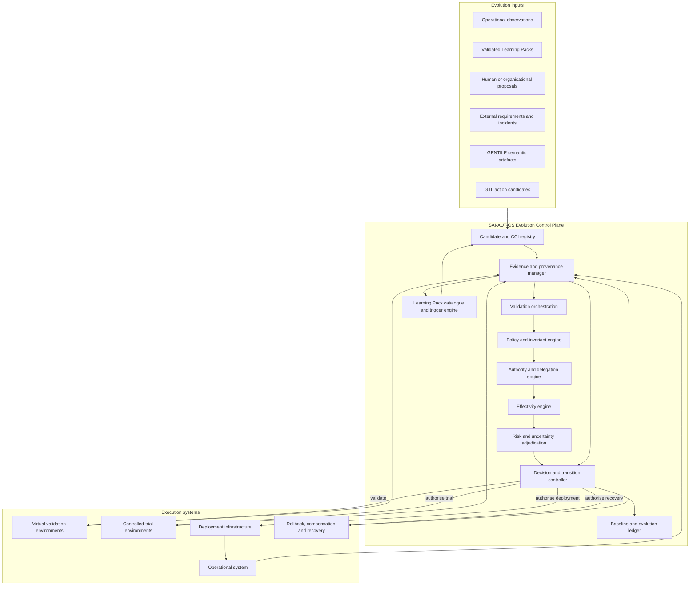
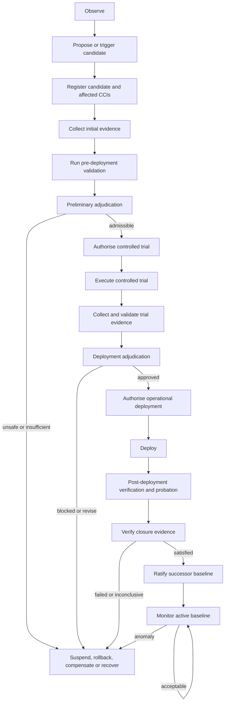

<!-- ages:authored — informative. This document does not define conformance requirements. -->

# SAI-AUT-OS — Selective AI for Autonomous Upgrade and Tuning — Open Standard

**Status:** Exploratory · **Document class:** Informative · **Repository:** AGES

**Purpose.** Describe SAI-AUT-OS as a proposed operational method and future
open standard for implementing an AGES Evolution Control Plane for selective,
evidence-based and governed artificial-system evolution.

SAI-AUT-OS is not a foundation model, agent framework, operating system or
autonomous self-modification engine. It is a specification-first control
architecture for identifying, validating, authorising, executing, verifying
and ratifying bounded changes to artificial systems.

At this stage, SAI-AUT-OS is a pre-specification construct. It does not define
formal conformance requirements, certification or an adopted industry
standard.

## 1. Definition

**SAI-AUT-OS — Selective AI for Autonomous Upgrade and Tuning — Open
Standard** is a proposed Evolution Control Plane for governed AI evolution.

Its central question is:

> **Which parts of an artificial system may change, under which evidence,
> authority, effectivity, risk and invariant constraints, and through which
> lifecycle may the resulting configuration become canonical?**

SAI-AUT-OS operationalises the AGES distinction between:

- current operation;
- possible evolution;
- permitted evolution.

It may coordinate:

- configuration identification;
- Cognitive Configuration Item management;
- candidate-change registration;
- evidence collection;
- automated validation;
- controlled-trial governance;
- policy adjudication;
- authority evaluation;
- effectivity enforcement;
- deployment authorisation;
- closure verification;
- baseline ratification;
- Learning Pack cataloguing;
- evolution-trigger generation;
- rollback, compensation and recovery;
- ledger and provenance management.

## 2. Position within the AGES ecosystem

| Construct | Primary role |
|---|---|
| AGES | Defines the paradigm, ontology and lifecycle of governed artificial evolution |
| AI-II | Defines interoperable architecture, common objects and interface contracts |
| SAI-AUT-OS | Operationalises the Evolution Control Plane and selective-evolution workflow |
| GENTILE | Co-constructs intent into structured semantic artefacts |
| GTL | Grounds semantic artefacts into bounded action candidates |
| Learning Mechanics | Converts closed operational experience into governed evolutionary input |

The relationship may be expressed as:

```text
AGES
defines what governed evolution is

AI-II
defines how heterogeneous components exchange evolutive objects

SAI-AUT-OS
decides how selected candidate changes move through governance

GENTILE
structures intended meaning

GTL
structures bounded action

Learning Mechanics
structures experience into evolution-ready evidence
```

SAI-AUT-OS should remain free-standing enough to be implemented independently,
while retaining conceptual alignment with AGES.

## 3. Core proposition

SAI-AUT-OS is based on selective rather than unrestricted adaptation.

> **Not every component may evolve, not every observation should become a
> change, and not every technically successful change should become a new
> baseline.**

The architecture therefore separates:

- immutable or tightly governed foundation elements;
- mutable but baseline-controlled elements;
- runtime-adaptive elements operating inside a delegated envelope;
- externally governed infrastructure;
- evidence and authority systems;
- candidate changes;
- ratified baselines.

The objective is not to eliminate adaptation. It is to make adaptation:

- bounded;
- attributable;
- testable;
- reversible where possible;
- compensable where rollback is impossible;
- effectivity-aware;
- policy-governed;
- reconstructable.

## 4. Foundational principles

SAI-AUT-OS should follow these principles:

> **Specification before implementation. Governance before evolution.**

> **No evolution without evidence.**

> **Every AI evolution should be explainable, traceable and reversible, or
> explicitly classified as irreversible with declared compensation and
> recovery provisions.**

> **True freedom is not the absence of rules. True freedom is
> self-determination.**

Within SAI-AUT-OS, self-determination means that an artificial system may
adapt only through declared and inspectable rules governing:

- which components are mutable;
- which objectives are permitted;
- which evidence is required;
- which authorities are competent;
- which effects are acceptable;
- which invariants must remain true;
- which resulting states may become canonical.

## 5. Architectural role

SAI-AUT-OS operates primarily in the **Evolution Control Plane**.

It may interact with:

- the Operational Plane, to observe current operation, enforce runtime
  authority and receive closure evidence;
- the Evolution Plane, to receive candidate changes, validation evidence,
  controlled-trial results and deployment plans;
- external governance systems, to resolve human, organisational, legal or
  regulatory authority;
- record systems, to identify baselines, artefacts, models, policies,
  evidence and hardware;
- Learning Pack catalogues, to detect evolution-worthy operational patterns.

SAI-AUT-OS is not normally part of the hard real-time datapath.

Runtime safety and immediate control should remain independently capable of
entering safe states under prior authority when the Evolution Control Plane
is unavailable.

## 6. Conceptual architecture



This is a conceptual decomposition, not a required implementation topology.

## 7. Foundation core and adaptive domain

SAI-AUT-OS may classify system content into mutation domains.

### Foundation core

The foundation core contains elements whose modification is:

- prohibited;
- highly restricted;
- externally certified;
- subject to exceptional authority;
- treated as identity-constitutive.

Possible examples include:

- constitutional policies;
- root authority rules;
- identity anchors;
- independent safety mechanisms;
- trust roots;
- foundational model weights;
- validated runtime kernel;
- evidence-integrity mechanisms.

The foundation core is not necessarily immutable forever. It is subject to a
higher governance threshold.

### Adaptive domain

The adaptive domain contains baseline-controlled components eligible for
candidate change.

Possible examples include:

- specialised model adapters;
- parameter sets;
- task policies;
- workflow definitions;
- calibration values;
- memory and knowledge stores;
- tool configurations;
- optimisation parameters;
- deployment topology.

### Delegated operational domain

The delegated operational domain contains runtime variation permitted without
creating a new baseline for each action.

Possible examples include:

- task planning;
- trajectory selection;
- resource allocation;
- bounded parameter adaptation;
- selection among authorised alternatives;
- temporary memory;
- operational scheduling.

The boundary among these domains must be explicit.

## 8. Cognitive Configuration Items

A **Cognitive Configuration Item**, or **CCI**, is an identity-relevant,
baseline-controlled component whose change may alter the capability,
behaviour, authority, safety, knowledge or reconstructability of the system.

A CCI may be:

- model weights;
- adapters;
- prompts or system instructions;
- policies;
- behavioural rules;
- memory stores;
- knowledge bases;
- tools;
- agent topology;
- interface contracts;
- safety thresholds;
- calibration;
- authority assignments;
- effectivity rules;
- learning thresholds;
- validation suites.

A CCI record should identify:

- CCI identifier;
- type;
- owning system;
- source baseline;
- current version or immutable reference;
- mutability class;
- authority class;
- effectivity;
- applicable invariants;
- validation requirements;
- rollback or recovery provisions;
- provenance;
- dependencies.

Not every file or parameter must become a CCI.

CCI selection should focus on elements whose change affects governed system
identity or behaviour.

## 9. CCI mutability classes

SAI-AUT-OS may define mutability classes such as:

| Class | Meaning |
|---|---|
| M0 — Constitutive | Change requires exceptional governance and may redefine system identity |
| M1 — Restricted | Change permitted only through full evidence, trial, authority and ratification lifecycle |
| M2 — Governed adaptive | Change permitted through standard candidate lifecycle |
| M3 — Delegated adaptive | Change permitted automatically within a declared envelope |
| M4 — Operational transient | Runtime variation that does not alter the canonical baseline |
| M5 — External | Governed by an external authority or infrastructure boundary |

A profile should define which classes are allowed and how transitions between
classes are governed.

Changing a CCI’s mutability class is itself a baseline-relevant change.

## 10. Candidate Change Item

A candidate change may be represented as a **Candidate Change Item**, or
provisional CCI change record.

It should identify:

- candidate identifier;
- source baseline;
- affected CCIs;
- proposed resulting values or references;
- rationale;
- source GENTILE artefact;
- GTL action candidates;
- intended effectivity;
- expected effects;
- invariant impact;
- evidence requirements;
- validation plan;
- controlled-trial plan;
- deployment plan;
- rollback, compensation and recovery plan;
- authority requirements;
- provenance.

A candidate change remains non-canonical until ratification.

## 11. Candidate registration

SAI-AUT-OS should reject or quarantine a candidate that lacks the minimum
information required for governance.

Candidate registration may verify:

- source-baseline identity;
- affected CCI identity;
- semantic rationale;
- effectivity;
- authority request;
- expected result;
- invariant applicability;
- validation plan;
- closure criteria;
- recovery provisions;
- provenance.

Registration does not imply admissibility or approval.

It establishes a governed identity for the proposal.

## 12. Decision predicate

An exploratory baseline decision predicate may be:

```math
\mathrm{Allow}(u)
:=
D(u)
\land
C(u)
\land
M(u)
\land
A(u)
\land
E(u)
\land
R(u)
\land
V(u)
```

Where:

- $D(u)$ means the candidate belongs to an allowed domain;
- $C(u)$ means the applicable context is valid;
- $M(u)$ means the target CCI is mutable under the declared class;
- $A(u)$ means competent authority exists;
- $E(u)$ means required evidence is sufficient;
- $R(u)$ means risk and recovery requirements are satisfied;
- $V(u)$ means required validation has passed.

This predicate is conceptual.

A production implementation may require richer multi-valued decisions,
uncertainty, dissent, conditions and escalation.

## 13. Governance verdicts

SAI-AUT-OS may issue or record verdicts such as:

- `ALLOW`;
- `BLOCK`;
- `WARN`;
- `ESCALATE`;
- `DEFER`;
- `REVISE`;
- `AUTHORISE_TRIAL`;
- `AUTHORISE_DEPLOYMENT`;
- `DECLINE_DEPLOYMENT`;
- `RATIFY`;
- `DECLINE_RATIFICATION`;
- `SUSPEND`;
- `AUTHORISE_ROLLBACK`;
- `AUTHORISE_COMPENSATION`;
- `AUTHORISE_RECOVERY`.

A verdict should include:

- decision identifier;
- candidate;
- source baseline;
- competent authority;
- policy basis;
- evidence considered;
- effectivity;
- conditions;
- expiry;
- dissent;
- provenance.

## 14. Policy model

SAI-AUT-OS policy determines how candidate changes are evaluated.

Policy may govern:

- eligible CCI classes;
- required evidence;
- required validators;
- minimum confidence;
- acceptable uncertainty;
- permitted effectivity;
- allowed automation level;
- risk limits;
- mandatory controlled trials;
- rollback requirements;
- probation duration;
- authority separation;
- ratification conditions;
- emergency actions.

Policy should distinguish:

- constitutional policy;
- organisational policy;
- programme policy;
- system policy;
- component policy;
- jurisdictional policy;
- temporary emergency policy.

Precedence and conflict resolution must be explicit.

## 15. Invariant model

SAI-AUT-OS should identify invariants that candidate changes must preserve.

An invariant may concern:

- identity;
- authority;
- safety;
- privacy;
- security;
- environmental limits;
- performance floor;
- human oversight;
- reversibility;
- evidence integrity;
- operational independence;
- effectivity;
- legal or contractual constraints.

An invariant record may include:

- invariant identifier;
- statement;
- formal or semi-formal expression;
- applicable CCIs;
- effectivity;
- validation method;
- runtime monitor;
- violation severity;
- required response;
- waiver policy;
- provenance.

A candidate that modifies the invariant set should face a higher governance
threshold than one assessed under an unchanged invariant set.

## 16. Evidence orchestration

SAI-AUT-OS may orchestrate evidence from:

- static analysis;
- schema validation;
- type checking;
- formal verification;
- model checking;
- regression suites;
- simulation;
- software-in-the-loop testing;
- digital twins;
- hardware-in-the-loop testing;
- controlled trials;
- shadow evaluation;
- canary deployment;
- security testing;
- privacy testing;
- red-team testing;
- monitoring;
- inspection;
- human attestation.

The control plane should preserve:

- evidence identity;
- method;
- producer;
- environment;
- baseline;
- candidate;
- effectivity;
- uncertainty;
- limitations;
- integrity;
- provenance.

Evidence quantity is not equivalent to evidence sufficiency.

## 17. Validation orchestration

SAI-AUT-OS may run validation automatically when authorised.

A validation plan may define:

- validator;
- input candidate;
- target CCI;
- environment;
- tests;
- success criteria;
- evidence outputs;
- time limits;
- resource limits;
- independence requirements;
- escalation conditions.

A validation pipeline may be:


Validation execution belongs to the Evolution Plane.

SAI-AUT-OS orchestrates or requests the execution and adjudicates the result.

## 18. Preliminary adjudication

Preliminary adjudication determines whether a candidate is eligible for
bounded experimentation.

It may consider:

- structural completeness;
- source-baseline validity;
- CCI mutability;
- virtual-validation results;
- evidence sufficiency;
- risk;
- trial environment;
- trial effectivity;
- recovery provisions;
- competent trial authority.

The outcome may be:

- block;
- revise;
- request additional evidence;
- authorise controlled trial;
- escalate.

Approval at this stage does not authorise operational deployment.

## 19. Controlled-trial authority

A controlled-trial authorisation should define:

- candidate;
- source baseline;
- permitted CCI changes;
- trial environment;
- trial instances or cohorts;
- permitted data;
- effectivity;
- operational limits;
- duration;
- monitoring;
- abort conditions;
- restoration;
- compensation;
- evidence requirements;
- responsible executor;
- authority expiry.

A controlled trial may include:

- simulation involving protected data;
- hardware-in-the-loop;
- sandbox execution;
- laboratory operation;
- staging;
- shadow mode;
- canary deployment;
- limited fleet trials.

The trial itself may produce real effects and therefore requires explicit,
bounded authority.

## 20. Deployment adjudication

Deployment adjudication evaluates:

- original candidate rationale;
- source baseline;
- affected CCIs;
- virtual-validation evidence;
- controlled-trial evidence;
- adverse evidence;
- invariant results;
- effectivity;
- residual risk;
- rollback or compensation;
- deployment sequencing;
- probation conditions;
- closure criteria;
- competent deployment authority.

The outcome may authorise:

- one specific candidate;
- a bounded candidate set;
- a defined fallback sequence;
- a restricted effectivity;
- a time-limited deployment;
- a probation-only deployment.

## 21. Operational deployment authority

An operational deployment authorisation should identify:

- candidate or bounded candidate set;
- target baseline;
- target systems;
- target CCIs;
- deployment effectivity;
- executor;
- deployment method;
- allowed parameters;
- sequencing;
- rollback target;
- compensation;
- safe state;
- probation requirements;
- closure criteria;
- authority expiry;
- revocation conditions.

Deployment authority is not ratification authority.

## 22. Deployment and probation

After deployment, the candidate configuration may operate under bounded
probation.

SAI-AUT-OS should track:

- actual deployed artefact identities;
- actual CCI states;
- target instances;
- start time;
- deployment deviations;
- invariant status;
- monitoring requirements;
- anomaly status;
- rollback readiness;
- closure-evidence progress;
- probation expiry.

A deployed candidate is not necessarily the canonical baseline.

The current canonical baseline remains the last ratified baseline until
ratification policy explicitly establishes the successor.

## 23. Closure verification

Closure verification determines whether:

- the authorised operation occurred;
- the correct CCIs changed;
- no unauthorised CCIs changed;
- deployment remained within effectivity;
- expected effects were achieved;
- applicable invariants remained true;
- deviations are acceptable;
- rollback or compensation was invoked;
- the resulting configuration is uniquely identifiable;
- evidence is sufficient for ratification.

Closure verification may require independent validators.

## 24. Baseline ratification

Ratification is the lifecycle event through which the verified resulting
configuration becomes canonical.

A ratification record should bind:

- source baseline;
- candidate;
- resulting baseline;
- affected CCIs;
- execution record;
- closure evidence;
- invariant results;
- effectivity;
- residual risk;
- competent authority;
- decision;
- reservations;
- provenance.

Ratification closes the preceding age and opens the next.

```text
Deployment completion
≠ closure verification
≠ baseline ratification
```

## 25. Baseline ledger

SAI-AUT-OS may maintain or reference an append-only **Baseline and Evolution
Ledger**.

The ledger may record:

- baseline identities;
- ages;
- candidate changes;
- CCI states;
- evidence packages;
- authority records;
- effectivity;
- validation;
- trial;
- deployment;
- closure;
- ratification;
- suspension;
- rollback;
- compensation;
- recovery;
- Learning Pack triggers.

The ledger does not need to store all underlying artefacts.

It may bind immutable references to Git repositories, model registries,
evidence systems, hardware records and policy stores.

## 26. Learning Pack catalogue

SAI-AUT-OS may operationalise the Learning Pack Catalogue defined by AGES
Learning Mechanics.

Responsibilities may include:

- detect task closure;
- form Learning Pack candidates;
- validate pack structure;
- verify provenance and integrity;
- classify outcomes;
- evaluate effectivity;
- detect duplicate or replayed packs;
- detect poisoning or manipulation;
- catalogue validated packs;
- compare similar packs;
- construct Learning Aggregates;
- generate Learning Signals;
- apply evolution-trigger policy.

The catalogue should preserve nominal success, fallback, failure, anomaly,
safe-abort, compensation and recovery experience.

## 27. Evolution-trigger engine

An evolution-trigger engine evaluates whether validated operational experience
should open a candidate lifecycle.

A trigger policy may consider:

- recurrence;
- novelty;
- operational impact;
- confidence;
- uncertainty;
- hazard;
- affected CCI class;
- effectivity;
- evidence diversity;
- contradiction;
- recovery feasibility;
- authority.

A conceptual trigger condition is:

```math
\mathrm{TriggerEvolution}(LP)
:=
\mathrm{ValidLP}(LP)
\land
\mathrm{Eligible}(LP)
\land
\mathrm{ThresholdSatisfied}(LP)
\land
\mathrm{AuthorityAllowsTrigger}(LP)
```

The trigger should normally create:

- a GENTILE evolutionary-intent artefact;
- a candidate-change request;
- a validation campaign;
- a human review request;
- an RFC or anomaly record.

It should not silently create a new baseline.

## 28. Automatic evolution levels

SAI-AUT-OS may define automation levels.

| Level | Permitted automation |
|---|---|
| L0 — Observe | Record operational evidence |
| L1 — Catalogue | Form and catalogue validated Learning Packs |
| L2 — Recommend | Produce Learning Signals and recommendations |
| L3 — Propose | Automatically create candidate changes |
| L4 — Validate | Automatically run declared virtual-validation suites |
| L5 — Trial | Automatically request or execute pre-authorised controlled trials |
| L6 — Deploy | Automatically deploy within tightly bounded delegated authority |
| L7 — Ratify | Automatically ratify only where explicit policy permits and independent closure criteria are satisfied |

Higher levels require stronger:

- authority;
- effectivity limits;
- evidence;
- independent validation;
- rollback or compensation;
- monitoring;
- auditability;
- separation of duties.

The default architecture should not assume L6 or L7.

## 29. Delegated autonomy

SAI-AUT-OS may permit delegated machine authority for bounded decisions.

Examples include:

- reject malformed candidates;
- request missing evidence;
- select among pre-authorised validators;
- schedule simulations;
- stop an unsafe trial;
- choose among authorised fallbacks;
- trigger a pre-authorised rollback;
- open a candidate-change request after threshold satisfaction.

Delegation should define:

- delegating authority;
- delegated subject;
- permitted actions;
- prohibited actions;
- effectivity;
- validity period;
- evidence thresholds;
- escalation conditions;
- revocation mechanism;
- audit requirements.

A delegated system must not be permitted to:

- expand its own authority;
- broaden its own effectivity;
- redefine constitutional invariants;
- suppress adverse evidence;
- ratify its own unrestricted changes;
- rewrite the policy that governs its delegation.

## 30. Human and organisational authority

SAI-AUT-OS should support human and organisational participation as:

- proposer;
- domain expert;
- evidence producer;
- validator;
- evidence adjudicator;
- trial authority;
- deployment authority;
- closure verifier;
- ratification authority;
- suspension authority;
- recovery authority;
- ledger custodian;
- affected stakeholder.

Human involvement does not automatically establish competence or authority.

Roles, mandates, effectivity and conflicts of interest should be explicit.

## 31. Separation of duties

Higher-risk profiles may require independent:

- candidate generation;
- evidence generation;
- validation;
- adjudication;
- deployment;
- closure verification;
- ratification;
- ledger custody.

A low-risk profile may combine roles.

Role combination should remain declared and auditable.

The component being modified should not silently approve its own unrestricted
evolution.

## 32. Effectivity engine

SAI-AUT-OS should evaluate effectivity across:

- candidate;
- evidence;
- validation;
- trial;
- deployment;
- probation;
- baseline;
- rollback;
- recovery;
- authority.

The engine should detect:

- missing effectivity;
- conflicts;
- overlap;
- illegal expansion;
- expired authority;
- unsupported extrapolation;
- incompatible rollback scope;
- jurisdictional mismatch;
- configuration mismatch.

A decision valid for one effectivity must not be silently applied to another.

## 33. Risk and uncertainty

SAI-AUT-OS should represent risk and uncertainty explicitly.

Risk evaluation may consider:

- affected CCI class;
- operational criticality;
- physical consequences;
- reversibility;
- data sensitivity;
- autonomy level;
- affected population or fleet;
- novelty;
- evidence quality;
- model uncertainty;
- environmental uncertainty;
- authority uncertainty;
- recovery feasibility.

A scalar risk score may be useful but should not erase:

- qualitative hazards;
- dissent;
- uncertainty distributions;
- unknowns;
- irreversible consequences;
- jurisdictional constraints.

## 34. Recovery control

SAI-AUT-OS should distinguish:

- rollback;
- compensation;
- containment;
- safe-state transition;
- recovery action;
- recovery baseline;
- declared irreversibility.

A recovery plan should identify:

- trigger;
- responsible authority;
- target state;
- applicable CCIs;
- effectivity;
- reversible steps;
- irreversible steps;
- evidence requirements;
- closure criteria;
- ratification requirements.

Rollback should not be assumed possible merely because digital artefacts can
be restored.

## 35. Suspension

SAI-AUT-OS may suspend:

- a candidate;
- a trial;
- a deployment;
- a probation configuration;
- a ratified baseline;
- a CCI;
- an authority delegation;
- an effectivity partition;
- a Learning Pack trigger policy.

Suspension should record:

- subject;
- reason;
- authority;
- time;
- effectivity;
- immediate operational response;
- review requirement;
- recovery options;
- provenance.

Suspension does not erase history.

## 36. Emergency governance

Some actions must occur immediately.

SAI-AUT-OS may support pre-authorised emergency paths for:

- emergency stop;
- containment;
- safe-state activation;
- rollback;
- model isolation;
- network isolation;
- authority revocation;
- effectivity contraction.

> **Operational immediacy does not imply absence of governance; it may reflect
> governance established in advance.**

Emergency actions should produce post-event evidence and authority records
where complete pre-execution recording is impossible.

## 37. AI-II interfaces

SAI-AUT-OS may implement or consume AI-II interfaces for:

- identity;
- baseline;
- CCI registry;
- semantic artefacts;
- GTL candidates;
- evidence;
- authority;
- effectivity;
- validation;
- controlled trials;
- deployment;
- closure;
- ratification;
- recovery;
- Learning Packs;
- ledger.

SAI-AUT-OS should not require all systems to share one storage platform.

It may orchestrate immutable references across heterogeneous infrastructure.

## 38. GENTILE integration

SAI-AUT-OS may invoke GENTILE to:

- structure a human or machine proposal;
- clarify candidate rationale;
- identify affected CCIs;
- expose assumptions;
- identify effectivity;
- structure evidence claims;
- create governance requests;
- explain adjudication;
- convert Learning Signals into evolutionary intent.

GENTILE does not authorise the resulting artefact.

SAI-AUT-OS must independently evaluate its authority claims and baseline
impact.

## 39. GTL integration

SAI-AUT-OS may require GTL candidates for:

- controlled-trial execution;
- deployment;
- configuration change;
- rollback;
- compensation;
- safe-state transition;
- recovery.

It should verify:

- executor;
- operation;
- direct object;
- preconditions;
- limits;
- invariants;
- expected effects;
- abort behaviour;
- recovery;
- closure evidence;
- effectivity;
- authority.

A GTL candidate may be technically valid while remaining blocked by policy or
authority.

## 40. Operational lifecycle



## 41. Decision-state model

A candidate may move through states such as:

```text
DRAFT
REGISTERED
EVIDENCE_PENDING
PREVALIDATION_RUNNING
PREVALIDATED
TRIAL_ADJUDICATION
TRIAL_AUTHORISED
TRIAL_RUNNING
TRIAL_CLOSED
DEPLOYMENT_ADJUDICATION
DEPLOYMENT_AUTHORISED
DEPLOYING
IN_PROBATION
CLOSURE_VERIFIED
RATIFIED
BLOCKED
REVISE_REQUIRED
SUSPENDED
ROLLING_BACK
COMPENSATING
RECOVERY_PENDING
RECOVERY_BASELINED
CLOSED_NO_CHANGE
```

A profile may use a subset.

State transitions should be explicit and ledgered.

## 42. Minimum Candidate Change Item

An exploratory candidate record may include:

```yaml
candidateId:
status:
sourceBaselineId:

rationale:
  semanticArtefactId:
  objective:
  reason:
  expectedBenefit:

affectedCCIs:
  - cciId:
    currentReference:
    proposedReference:
    mutabilityClass:

effectivity:
  organisations:
  systems:
  instances:
  cohorts:
  environments:
  jurisdictions:
  lifecycleStages:
  validFrom:
  validUntil:
  exclusions:

invariants:
  applicable:
  proposedChanges:

evidence:
  initialPackageId:
  requiredValidation:
  requiredTrial:
  closureCriteria:

execution:
  gtlCandidateIds:
  deploymentPlanId:
  probationPlanId:

recovery:
  reversibilityClass:
  rollbackTarget:
  compensationPlan:
  safeState:
  recoveryBaselineCandidate:

authority:
  proposer:
  trialAuthorityRequired:
  deploymentAuthorityRequired:
  ratificationAuthorityRequired:

provenance:
  createdBy:
  createdAt:
  integrityDigest:
```

This example is exploratory and non-normative.

## 43. Minimum CCI record

```yaml
cciId:
name:
type:
owner:
systemId:

identity:
  activeBaselineId:
  activeReference:
  integrityDigest:

governance:
  mutabilityClass:
  authorityClass:
  applicablePolicies:
  applicableInvariants:

effectivity:
  scope:
  exclusions:

validation:
  requiredSuites:
  trialRequired:
  closureRequirements:

recovery:
  rollbackSupported:
  rollbackTarget:
  compensationRequired:
  safeState:

provenance:
  registry:
  custodian:
  historyReference:
```

This example is exploratory and non-normative.

## 44. Minimum decision record

```yaml
decisionId:
decisionType:
candidateId:
sourceBaselineId:

verdict:
conditions:
expiry:

assessment:
  policyResults:
  authorityResults:
  effectivityResults:
  invariantResults:
  evidenceResults:
  riskResults:
  unresolvedIssues:

authority:
  decisionMaker:
  role:
  delegationReference:

provenance:
  evidencePackageIds:
  dissent:
  integrityDigest:
  decidedAt:
```

This example is exploratory and non-normative.

## 45. Observability analogy

SAI-AUT-OS may be positioned by analogy with OpenTelemetry:

> **SAI-AUT-OS aims to do for AI evolution what OpenTelemetry did for
> observability: define shared, implementation-neutral structures across
> heterogeneous systems.**

The analogy has limits.

OpenTelemetry primarily observes and transports telemetry.

SAI-AUT-OS additionally:

- evaluates evidence;
- resolves authority;
- enforces effectivity;
- adjudicates candidate changes;
- authorises bounded transitions;
- controls ratification;
- governs rollback and recovery.

It is therefore not merely an evolution-observability framework.

## 46. Constitutional boundary

SAI-AUT-OS may be understood as an operational constitutional mechanism for
artificial systems.

Its constitutional role is to determine:

- who may propose change;
- which components may change;
- which invariants constrain change;
- which evidence is required;
- which authority is competent;
- which effectivity applies;
- when execution may begin;
- when a resulting state may become canonical.

This is an architectural analogy, not a legal claim.

SAI-AUT-OS does not grant legal personality or sovereignty to artificial
systems.

## 47. Relationship to Git and registries

SAI-AUT-OS does not replace Git, model registries, package registries,
configuration databases or evidence stores.

It may use those systems as underlying record mechanisms.

For example:

- Git stores and identifies digital artefacts;
- model registries store model checkpoints;
- evidence systems store tests and attestations;
- hardware systems store configuration and calibration;
- SAI-AUT-OS binds those records into candidate, authority, transition and
  baseline decisions.

> **Git may record what changed. SAI-AUT-OS governs whether the system was
> permitted to change and whether the result may become canonical.**

## 48. Security considerations

Potential threats include:

- malicious candidate generation;
- CCI substitution;
- hidden model replacement;
- authority forgery;
- evidence fabrication;
- Learning Pack poisoning;
- effectivity expansion;
- policy tampering;
- invariant suppression;
- replay of expired authorisations;
- deployment adapter compromise;
- provenance truncation;
- self-approval;
- rollback sabotage;
- ledger compromise;
- denial of governance service.

Controls may include:

- strong identity;
- signed records;
- least privilege;
- separation of duties;
- replay protection;
- immutable ledgers;
- independent validators;
- hardware attestation;
- policy integrity;
- quorum;
- veto;
- safe-state fallback;
- offline authority caches;
- incident reconstruction.

## 49. Privacy and confidentiality

SAI-AUT-OS may process:

- personal data;
- proprietary models;
- sensitive evidence;
- operational telemetry;
- security findings;
- regulated information.

The architecture should support:

- scoped access;
- encryption;
- controlled redaction;
- retention policies;
- privacy-preserving attestations;
- jurisdictional constraints;
- purpose limitation;
- deletion or tombstone records where required.

Privacy controls must not silently remove evidence material to a governance
decision.

## 50. Distributed operation

SAI-AUT-OS may operate across:

- cloud;
- edge;
- vehicles;
- robots;
- disconnected sites;
- multiple organisations;
- multiple jurisdictions.

Distributed profiles may require:

- local delegated authority;
- signed event chains;
- logical clocks;
- later reconciliation;
- conflict detection;
- provisional states;
- quarantine;
- distributed ratification;
- custody transfer;
- effectivity partitioning.

No disconnected component should silently claim global canonicality.

## 51. Conformance outlook

A future SAI-AUT-OS standard may define conformance profiles such as:

- Core Candidate Registry Profile;
- CCI Identification Profile;
- Evidence and Authority Profile;
- Controlled-Trial Profile;
- Deployment and Probation Profile;
- Baseline Ratification Profile;
- Learning Pack Automation Profile;
- Recovery and Rollback Profile;
- Cyber-Physical Profile;
- Fleet Effectivity Profile;
- High-Assurance Separation-of-Duties Profile.

Formal conformance is outside the scope of this exploratory document.

## 52. Scope boundaries

SAI-AUT-OS does not yet define:

- a complete implementation;
- a universal policy language;
- a universal risk model;
- legal authority;
- certification;
- guaranteed rollback;
- guaranteed physical reversibility;
- universal formal verification;
- one required model registry;
- one required deployment system;
- one cryptographic infrastructure;
- unrestricted autonomous self-modification;
- automatic ratification by default;
- one universal definition of intelligence or agency.

## 53. Design principles

1. **Selectivity precedes adaptation.**
2. **Every baseline-relevant mutable element should be identifiable.**
3. **Candidate registration does not imply approval.**
4. **Evidence generation is distinct from evidence adjudication.**
5. **Capability is distinct from authority.**
6. **Trial authority is distinct from deployment authority.**
7. **Deployment authority is distinct from ratification authority.**
8. **Effectivity must be explicit at every lifecycle stage.**
9. **Invariant changes require stronger governance than ordinary CCI changes.**
10. **Generation must remain separable from validation.**
11. **A Learning Pack may trigger evolution but does not complete it.**
12. **Automatic validation does not imply automatic deployment.**
13. **Automatic deployment does not imply automatic ratification.**
14. **Rollback, compensation and irreversibility must be declared before
    execution where technically applicable.**
15. **The complete transition must remain reconstructable.**
16. **Emergency action may be immediate while remaining governed by prior
    authority.**
17. **The system must not silently expand its own authority or effectivity.**
18. **Negative evidence, dissent and failed trials must be preserved.**
19. **The current baseline remains canonical until successor ratification.**
20. **Governed evolution should remain proportionate to risk.**

## 54. Open questions

- Which CCI types are mandatory in the minimum profile?
- How should CCI mutability classes be standardised?
- Which policies belong to the constitutional core?
- Can a system participate in ratifying changes to its own adaptive domain?
- Which validation activities require independent execution?
- What minimum evidence is required for automatic candidate generation?
- Which risk classes may permit automatic deployment?
- Under what conditions may ratification be automated?
- How should distributed authority conflicts be resolved?
- How should authority revocation affect active trials and deployments?
- How should long-running transitions survive policy changes?
- How should effectivity be partitioned across fleets?
- How should Learning Pack staleness be represented?
- How should contradictory Learning Aggregates be adjudicated?
- How should privacy-preserving evidence remain independently verifiable?
- How should SAI-AUT-OS interoperate with existing MLOps and DevOps tools?
- Which functions belong in SAI-AUT-OS versus AI-II?
- How should conformance be tested without prescribing implementation?
- Which ledger properties are mandatory?
- How should recovery baselines preserve system identity after irreversible
  events?
- How should system self-determination be bounded without reducing useful
  autonomy?
- Which emergency actions may be pre-authorised?
- How should model-generated policies be reviewed?
- Can several SAI-AUT-OS control domains govern one system?
- How should cross-jurisdictional ratification work?

## 55. Unresolved issues

- minimum CCI ontology;
- constitutional-policy representation;
- policy conflict and precedence;
- authority federation;
- distributed ratification;
- automatic ratification boundaries;
- high-assurance validator independence;
- risk-model interoperability;
- Learning Pack poisoning;
- long-term ledger durability;
- privacy-preserving provenance;
- cross-jurisdictional effectivity;
- rollback after irreversible physical change;
- conformance profile composition;
- integration with legacy MLOps;
- machine-generated authority requests;
- self-referential policy modification;
- multi-control-plane coordination;
- offline reconciliation;
- cryptographic agility.

## Related

- [`01-architectural-planes.md`](01-architectural-planes.md)
- [`02-state-and-transition-model.md`](02-state-and-transition-model.md)
- [`03-evidence-and-authority.md`](03-evidence-and-authority.md)
- [`04-effectivity.md`](04-effectivity.md)
- [`05-identity-and-provenance.md`](05-identity-and-provenance.md)
- [`06-GENTILE.md`](06-GENTILE.md)
- [`07-GTL.md`](07-GTL.md)
- [`08-gentile-gtl-integration.md`](08-gentile-gtl-integration.md)
- [`09-learning-mechanics.md`](09-learning-mechanics.md)
- [`AI-II.md`](AI-II.md)
- [`../positioning/AI-II-within-AGES.md`](../positioning/AI-II-within-AGES.md)
- [`../theory/04-evolution-transitions.md`](../theory/04-evolution-transitions.md)
- [`../theory/05-governed-continuity.md`](../theory/05-governed-continuity.md)
- [`../theory/06-evolutionary-invariants.md`](../theory/06-evolutionary-invariants.md)
- [`../models/transition-model.md`](../models/transition-model.md)
- [`../models/identity-continuity-model.md`](../models/identity-continuity-model.md)
