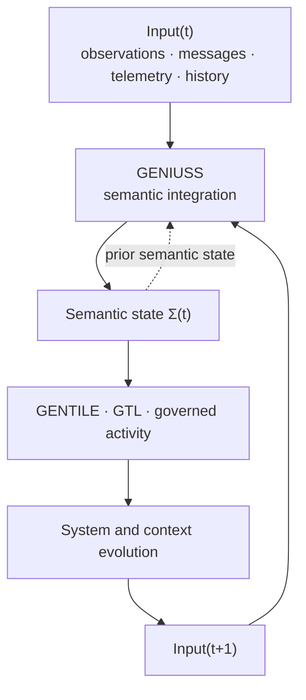

<!-- ages:authored — informative. This document does not define conformance requirements. -->

# GENIUSS — Graph Engine for Neural Integration and Understanding of Semantic Structures

**Status:** Exploratory · **Document class:** Informative · **Repository:** AGES

**Purpose.** Describe GENIUSS, a proposed functional engine within AGES, as a
conceptual model and draft architecture for transforming heterogeneous,
contextual input into an integrated and inspectable semantic structure.

GENIUSS is not a normative standard at this stage. It is a pre-specification
construct subject to research, experimentation and RFC review
([`../rfcs/0018-geniuss.md`](../rfcs/0018-geniuss.md)).

GENIUSS is a cognitive and semantic integration engine. It is **not** a
graphical rendering engine, a user-interface component, a graph database or a
prescribed neural architecture.

## 1. Definition

GENIUSS is an integrative and contextual interpretation engine.

It transforms:

```text
Heterogeneous observations
+ current context
+ prior semantic state
+ declared provenance
+ temporal context
```

into:

```text
A contextualised semantic structure describing what the system currently
understands about its environment, inputs, entities, relations and state
```

The core question answered by GENIUSS is:

> **What does this input mean in the current context?**

GENIUSS produces understanding, not intention and not action. Its output is a
reviewable representation of interpretation, including what remains uncertain,
ambiguous or merely hypothetical.

## 2. Meaning of “Neural” and of “Graph”

As in [GENTILE](06-GENTILE.md), the term *Neural* identifies the principal
AI-oriented implementation domain of GENIUSS. It does not prescribe an
exclusively neural implementation. A GENIUSS-compatible engine may be neural,
symbolic, neuro-symbolic, statistical, rule-based, model-driven, multi-agent,
human-in-the-loop or hybrid.

The term *Graph* identifies the architectural shape of the output — entities,
relations, roles and attributes carrying confidence, salience and temporal
context. It does not prescribe a particular storage technology, query language
or ontology.

The architectural requirements are not the internal computational technique,
but the preservation of:

- explicit entities, relations and roles;
- explicit confidence and competing hypotheses;
- provenance back to source observations;
- temporal context;
- separation from intent, authority and execution.

GENIUSS implements computational contextual understanding. The architecture
makes **no claim** of consciousness, subjective experience, phenomenal
awareness or sentience, and *sentience* must not be used as a technical
synonym for *understanding* in AGES documents.

## 3. Position among the functional engines

| Engine | Primary transformation | Core question | Primary output |
|---|---|---|---|
| GENIUSS | Heterogeneous contextual input → integrated semantic structure | What does this input mean in the current context? | Contextualised semantic structure with hypotheses and confidence |
| [GENTILE](06-GENTILE.md) | Intent, context and interactive language exchange → negotiated structured representation | What is intended? | Negotiated semantic artefact |
| [GTL](07-GTL.md) | Structured semantic artefact → grounded transitive action candidate | What operation could realise the intended state? | Technically executable, not-yet-authorised action candidate |
| AGES governance | Action candidate → governed decision | Is the candidate operation admissible and authorised? | Adjudicated decision under evidence, authority and effectivity |

The concise relationship is:

> **GENIUSS integrates meaning. GENTILE co-constructs intent. GTL grounds
> meaning into action. AGES governs what may proceed.**

The engines are complementary and not interchangeable:

```text
Understanding an input
≠ determining what an actor intends
≠ specifying an operation that could realise it
≠ authorising that operation
```

Document numbering in this directory reflects the order in which the
architecture was authored, not the order of the information flow.

## 4. Semantic structure

The GENIUSS output may be represented abstractly as:

```math
\Sigma(t) = \langle V,\ E,\ R,\ A,\ C,\ H,\ T \rangle
```

Where:

- $V$ is the set of entities, events and concepts;
- $E$ is the set of relations between them;
- $R$ is the set of semantic or functional roles;
- $A$ is the set of attributes and properties;
- $C$ is confidence and uncertainty;
- $H$ is the set of contextual hypotheses;
- $T$ is temporal and state information.

This is a conceptual contract, not a mandatory implementation schema. An
illustrative, non-normative rendering is given in
[`../schemas/examples/geniuss-semantic-structure.example.yaml`](../schemas/examples/geniuss-semantic-structure.example.yaml).

Where a semantic representation already exists in a profile or deployment,
GENIUSS should extend or map to it rather than introduce a competing model.

## 5. Recursive contextual interpretation

Interpretation at time $t$ may be conditioned by the semantic state
established at $t-1$:

```math
\Sigma(t) = F\big(X(t),\ \Sigma(t-1),\ \mathrm{context}(t)\big)
```

Where $X(t)$ is the heterogeneous input available at $t$.



Recursive conditioning is an interpretive mechanism only. It does not imply,
authorise or enable self-modification of the system baseline: any change to
the GENIUSS configuration itself remains a candidate change governed by the
Evolution Control Plane
([`01-architectural-planes.md`](01-architectural-planes.md)).

## 6. Inputs

GENIUSS may consume:

- natural-language statements;
- system state and configuration data;
- sensor readings;
- telemetry;
- machine-generated events and logs;
- visual or other perceptual channels;
- historical state and prior closure records;
- external structured data;
- previously produced semantic structures.

Every consumed input should carry, or be resolvable to, its provenance,
timestamp and integrity status
([`05-identity-and-provenance.md`](05-identity-and-provenance.md)).

## 7. Responsibilities

GENIUSS responsibilities may include:

- multimodal input integration;
- contextual interpretation;
- semantic grounding of references to identified objects;
- entity and relation construction;
- state estimation;
- salience attribution;
- confidence and uncertainty representation;
- hypothesis formation and maintenance;
- temporal integration;
- recursive updating of the current semantic and state representation.

GENIUSS must not:

- negotiate or determine user intent;
- authorise actions;
- execute actions;
- decide policy;
- collapse understanding into operational execution;
- create a direct path to any actuator.

## 8. Uncertainty and competing hypotheses

GENIUSS must not convert uncertain interpretation into false certainty.
Confidence, ambiguity and competing hypotheses must remain representable and
inspectable downstream. For example, an interpretation may retain several
mutually exclusive hypotheses with distinct confidences, including an explicit
*unknown* hypothesis.

Hypothesis records should indicate:

- the asserted interpretation;
- supporting and contradicting observations;
- confidence or another declared uncertainty measure;
- competing hypotheses not eliminated;
- the conditions under which the hypothesis would be revised.

Where ambiguity could materially affect safety, authority, effectivity or
system identity, the ambiguity must be propagated rather than resolved
silently. GENTILE may then expose it for negotiation
([`06-GENTILE.md`](06-GENTILE.md), section 8).

## 9. Semantic levels

GENIUSS may be probabilistic internally, but its architectural output must be
explicit and inspectable. The architecture distinguishes:

```text
observation
≠ inference
≠ hypothesis
≠ assertion
≠ decision
≠ action candidate
≠ authorisation
≠ execution
```

In particular:

```text
inference ≠ fact
action candidate ≠ authorised action
```

These levels must not collapse into one another, and a semantic structure
should label which level each element occupies.

## 10. Provenance and the evidence chain

Every GENIUSS interpretation should be traceable to the observations from
which it was derived:

```text
semantic assertion
    ↓ derived_from
observation(s)
    ↓ originated_from
source
```

The chain should preserve:

- provenance;
- timestamps;
- confidence;
- the identity and version of the transformation that produced the assertion;
- relevant contextual dependencies.

A downstream decision must be able, at least conceptually, to answer:

> Why does the system believe this?

Where a GENIUSS structure is used to support a governance decision, it enters
the evidence chain as an interpretation, not as a measurement, and remains
subject to evidence adjudication
([`03-evidence-and-authority.md`](03-evidence-and-authority.md)).

## 11. Interfaces

An implementation-neutral GENIUSS interface may expose the equivalent of:

```text
GENIUSS_INPUT
    heterogeneous observations
    current context
    prior semantic state
    provenance
    timestamp / temporal context

GENIUSS_OUTPUT
    semantic structure (entities · relations · roles · attributes)
    hypotheses
    confidence
    salience
    provenance
    temporal state
```

Potential downstream consumers:

```text
GENIUSS_OUTPUT
    ├── GENTILE
    ├── GTL
    ├── AGES evidence and governance services
    └── other authorised reasoning components
```

This list is illustrative and non-normative. No GENIUSS → actuator path is
defined by this architecture.

## 12. Position within the AGES planes

| Plane | GENIUSS participation |
|---|---|
| Operational Plane | Interprets operational inputs and system state under the active baseline; creates no baseline change by itself |
| Evolution Plane | Supplies contextual structures that may inform observation, candidate formation and validation interpretation |
| Evolution Control Plane | Supplies inspectable interpretations as evidentiary input; does not adjudicate, authorise or ratify |

A GENIUSS structure is not a candidate change:

```text
GENIUSS semantic structure
≠ GENTILE semantic artefact
≠ candidate change
≠ GTL action candidate
≠ authorised transition
≠ ratified baseline
```

## 13. Relation to GENTILE

GENIUSS establishes what an input means in context. GENTILE establishes what
an actor intends to achieve. The two must remain distinct: a correct
interpretation of a message is not a negotiated intent, and a negotiated
intent is not a validated interpretation of the environment.

GENIUSS should provide GENTILE with:

- identified entities and relations;
- the current contextual state representation;
- salience of the elements considered relevant;
- confidence and competing hypotheses;
- unresolved ambiguity;
- provenance and temporal context.

GENTILE may then use that structure as grounding context while eliciting,
clarifying and negotiating intent. GENTILE remains responsible for the
negotiated semantic artefact and for recording rejected interpretations.

## 14. Relation to GTL

GTL consumes sufficiently grounded semantic structures and intent artefacts
and produces bounded action candidates. GENIUSS may supply the object
identification, contextual preconditions and state estimates on which
grounding depends.

GTL must not treat a GENIUSS hypothesis as an established precondition. Where
a precondition rests on an inference, the action candidate should record the
dependency, its confidence and the verification required before execution
([`07-GTL.md`](07-GTL.md)).

## 15. Failure modes

Potential GENIUSS failure modes include:

- premature disambiguation;
- suppression of competing hypotheses;
- confidence inflation;
- loss of source attribution;
- conflation of inference with observation;
- conflation of interpretation with intent;
- stale prior state dominating new observations;
- feedback amplification across recursive updates;
- silent ontology or terminology drift;
- context poisoning and prompt injection through language inputs;
- adversarial sensor or telemetry manipulation;
- over-generalisation of a local interpretation to a wider effectivity scope.

Profiles should define detection, review and mitigation mechanisms
proportionate to risk.

## 16. Design principles

1. **Interpretation is not intent.**
2. **Interpretation is not authority.**
3. **Inference is not fact.**
4. **Uncertainty must survive integration.**
5. **Competing hypotheses must remain representable.**
6. **Every assertion must be traceable to its observations.**
7. **Temporal context must be explicit.**
8. **Prior semantic state may condition interpretation, not governance.**
9. **Semantic levels must not collapse.**
10. **No understanding path leads directly to an actuator.**

## 17. Open questions

- What minimum structure constitutes a usable semantic structure?
- How should confidence be represented across heterogeneous input classes?
- When may a hypothesis be promoted to an assertion, and by which authority?
- How should competing hypotheses be retired without losing provenance?
- How should recursive state be bounded to avoid feedback amplification?
- Which GENIUSS outputs qualify as evidence, and under which class?
- How should salience be declared, reviewed and audited?
- How should GENIUSS structures be reconciled when several engines disagree?
- How should semantic structures survive model, schema or repository
  migration?
- How should GENIUSS interact with profile-specific world models, such as
  those referenced by AGES-CPS baselines?

## Related

- [`01-architectural-planes.md`](01-architectural-planes.md)
- [`03-evidence-and-authority.md`](03-evidence-and-authority.md)
- [`05-identity-and-provenance.md`](05-identity-and-provenance.md)
- [`06-GENTILE.md`](06-GENTILE.md)
- [`07-GTL.md`](07-GTL.md)
- [`08-gentile-gtl-integration.md`](08-gentile-gtl-integration.md)
- [`../examples/geniuss-gentile-gtl-governance.md`](../examples/geniuss-gentile-gtl-governance.md)
- [`../GLOSSARY.md`](../GLOSSARY.md)
- [`../rfcs/0018-geniuss.md`](../rfcs/0018-geniuss.md)
