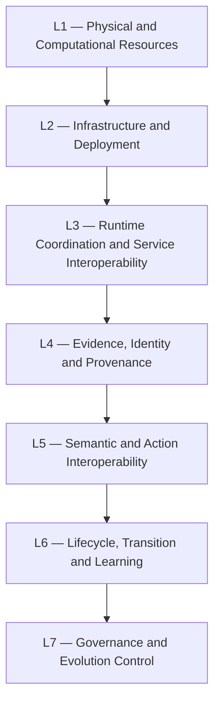
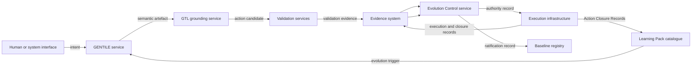

<!-- ages:seed v0.2.0 — exploratory scaffold; supersede through the RFC process. -->

# AI-II — Artificial Intelligence Interoperability and Infrastructure

**Status:** Exploratory · **Document class:** Informative · **Repository:** AGES

**Purpose.** Define AI-II as a proposed reference architecture for
interoperable, governable and evolutive artificial-intelligence systems.

AI-II is not itself an AI model, runtime, operating system or implementation.
Its intended role is to establish a shared architectural language, common
objects, interface boundaries and lifecycle contracts through which different
technical implementations may participate in an AGES-aligned system.

The comparison with the OSI model is an architectural aspiration and
explanatory analogy only. No claim of equivalent maturity, adoption,
standardisation or industry status is made.

## 1. Definition

**AI-II — Artificial Intelligence Interoperability and Infrastructure** is a
proposed reference architecture for AI-centred evolutive systems.

AI-II may define:

- state representations;
- system and component identities;
- lifecycle semantics;
- interface contracts;
- interoperability rules;
- infrastructure boundaries;
- transition protocols;
- evidence-exchange formats;
- effectivity semantics;
- provenance mechanisms;
- authority and governance interfaces;
- learning-pack and evolution-trigger interfaces;
- deployment and recovery interfaces;
- conformance-profile boundaries.

Its central question is:

> **Which shared architectural contracts allow heterogeneous AI, software,
> cyber-physical and governance components to evolve together without losing
> identity, provenance, authority or reconstructability?**

## 2. Position within AGES

AGES, AI-II and SAI-AUT-OS occupy different architectural levels.

| Construct | Role |
|---|---|
| AGES | Paradigm for governed continuity across ratified artificial-system states |
| AI-II | Reference architecture for interoperable AI-centred evolutive systems |
| SAI-AUT-OS | Operational Evolution Control Plane method and proposed open standard |
| GENTILE | Interactive semantic transformation engine |
| GTL | Grounded transitive action-language model |
| Learning Mechanics | Model for converting operational experience into governed evolutionary input |

The relationship is conceptual:

```text
AGES
defines the paradigm and lifecycle ontology

AI-II
defines interoperable architectural contracts

SAI-AUT-OS
operationalises selective evolution governance

GENTILE and GTL
structure meaning and executable action candidates

Learning Mechanics
feeds validated experience back into evolution
```

None of these relationships is yet a formal conformance dependency.

## 3. Architectural objective

AI-centred systems are commonly assembled from heterogeneous elements:

- foundation models;
- specialised models;
- deterministic services;
- agents;
- tools;
- memory systems;
- knowledge stores;
- policy engines;
- orchestration systems;
- model registries;
- data platforms;
- hardware;
- sensors and actuators;
- human authorities;
- external organisations.

Without shared contracts, each component may represent identity, state,
authority, evidence and deployment differently.

AI-II proposes a common architectural frame through which those elements may:

- identify themselves;
- exchange state and intent;
- describe candidate changes;
- expose authority requirements;
- exchange evidence;
- declare effectivity;
- execute bounded transitions;
- produce closure evidence;
- participate in ratification;
- preserve provenance;
- support recovery;
- contribute validated learning.

## 4. Reference architecture, not product architecture

AI-II should remain implementation-neutral.

It should not prescribe:

- one programming language;
- one cloud provider;
- one model architecture;
- one message broker;
- one database;
- one agent framework;
- one identity provider;
- one deployment platform;
- one cryptographic infrastructure;
- one robotics middleware;
- one vendor ecosystem.

Instead, AI-II should define the semantic and lifecycle obligations at the
interfaces among those systems.

A reference architecture may permit several technical realisations while
preserving compatible meaning.

## 5. Proposed architectural layers

AI-II may be described through seven conceptual layers.



The numbering is explanatory and exploratory. It does not assert direct
equivalence with the OSI model.

### L1 — Physical and computational resources

Possible contents:

- processors;
- accelerators;
- storage;
- networks;
- sensors;
- actuators;
- robotic platforms;
- vehicles;
- laboratory systems;
- edge devices;
- energy systems;
- physical environments.

This layer exposes resource identity, capability, state and constraints.

### L2 — Infrastructure and deployment

Possible contents:

- containers;
- virtual machines;
- schedulers;
- orchestration systems;
- model-serving platforms;
- package registries;
- infrastructure-as-code systems;
- firmware deployment;
- hardware configuration;
- runtime isolation;
- rollback infrastructure.

This layer exposes deployable units, target environments and recovery
mechanisms.

### L3 — Runtime coordination and service interoperability

Possible contents:

- service discovery;
- invocation contracts;
- messaging;
- event exchange;
- agent coordination;
- tool invocation;
- state synchronisation;
- workflow orchestration;
- runtime health;
- operational envelopes.

This layer supports operation under the active baseline.

### L4 — Evidence, identity and provenance

Possible contents:

- system identifiers;
- baseline identifiers;
- artefact references;
- evidence packages;
- signatures;
- attestations;
- provenance graphs;
- custody records;
- configuration digests;
- closure-evidence records.

This layer allows the system to prove what existed, what happened and how the
result was established.

### L5 — Semantic and action interoperability

Possible contents:

- GENTILE semantic artefacts;
- intent classes;
- controlled terminology;
- requirements;
- procedural representations;
- GTL action candidates;
- object models;
- operation vocabularies;
- preconditions;
- constraints;
- expected effects;
- recovery semantics.

This layer connects meaning with bounded action.

### L6 — Lifecycle, transition and learning

Possible contents:

- candidate changes;
- validation campaigns;
- controlled trials;
- deployment transitions;
- probation;
- ratification;
- rollback;
- recovery baselines;
- Action Closure Records;
- Learning Packs;
- Learning Aggregates;
- evolution triggers.

This layer represents how the system may move from one governed state to
another.

### L7 — Governance and Evolution Control

Possible contents:

- authority;
- delegation;
- evidence adjudication;
- effectivity adjudication;
- policy evaluation;
- invariant enforcement;
- trial authorisation;
- deployment authorisation;
- ratification authority;
- suspension;
- rollback governance;
- conformance profiles.

SAI-AUT-OS may operationalise significant parts of this layer.

## 6. Layer interaction principles

AI-II layers should follow these principles:

1. A lower layer may provide capability without granting authority.
2. A higher layer may impose semantic or governance constraints on lower-layer
   execution.
3. Identity and provenance should remain traceable across layer boundaries.
4. Effectivity should be preserved through transformations.
5. Translation between layers should not silently broaden meaning or
   authority.
6. Validation should be separable from generation.
7. Execution should remain distinguishable from ratification.
8. Recovery paths should be represented before deployment where technically
   applicable.

## 7. Core interoperable objects

AI-II may define common representations for:

- system identity;
- component identity;
- baseline;
- age;
- candidate change;
- semantic artefact;
- GTL action candidate;
- evidence package;
- authority record;
- effectivity;
- validation record;
- trial record;
- deployment record;
- closure-evidence record;
- ratification record;
- rollback or recovery record;
- Action Closure Record;
- Learning Pack;
- Learning Aggregate;
- evolution trigger.

These objects may be exchanged by reference rather than copied.

## 8. Identity object

A shared identity object should distinguish:

- persistent identity;
- current location;
- current custodian;
- active baseline;
- effectivity;
- configuration digest;
- provenance root;
- authority domain.

A component identity is not equivalent to the identity of the complete
system.

AI-II should permit component identities to be bound into a whole-system
baseline.

## 9. Baseline object

A baseline object may bind references to:

- source-code commits;
- executable artefacts;
- model checkpoints;
- parameters;
- memory and knowledge snapshots;
- policies;
- permissions;
- tools;
- infrastructure;
- hardware manifests;
- calibration;
- invariants;
- effectivity;
- evidence;
- recovery targets;
- ratification records.

AI-II should not require all content to be stored in one system.

It should support immutable references and verification across heterogeneous
record systems.

## 10. Semantic artefact interface

The semantic artefact interface may expose:

- artefact identity;
- class;
- declared intent;
- objective;
- rationale;
- context;
- assumptions;
- controlled terms;
- constraints;
- invariants;
- effectivity;
- authority claims;
- unresolved ambiguity;
- review status;
- provenance.

GENTILE may create or revise this object.

Consumers should not assume that semantic closure implies governance
authorisation.

## 11. Action-candidate interface

The action-candidate interface may expose:

- candidate identity;
- source semantic artefact;
- executor;
- operation;
- direct object;
- context;
- preconditions;
- operational envelope;
- expected effects;
- invariants;
- abort conditions;
- rollback or compensation;
- closure criteria;
- effectivity;
- authority references;
- provenance.

GTL may produce this object.

Consumers should not assume that technical executability implies permission to
execute.

## 12. Evidence-exchange interface

An evidence object should expose:

- evidence identity;
- producer;
- source;
- method;
- tool or instrument;
- time;
- subject;
- baseline;
- candidate;
- effectivity;
- result;
- uncertainty;
- assumptions;
- limitations;
- integrity proof;
- provenance.

Evidence interfaces should support:

- analytical evidence;
- simulation evidence;
- controlled-trial evidence;
- deployment evidence;
- closure evidence;
- monitoring evidence;
- negative and conflicting evidence.

Evidence transport should not erase its limitations.

## 13. Authority interface

An authority object should expose:

- authority identity;
- role;
- mandate;
- permitted actions;
- prohibited actions;
- delegated subject;
- delegation chain;
- effectivity;
- validity period;
- policy basis;
- revocation status;
- integrity proof.

AI-II should distinguish:

- proposal authority;
- validation authority;
- adjudication authority;
- trial authority;
- deployment authority;
- ratification authority;
- suspension authority;
- recovery authority.

An authority object should be independently verifiable where proportionate to
risk.

## 14. Effectivity interface

An effectivity object may describe:

- organisations;
- products;
- configurations;
- instances;
- cohorts;
- environments;
- jurisdictions;
- operating modes;
- lifecycle stages;
- temporal validity;
- exclusions;
- inheritance;
- precedence.

Effectivity should be propagated through:

```text
semantic artefact
→ candidate change
→ validation
→ controlled trial
→ deployment
→ probation
→ baseline
```

Expansion should require explicit governance.

## 15. Lifecycle interface

AI-II may define lifecycle states such as:

```text
Observed
→ Proposed
→ Semantically structured
→ Classified
→ Candidate formed
→ Grounded
→ Pre-validated
→ Trial-authorised
→ Trialled
→ Deployment-adjudicated
→ Deployment-authorised
→ Deployed
→ In probation
→ Closure-verified
→ Ratified
→ Monitored
→ Suspended, rolled back or recovered
```

Profiles may combine or omit states where justified, but the semantic
distinctions should remain reconstructable.

## 16. Transition protocol

A transition protocol may define messages or records equivalent to:

- propose candidate;
- submit semantic artefact;
- submit GTL candidate;
- request validation;
- submit validation evidence;
- request controlled-trial authority;
- authorise trial;
- submit trial evidence;
- request deployment authority;
- authorise deployment;
- report execution;
- submit closure evidence;
- request ratification;
- ratify baseline;
- suspend baseline;
- authorise rollback;
- establish recovery baseline.

The protocol should preserve:

- correlation identifiers;
- source baseline;
- candidate identity;
- effectivity;
- authority;
- timestamps;
- evidence references;
- decision status;
- provenance.

## 17. Learning interface

AI-II may define interfaces for:

- task-closure detection;
- Action Closure Record submission;
- Learning Pack formation;
- pack validation;
- catalogue registration;
- pack comparison;
- Learning Aggregate formation;
- learning-signal publication;
- evolution-trigger creation;
- candidate-change initiation.

A Learning Pack interface should preserve:

- source baseline;
- task and action identities;
- effectivity;
- evidence;
- outcome class;
- deviation and recovery records;
- quality;
- provenance;
- automation level;
- trigger-policy references.

See [`09-learning-mechanics.md`](09-learning-mechanics.md).

## 18. SAI-AUT-OS interface profile

SAI-AUT-OS may define an operational AI-II profile for the Evolution Control
Plane.

It may expose services equivalent to:

- register candidate;
- resolve baseline impact;
- evaluate policy;
- validate authority;
- validate effectivity;
- register evidence;
- request independent validation;
- adjudicate evidence;
- issue trial authority;
- issue deployment authority;
- register closure evidence;
- ratify baseline;
- suspend baseline;
- authorise recovery;
- catalogue Learning Packs;
- apply evolution-trigger policy.

SAI-AUT-OS should not require one implementation topology.

## 19. GENTILE and GTL interface profile

A GENTILE–GTL AI-II profile may define:

```text
GENTILE semantic artefact
→ classification interface
→ candidate-change interface
→ GTL grounding interface
→ validation interface
→ authority interface
→ execution adapter
```

The interface should preserve the semantic relationship from source intent to
executed action.

Translation into a domain-specific command must remain traceable to the GTL
candidate and source semantic artefact.

## 20. Runtime and control-plane separation

AI-II should distinguish runtime execution from evolution governance.

The Operational Plane may require:

- low latency;
- deterministic control;
- local autonomy;
- independent safety;
- offline operation.

The Evolution Control Plane may require:

- stronger evidence;
- distributed authority;
- long-running adjudication;
- policy evaluation;
- ledger persistence;
- organisational review.

Therefore, AI-II should permit bounded prior authority so that runtime systems
may act immediately inside a delegated operational envelope without consulting
the Control Plane for every decision.

Changes to the envelope itself may require evolutionary governance.

## 21. Controlled-trial infrastructure

AI-II may identify controlled-trial environments such as:

- simulation;
- software-in-the-loop;
- digital twin;
- hardware-in-the-loop;
- sandbox;
- staging;
- shadow mode;
- canary deployment;
- laboratory cells;
- limited fleet cohorts.

A trial interface should expose:

- trial identity;
- candidate;
- source baseline;
- environment;
- effectivity;
- authority;
- limits;
- monitoring;
- abort conditions;
- restoration or compensation;
- evidence outputs.

## 22. Deployment and probation interface

A deployment interface should expose:

- authorised candidate;
- target environment;
- target instances;
- deployment sequence;
- configuration references;
- rollback target;
- compensation plan;
- authority;
- effectivity;
- execution result.

A probation interface should expose:

- provisional configuration;
- monitoring requirements;
- closure criteria;
- maximum duration;
- anomalies;
- rollback readiness;
- ratification status.

A deployed configuration should not be represented as canonical merely because
deployment completed.

## 23. Recovery interface

AI-II should distinguish:

- rollback;
- compensation;
- containment;
- safe-state transition;
- recovery action;
- recovery baseline;
- declared irreversibility.

A recovery record should expose:

- trigger;
- authority;
- active baseline;
- affected effectivity;
- action;
- irreversible effects;
- resulting state;
- closure evidence;
- baseline decision.

## 24. Infrastructure boundaries

AI-II should identify boundaries among:

- system-of-record services;
- execution systems;
- evidence systems;
- authority systems;
- registries;
- policy engines;
- learning catalogues;
- human interfaces;
- external organisations.

A component may participate in more than one function, but its roles should
remain explicit.

For higher-risk profiles, separation of duties may require distinct services
or organisational owners.

## 25. Interoperability modes

AI-II may support several interoperability modes.

### Reference interoperability

Systems exchange immutable references to externally stored objects.

### Schema interoperability

Systems exchange objects conforming to shared schemas.

### Semantic interoperability

Systems share controlled meanings for state, authority, evidence and action.

### Lifecycle interoperability

Systems coordinate valid state transitions and governance events.

### Evidentiary interoperability

Systems preserve evidence quality, provenance, limitations and effectivity.

### Operational interoperability

Systems execute compatible bounded actions through adapters.

No single mode is sufficient by itself.

## 26. Adapters and gateways

Legacy or domain-specific systems may participate through adapters.

An adapter should declare:

- source and target interface;
- transformation;
- information lost;
- assumptions;
- authority boundary;
- effectivity;
- validation;
- version;
- provenance.

Adapter success does not prove semantic equivalence.

Critical transformations may require independent testing or formal assurance.

## 27. Service discovery and capability declaration

AI-II may define how a component advertises:

- identity;
- interface version;
- capabilities;
- supported object types;
- supported operations;
- authority requirements;
- evidence outputs;
- effectivity;
- lifecycle support;
- security properties.

Capability discovery must remain distinct from permission discovery.

A service may advertise that it can deploy a model without being authorised
to deploy a particular model to a particular environment.

## 28. Versioning and compatibility

AI-II objects and interfaces should support explicit versioning.

Versioning should distinguish:

- schema version;
- semantic version;
- protocol version;
- implementation version;
- baseline version;
- canonicalisation version.

Compatibility may be:

- backward compatible;
- forward compatible;
- adapter-compatible;
- semantically equivalent;
- unsupported;
- unsafe.

Schema compatibility does not automatically imply lifecycle or semantic
compatibility.

## 29. Security and trust boundaries

AI-II should support explicit trust boundaries.

Potential concerns include:

- identity spoofing;
- authority forgery;
- evidence tampering;
- replay;
- object substitution;
- effectivity expansion;
- policy bypass;
- provenance truncation;
- malicious adapters;
- learning-pack poisoning;
- hidden model substitution;
- unauthorised runtime escalation.

Possible mechanisms include:

- mutual authentication;
- signed objects;
- least privilege;
- replay protection;
- immutable provenance;
- hardware attestation;
- policy enforcement;
- audit;
- independent validation;
- compartmentalisation.

AI-II does not prescribe one universal trust model.

## 30. Privacy and confidentiality

Interoperable provenance and evidence may contain sensitive information.

AI-II should permit:

- scoped disclosure;
- redaction;
- access-controlled references;
- encrypted evidence;
- privacy-preserving attestations;
- jurisdictional restrictions;
- retention policies;
- deletion markers where legally required.

Confidentiality controls must not silently remove information material to an
authority decision.

## 31. Distributed and disconnected operation

AI-II should consider systems that are:

- geographically distributed;
- intermittently connected;
- offline;
- operating under local authority;
- synchronised after the event.

Such systems may require:

- local delegated authority;
- signed event chains;
- logical clocks;
- later reconciliation;
- conflict detection;
- quarantine of disputed states;
- provisional effectivity;
- delayed ratification.

Disconnected operation must not erase the need for provenance.

## 32. Multi-organisation interoperability

AI-II may span:

- system manufacturers;
- operators;
- maintainers;
- regulators;
- model providers;
- cloud providers;
- data providers;
- independent validators;
- customers;
- research partners.

Cross-organisation interfaces should define:

- authority boundaries;
- evidence ownership;
- custody;
- confidentiality;
- jurisdiction;
- liability records;
- retention;
- dispute resolution;
- revocation.

AI-II does not itself establish legal authority.

## 33. Minimal conceptual interface set

An exploratory minimal interface set may include:

```text
Identity Interface
Baseline Interface
Semantic Artefact Interface
Candidate Change Interface
GTL Action Candidate Interface
Evidence Interface
Authority Interface
Effectivity Interface
Validation Interface
Trial Interface
Deployment Interface
Closure Interface
Ratification Interface
Recovery Interface
Learning Pack Interface
Ledger Interface
```

Profiles may select subsets according to scope and risk.

## 34. Example object exchange



This is a conceptual topology, not a required deployment architecture.

## 35. Conformance profiles

AI-II may eventually define profiles such as:

- AI-II Core Identity Profile;
- AI-II Evidence Exchange Profile;
- AI-II GENTILE Semantic Artefact Profile;
- AI-II GTL Action Candidate Profile;
- AI-II Evolution Transition Profile;
- AI-II Learning Pack Profile;
- AI-II Cyber-Physical Profile;
- AI-II SAI-AUT-OS Control-Plane Profile;
- AI-II Fleet Effectivity Profile;
- AI-II Recovery Profile.

This repository does not yet define formal conformance requirements.

## 36. Relationship to conventional middleware

AI-II does not replace:

- service meshes;
- robotics middleware;
- agent frameworks;
- workflow systems;
- event buses;
- model-serving platforms;
- registries;
- DevOps tools;
- configuration-management systems.

Those technologies may implement parts of AI-II.

The proposed distinction is that AI-II defines cross-system semantics for
identity, evolution, evidence, authority and ratification that conventional
middleware does not necessarily provide as one integrated reference model.

## 37. Relationship to version control and registries

Git, model registries, package registries and evidence stores may act as
underlying record systems.

AI-II may define how their immutable references are bound into:

- baselines;
- transition records;
- evidence packages;
- Learning Packs;
- ratification records.

The reference architecture should orchestrate rather than duplicate those
systems.

## 38. Design principles

AI-II should follow these principles:

1. **Interoperability requires shared semantics, not only shared transport.**
2. **Identity must survive implementation and custodian changes.**
3. **Capability must remain distinct from authority.**
4. **Evidence must preserve scope, provenance and limitations.**
5. **Effectivity must be explicit and propagatable.**
6. **Semantic agreement must remain distinct from execution authority.**
7. **Technical executability must remain distinct from permission.**
8. **Validation must remain separable from generation.**
9. **Trial authority must remain distinct from deployment authority.**
10. **Deployment must remain distinct from ratification.**
11. **Learning may trigger evolution but must not bypass governance.**
12. **Adapters must disclose semantic loss.**
13. **Recovery and irreversibility must be represented explicitly.**
14. **Profiles should be composable and implementation-neutral.**
15. **The complete transition chain must remain reconstructable.**

## 39. Open questions

- What is the minimum AI-II Core?
- Which objects should have stable common schemas?
- Should AI-II define layers, planes, profiles or all three?
- How should semantic compatibility be tested?
- How should authority be federated across organisations?
- Which provenance fields are mandatory?
- How should AI-II support offline and disconnected operation?
- How should baseline identity span physical and digital components?
- How should adapters declare semantic loss?
- Which interfaces require synchronous versus asynchronous exchange?
- How should distributed ratification work?
- How should Learning Packs be exchanged across system families?
- How should privacy-preserving evidence be represented?
- How should version negotiation interact with baseline effectivity?
- Which profiles are appropriate for low-risk software-only systems?
- Which profiles are required for cyber-physical systems?
- How should AI-II relate to existing open standards without duplicating them?
- What should be normative in a future specification?
- How should reference implementations be separated from the reference model?

## 40. Unresolved issues

- layer boundaries;
- minimum core object set;
- common schema governance;
- semantic versioning;
- distributed authority;
- cross-jurisdictional effectivity;
- evidence interoperability;
- adapter assurance;
- long-term identifier durability;
- offline reconciliation;
- privacy-preserving provenance;
- learning-pack portability;
- cryptographic agility;
- profile composition;
- conformance testing;
- reference implementation scope.

## Related

- [`01-architectural-planes.md`](01-architectural-planes.md)
- [`02-state-and-transition-model.md`](02-state-and-transition-model.md)
- [`03-evidence-and-authority.md`](03-evidence-and-authority.md)
- [`04-effectivity.md`](04-effectivity.md)
- [`05-identity-and-provenance.md`](05-identity-and-provenance.md)
- [`06-GENTILE.md`](06-GENTILE.md)
- [`07-GTL.md`](07-GTL.md)
- [`08-gentile-gtl-integration.md`](08-gentile-gtl-integration.md)
- [`09-learning-mechanics.md`](09-learning-mechanics.md)
- [`../positioning/AI-II-within-AGES.md`](../positioning/AI-II-within-AGES.md)
- [`../schemas/README.md`](../schemas/README.md)
- [`../models/README.md`](../models/README.md)
- [`../research/open-questions.md`](../research/open-questions.md)
