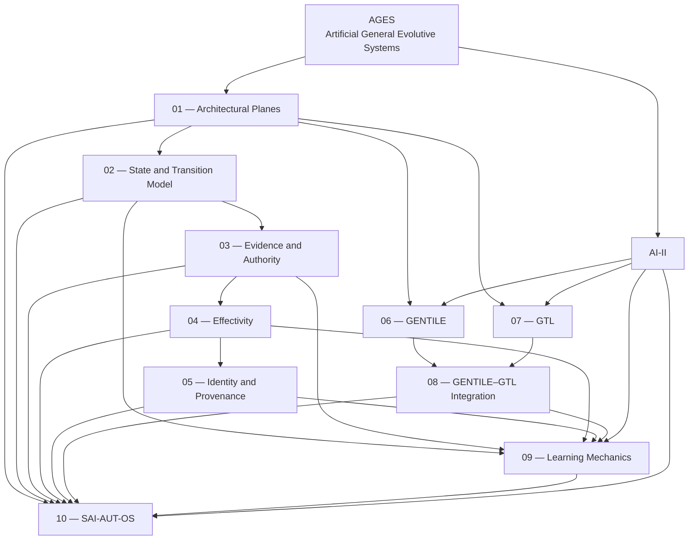

<!-- ages:authored — informative. This document does not define conformance requirements. -->

# AGES Architecture

**Status:** Exploratory · **Document class:** Informative · **Repository:** AGES

**Purpose.** Provide the architectural index and recommended reading order for
the AGES paradigm, its functional engines, learning mechanics, reference
architecture and operational Evolution Control Plane.

The documents in this directory describe how an artificial evolutive system
may preserve governed continuity across:

- current operation;
- candidate generation;
- validation;
- controlled trials;
- adjudication;
- deployment;
- closure verification;
- baseline ratification;
- monitoring;
- learning;
- rollback and recovery.

This architecture remains a pre-specification. It does not yet define formal
conformance requirements, certification or a completed mathematical theory.

## 1. Architectural scope

AGES decomposes an artificial evolutive system into three coordinated planes:

```math
\mathrm{AGES} := \langle O,\ E,\ C_E \rangle
```

Where:

- $O$ is the **Operational Plane**;
- $E$ is the **Evolution Plane**;
- $C_E$ is the **Evolution Control Plane**.

The decomposition is architectural, not arithmetic.

The core distinction is:

```text
Operational Plane
What does the system do under its current baseline?

Evolution Plane
What could the system become?

Evolution Control Plane
What is the system permitted to become?
```

## 2. Recommended reading order

| Order | Document | Purpose |
|---:|---|---|
| 1 | [`01-architectural-planes.md`](01-architectural-planes.md) | Defines the Operational, Evolution and Evolution Control planes |
| 2 | [`02-state-and-transition-model.md`](02-state-and-transition-model.md) | Defines the candidate-to-ratified-baseline lifecycle |
| 3 | [`03-evidence-and-authority.md`](03-evidence-and-authority.md) | Defines evidence classes, sufficiency, authority and adjudication |
| 4 | [`04-effectivity.md`](04-effectivity.md) | Defines where, when and to which systems a change or baseline applies |
| 5 | [`05-identity-and-provenance.md`](05-identity-and-provenance.md) | Defines baseline identity, provenance and reconstructability |
| 6 | [`06-GENTILE.md`](06-GENTILE.md) | Defines interactive semantic co-construction |
| 7 | [`07-GTL.md`](07-GTL.md) | Defines grounded transitive action candidates |
| 8 | [`08-gentile-gtl-integration.md`](08-gentile-gtl-integration.md) | Connects semantic artefacts to governed execution |
| 9 | [`09-learning-mechanics.md`](09-learning-mechanics.md) | Defines Learning Packs, learning signals and evolution triggers |
| 10 | [`10-SAI-AUT-OS.md`](10-SAI-AUT-OS.md) | Defines the operational Evolution Control Plane |
| 11 | [`AI-II.md`](AI-II.md) | Defines the interoperability and infrastructure reference architecture |

## 3. Architectural map



The diagram represents conceptual dependency and relationship, not build order
or required implementation topology.

## 4. Core lifecycle

The complete evolutionary lifecycle is:

```text
Observe
→ Propose or trigger candidate
→ Register candidate and affected configuration items
→ Collect initial evidence
→ Pre-deployment validation
→ Preliminary adjudication
→ Controlled-trial authorisation
→ Controlled trial
→ Trial-evidence validation
→ Deployment adjudication
→ Operational deployment authorisation
→ Deployment
→ Post-deployment verification and probation
→ Closure evidence
→ Baseline ratification
→ Monitoring
→ Continued operation, suspension, rollback or recovery
```

A controlled trial may be omitted only where a declared profile or policy
considers it technically inapplicable or disproportionate to risk.

The ordering constraints are:

1. semantic representation precedes grounding;
2. grounding precedes candidate-specific validation;
3. validation precedes adjudication;
4. trial authority precedes governed trial execution;
5. deployment authority precedes deployment;
6. deployment precedes closure verification;
7. closure evidence precedes baseline ratification;
8. failed or inconclusive execution does not automatically create a new
   baseline.

## 5. Fundamental state distinctions

The architecture preserves the following distinctions:

```text
Intent
≠ semantic artefact
≠ candidate change
≠ GTL action candidate
≠ validated candidate
≠ trial-authorised action
≠ operationally authorised action
≠ completed deployment
≠ closure-verified resulting state
≠ ratified baseline
```

Likewise:

```text
Capability ≠ authority
Semantic agreement ≠ governance authorisation
Technical executability ≠ permission to execute
Evidence production ≠ evidence adjudication
Deployment completion ≠ baseline ratification
```

## 6. Architectural planes

### Operational Plane

The Operational Plane contains the currently authorised runtime system.

Possible contents include:

- runtime components;
- models and agents;
- interfaces and tools;
- memory and knowledge;
- infrastructure;
- sensors and actuators;
- real-time control;
- runtime safety;
- delegated operational adaptation.

Operational actions do not automatically create new baselines.

### Evolution Plane

The Evolution Plane contains mechanisms that generate and test possible
successor configurations.

Possible contents include:

- observation;
- candidate generation;
- training and tuning;
- GENTILE semantic transformation;
- GTL action grounding;
- static validation;
- simulation;
- software-in-the-loop;
- digital twins;
- hardware-in-the-loop;
- controlled trials;
- deployment mechanics;
- evidence collection.

### Evolution Control Plane

The Evolution Control Plane determines what the system is permitted to become.

Possible contents include:

- configuration identification;
- CCI management;
- policy;
- authority;
- effectivity;
- evidence adjudication;
- risk;
- invariant enforcement;
- trial authorisation;
- deployment authorisation;
- probation;
- ratification;
- suspension;
- rollback and recovery;
- ledger management.

SAI-AUT-OS operationalises this plane.

## 7. GENTILE and GTL

### GENTILE

**GENTILE — Generative Engine for Neural Transformation through Interactive
Language Exchange**

GENTILE transforms intent, context and interactive language exchange into a
negotiated, structured and reviewable semantic artefact.

> **GENTILE co-constructs meaning.**

It does not automatically:

- create a candidate change;
- authorise execution;
- resolve all ambiguity;
- grant governance authority.

### GTL

**GTL — Generative Transitive Language**

GTL transforms a structured semantic artefact into a grounded transitive
action candidate.

> **GTL grounds meaning into action.**

Every grounded action should identify:

- executor;
- transitive operation;
- direct object;
- context;
- preconditions;
- operational limits;
- expected effects;
- invariants;
- failure and abort behaviour;
- rollback or compensation;
- closure evidence;
- effectivity;
- authority;
- provenance.

A GTL candidate is technically executable but not yet authorised.

## 8. Learning mechanics

Operational experience may be transformed into governed evolutionary input.

The learning chain is:

```text
Executed actions
→ Action Closure Records
→ Composite-task closure
→ Learning Pack candidate
→ Pack validation
→ Learning Pack Catalogue
→ Learning Aggregate
→ Learning Signal
→ Evolution Trigger
→ GENTILE evolutionary artefact
→ Candidate change
```

A Learning Pack is an immutable, provenance-bound package of operational
experience.

It may represent:

- nominal success;
- degraded success;
- fallback success;
- safe abort;
- compensation;
- recovery;
- failure;
- anomaly;
- inconclusive evidence.

The architecture does not equate successful repetition with justified
evolution.

```text
Validated Learning Pack
≠ candidate change
≠ deployment authority
≠ successor baseline
```

## 9. SAI-AUT-OS

**SAI-AUT-OS — Selective AI for Autonomous Upgrade and Tuning — Open
Standard**

SAI-AUT-OS is the proposed operational method for selective AI evolution.

It may provide:

- Cognitive Configuration Item registration;
- candidate registration;
- evidence orchestration;
- validation orchestration;
- policy and invariant evaluation;
- authority evaluation;
- effectivity enforcement;
- controlled-trial governance;
- deployment governance;
- probation tracking;
- closure verification;
- baseline ratification;
- Learning Pack cataloguing;
- evolution-trigger policy;
- rollback, compensation and recovery;
- baseline and evolution ledger.

Its core principle is:

> **Not every component may evolve, not every observation should become a
> change, and not every technically successful change should become a new
> baseline.**

## 10. AI-II

**AI-II — Artificial Intelligence Interoperability and Infrastructure**

AI-II is the proposed reference architecture for interoperable AI-centred
evolutive systems.

It may define shared interfaces for:

- identity;
- baseline;
- semantic artefacts;
- GTL action candidates;
- evidence;
- authority;
- effectivity;
- validation;
- controlled trials;
- deployment;
- closure;
- ratification;
- recovery;
- Learning Packs;
- ledgers.

AI-II is implementation-neutral.

It may be realised through existing:

- repositories;
- registries;
- service meshes;
- robotics middleware;
- workflow engines;
- model-serving platforms;
- evidence systems;
- configuration databases;
- deployment infrastructure.

## 11. Identity and governed continuity

AGES identifies the system through more than its current configuration.

A conceptual identity relation is:

```math
\mathrm{Identity}(t)
=
\left\langle
B_n,\;
\mathcal{T}_{0:n},\;
\mathcal{I}_n,\;
E_f,\;
P_n
\right\rangle
```

Where:

- $B_n$ is the active canonical baseline;
- $\mathcal{T}_{0:n}$ is the ratified transition history;
- $\mathcal{I}_n$ is the applicable invariant set;
- $E_f$ is active effectivity;
- $P_n$ is the relevant provenance state.

This expression is exploratory.

The central proposition is:

> **An artificial evolutive system is not a photograph of one configuration.
> It is the governed continuity of its ratified states.**

## 12. Evidence, authority and effectivity

Every candidate transition should bind:

- evidence;
- competent authority;
- effectivity;
- applicable invariants;
- risk;
- validation;
- recovery provisions.

Evidence answers:

> What is known, how was it established and within which limits?

Authority answers:

> Who or what is permitted to decide, act, delegate, ratify, suspend or
> reverse?

Effectivity answers:

> Where, when and to which systems, instances, environments or jurisdictions
> does the object apply?

None of these dimensions should be inferred silently.

## 13. Baselines and ages

A **baseline** is the complete canonical configuration identity of the
governed system under declared effectivity.

An **age** is the validity interval during which a ratified baseline remains
canonical.

Ratification:

- closes the preceding age;
- establishes the successor baseline;
- opens the next age.

Multiple baselines may be simultaneously canonical under different
effectivity partitions.

Whether those partitions constitute concurrent ages or one partitioned system
remains an open research question.

## 14. Recovery semantics

The architecture distinguishes:

| Recovery concept | Meaning |
|---|---|
| Rollback | Restore a recoverable prior configuration or state |
| Compensation | Mitigate effects without recreating the exact prior state |
| Containment | Prevent further propagation |
| Safe-state transition | Enter a bounded safe condition |
| Recovery action | Establish a stable state after abnormal execution |
| Recovery baseline | Ratify a new canonical state after failure or anomaly |
| Declared irreversibility | Record that exact restoration is impossible |

Rollback is not assumed to be universally possible.

For cyber-physical systems, recovery must account for physical irreversibility.

## 15. Repository relationships

This directory is supported by:

- [`../theory/`](../theory/) — conceptual foundations;
- [`../models/`](../models/) — formal and semi-formal models;
- [`../schemas/`](../schemas/) — structured object representations;
- [`../examples/`](../examples/) — illustrative scenarios;
- [`../positioning/`](../positioning/) — boundary-setting and comparison;
- [`../research/`](../research/) — unresolved questions;
- [`../rfcs/`](../rfcs/) — proposed change and maturation process.

The architecture documents should remain aligned with the deterministic
repository generator or scaffold source of truth.

## 16. Document dependency matrix

| Document | Depends principally on | Feeds principally into |
|---|---|---|
| 01 Architectural Planes | AGES core paradigm | All architecture documents |
| 02 State and Transition Model | Architectural planes | Evidence, effectivity, learning, SAI-AUT-OS |
| 03 Evidence and Authority | Transition model | Adjudication and control-plane design |
| 04 Effectivity | Transition and authority | Validation, deployment, baseline identity |
| 05 Identity and Provenance | Baselines, transitions, effectivity | Ledger, ratification, reconstructability |
| 06 GENTILE | Planes, authority, provenance | Candidate formation and GTL |
| 07 GTL | GENTILE, effectivity, authority | Validation, trial, deployment |
| 08 GENTILE–GTL Integration | GENTILE and GTL | Full semantic-to-execution lifecycle |
| 09 Learning Mechanics | Closure, evidence, provenance | Evolution triggers and SAI-AUT-OS |
| 10 SAI-AUT-OS | Documents 01–09 | Operational governance implementation |
| AI-II | Entire architecture | Interoperability profiles and interfaces |

## 17. Scope boundaries

The architecture does not yet claim:

- a completed mathematical theory;
- a universal AI architecture;
- a universal action language;
- autonomous legal authority;
- certification;
- guaranteed rollback;
- complete physical-world representation;
- universal formal verification;
- unrestricted machine self-modification;
- automatic baseline ratification by default;
- replacement of Git, MLOps, DevOps or robotics middleware;
- industry adoption or standard status.

## 18. Design principles

1. **Governed continuity is the primary architectural concern.**
2. **Operation, evolution and evolution control remain distinct.**
3. **Intent is not execution.**
4. **Semantic agreement is not authority.**
5. **Technical executability is not permission.**
6. **Validation execution is distinct from adjudication.**
7. **Trial authority is distinct from deployment authority.**
8. **Deployment is distinct from ratification.**
9. **Closure evidence precedes canonical identity.**
10. **Effectivity must remain explicit.**
11. **Identity includes reconstructable transition history.**
12. **Learning may trigger evolution but must not bypass governance.**
13. **Recovery and irreversibility must be declared honestly.**
14. **Negative evidence, dissent and failed trials must be preserved.**
15. **The active baseline remains canonical until successor ratification.**
16. **Automation must remain proportionate to risk and delegated authority.**

## 19. Open architectural questions

- What is the minimum AGES architecture profile?
- Which objects should eventually become normative?
- Which plane boundaries require organisational independence?
- When may controlled trials be omitted?
- How should concurrent canonical baselines be modelled?
- Which identity anchors are constitutive?
- How should distributed authority and ratification work?
- Which Learning Pack thresholds may trigger automatic candidate formation?
- Under what conditions may deployment or ratification be automated?
- How should recovery baselines preserve identity after irreversible change?
- How should AI-II profiles align with existing standards?
- How should SAI-AUT-OS conformance be tested?
- How should schema, semantic and lifecycle versions interact?
- How should long-lived systems preserve provenance across custodian changes?

## 20. Closing statement

> **AGES treats artificial evolution not as uncontrolled change, but as an
> engineered continuity of governed states.**
