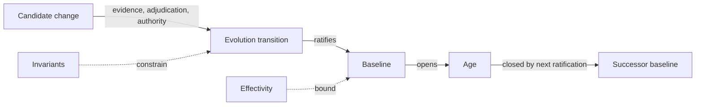

<!-- ages:seed v0.2.0 — exploratory scaffold; supersede through the RFC process. -->

# Minimal Conceptual Model

**Status:** Exploratory · **Document class:** Experimental model · **Repository:** AGES
**Purpose.** Relate the core objects in one picture.

$$
\mathrm{AGES} := \langle\, O,\ E,\ C_E \,\rangle
$$

Plain-language reading: candidates become transitions only through
evidence, adjudication and authority; transitions ratify baselines;
baselines open ages; invariants constrain transitions; effectivity
bounds where baselines apply. This is a minimal conceptual model, not a
formal theory.
