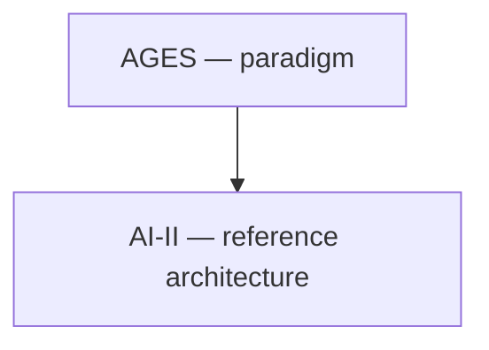

<!-- ages:authored — informative. This document does not define conformance requirements. -->

# AI-II within AGES

**Status:** Exploratory · **Document class:** Informative · **Repository:** AGES
The AI-II reference architecture (Artificial Intelligence
Interoperability and Infrastructure) is a possible architectural
realisation of the AGES paradigm for AI-centred systems: it may specify
how evolutionary states are represented, interconnected and made
interoperable — state representations, lifecycle semantics, interface
contracts, transition protocols, evidence exchange formats, identity and
provenance mechanisms, effectivity semantics.

AI-II is optional with respect to AGES, and AGES makes no claim about
AI-II's maturity or adoption. See
[`../architecture/AI-II.md`](../architecture/AI-II.md).
