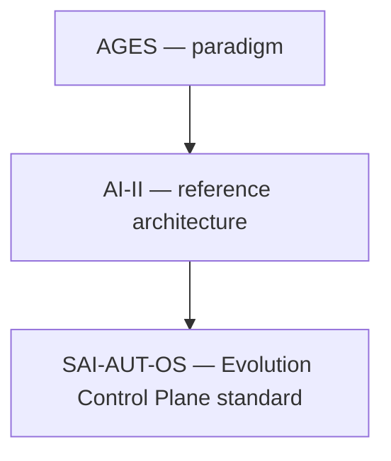

<!-- ages:authored — informative. This document does not define conformance requirements. -->

# SAI-AUT-OS within AGES

**Status:** Exploratory · **Document class:** Informative · **Repository:** AGES
The SAI-AUT-OS open standard (Selective AI for Autonomous Upgrade and
Tuning — Open Standard) is an independent, specification-first open
standard defining an Evolution Control Plane for governed AI evolution.
Within the AGES vocabulary, it operationalises the Evolution Control
Plane: selective mutability, cognitive configuration items, evidence
packages, effectivity, authority, policy and validation adjudication,
baselines, traceability, ledger management, deployment authorisation,
rollback and conformance.

This is one possible ecosystem stack, not a normative dependency chain:
the SAI-AUT-OS open standard is governed in its own repository, remains
usable without adopting AGES or AI-II, and its conformance language is
not normative here.
