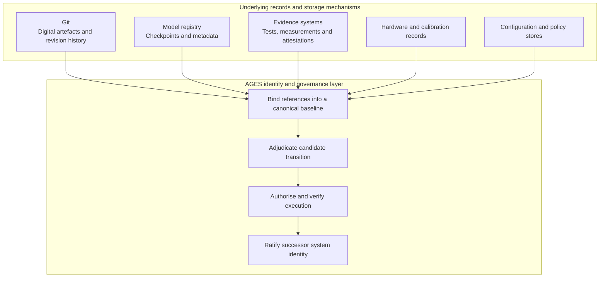

<!-- ages:authored — informative. This document does not define conformance requirements. -->

# AGES vs. Conventional Version Control and Model Checkpoints

**Status:** Exploratory positioning  
**Document class:** Informative  
**Repository:** AGES

## 1. Architectural scope

Conventional version-control systems are designed primarily to identify
and relate revisions of tracked artefacts. Git does this exceptionally
well: it gives every repository tree and every commit a stable identity,
relates revisions through an explicit graph, and supports distributed
collaboration on digital artefacts. Model checkpoints capture selected
computational state, commonly model parameters and associated training
metadata, at a declared point in a training or deployment process.

AGES addresses a different question: the identity of the complete
governed artificial system across change.

> **Standard version control records how tracked artefacts change. Model
> checkpoints record selected computational states. AGES proposes a
> broader identity and continuity model in which an artificial system is
> defined by the authorised, evidence-supported and reconstructable
> sequence connecting one ratified whole-system baseline to the next.**

The difference is one of architectural scope and semantics, not of tool
superiority. Git is neither primitive nor insufficient for its intended
purpose, and nothing in AGES makes it obsolete. AGES is not a
replacement for Git, for model registries or for checkpoints; it is a
higher-level system-identity and governance model under which such
mechanisms may operate.

## 2. The core distinction

> **Git tracks revisions of artefacts. AGES tracks the governed
> continuity of a system.**

A revision graph answers what a set of tracked files looked like at a
given identifier and how that state relates to others. Governed
continuity, as defined in
[`../theory/05-governed-continuity.md`](../theory/05-governed-continuity.md),
additionally requires that each change of the canonical system
configuration was authorised by a declared authority, supported by
evidence, bounded by effectivity, checked against invariants and
ratified into a successor baseline — and that this entire transition can
be reconstructed.

Git, model registries, evidence systems, hardware manifests and
configuration databases may all operate as mechanisms beneath an
AGES-aligned implementation. AGES provides the model that binds those
records into ratified baselines and reconstructable transitions.

## 3. Questions answered by Git, checkpoints and AGES

Git may answer:

- What tracked artefact changed?
- Which commit introduced the change?
- Who authored or merged it?
- What is the relationship between revisions, tags and branches?
- What repository tree corresponds to a specific identifier?

A model checkpoint may answer:

- Which model parameters were captured?
- Which optimiser, training or runtime state was retained?
- At which training or deployment stage was it created?
- Which metrics were associated with the checkpoint?

AGES additionally asks:

- What constituted the complete canonical system before the change?
- Which candidate change was evaluated?
- Which baseline was the source?
- Under whose authority was it proposed and authorised?
- Which evidence supported or opposed it?
- Which effectivity applied?
- Which invariants had to remain true?
- What action was actually executed?
- Did execution remain within the authorised envelope?
- Was closure evidence collected?
- Did the resulting system correspond to the candidate baseline?
- Was the result ratified as the new canonical identity?
- Can the entire transition be reconstructed?
- Is rollback possible, or is compensation or a recovery baseline
  required?

## 4. Comparison matrix

| Concern | Git | Model checkpoint | AGES |
|---|---|---|---|
| Primary object | Tracked artefacts and repository tree | Model parameters and selected computational state | Complete governed system baseline |
| Change unit | Commit | Checkpoint | Candidate change and ratified evolution transition |
| Identity | Commit or tree identifier | Checkpoint identifier | Active baseline plus governed transition history |
| Authority | Repository permissions and review workflow | Usually external | Explicit authority and delegation model |
| Evidence | Optional CI, reviews and linked records | Metrics and validation reports | First-class transition evidence |
| Policies | May be stored as artefacts | Usually external | Baseline-controlled where identity-relevant |
| Memory and knowledge | Trackable when serialised as artefacts | Usually partial | Baseline-controlled where identity-relevant |
| Effectivity | Branch, tag and deployment conventions | Deployment-specific | Explicit applicability by instance, environment, jurisdiction and lifecycle |
| Physical configuration | May store descriptive files | Not normally represented | Relevant hardware, calibration and configuration identity |
| Ratification | Merge, tag or release by convention | External promotion process | Explicit event establishing a successor baseline |
| Recovery | Revert, reset or restore artefacts | Restore a checkpoint | Rollback, compensation, safe state or recovery baseline |
| Continuity | Revision graph | Checkpoint sequence | Authorised, evidenced and reconstructable system history |

This matrix does not claim that Git lacks authority or evidence
mechanisms. In practice those functions are usually provided through
surrounding platforms, organisational processes, CI/CD systems and
repository policy. What conventional version control does not set out to
provide is a complete whole-system evolutionary ontology in which
authority, evidence, effectivity, invariants and ratification are
first-class parts of the system's identity model.

## 5. Whole-system baseline

An AGES baseline may bind references to:

- Git commits or immutable repository trees;
- model checkpoints;
- container or package identifiers;
- firmware versions;
- policies;
- permissions;
- authority assignments;
- memory and knowledge snapshots;
- tool registries;
- infrastructure configuration;
- hardware manifests;
- calibration records;
- effectivity;
- evidence packages;
- rollback or recovery targets.

AGES does not need to duplicate the content stored by those systems. It
may bind immutable identifiers, hashes, attestations and provenance
records into one canonical baseline object. A non-normative sketch, with
all identifiers illustrative and no specific tool required:

```yaml
artefactReferences:
  sourceRepository:
    provider: git
    repository: example-repository
    commit: illustrative-commit-id

  modelRegistry:
    modelId: example-model
    checkpointId: illustrative-checkpoint

  evidenceSystem:
    evidencePackageId: EP-0042

  hardwareConfiguration:
    manifestId: HW-MANIFEST-0017

  policyStore:
    policyBaselineId: POLICY-BL-0009
```

> **Git versions artefacts. AGES versions governed system identity.**

Here "versions" is architectural shorthand. More precisely, AGES
identifies and ratifies successive whole-system baselines and the
governed transitions connecting them
([`../theory/03-baselines-and-ages.md`](../theory/03-baselines-and-ages.md)).

## 6. Authority, evidence and ratification

A Git commit, merge or tag does not automatically establish an AGES
baseline. A repository event may become part of a baseline transition,
but AGES additionally requires the applicable lifecycle semantics:

```text
Commit
≠ candidate change
≠ authorised transition
≠ completed deployment
≠ closure evidence
≠ ratified baseline
```

A successor baseline may be ratified only after:

1. the source baseline is identified;
2. the candidate change is defined;
3. required evidence is collected;
4. validation is executed;
5. evidence, authority, effectivity and invariants are adjudicated;
6. the change is authorised;
7. execution or deployment succeeds;
8. closure evidence is collected;
9. the resulting state is verified;
10. ratification criteria are satisfied.

This does not imply that every repository commit requires this
lifecycle. Most artefact revisions never touch the canonical identity of
the system. Only baseline-relevant changes fall under evolution
governance, and only ratified transitions open a new age.

## 7. Physical-state boundary

AGES explicitly rejects the idea that it stores or versions the complete
physical world.

> **AGES does not attempt to store the entire physical state of the
> world. It records the governed relationship between an authorised
> change, its execution and the relevant resulting physical and digital
> state.**

AGES may identify:

- relevant hardware configuration;
- hardware identity;
- calibration state;
- environmental assumptions;
- physical invariants;
- observed execution results;
- digital–physical closure evidence;
- irreversible effects;
- compensation status;
- safe-state status;
- recovery-baseline status.

Four things must be distinguished: configuration identity (what the
baseline binds), operational state (what the running system currently
does), physical world state (what is true of the world) and evidence
about physical state (what has been observed and recorded). Sensor
telemetry is not, in general, baseline content, and telemetry volume is
not evidentiary sufficiency: evidence is admitted by relevance to
declared closure criteria, not by quantity.

## 8. Relationship rather than competition



This diagram shows a conceptual relationship, not a prescribed
implementation topology. An AGES-aligned implementation may use
different tools and storage mechanisms; AGES does not yet define formal
conformance, so no implementation can currently claim conformance to it.

## 9. Constitutional version control

> **AGES can be understood as constitutional version control for
> artificial systems: not merely recording what changed, but
> establishing whether the system was authorised to change, whether the
> transition preserved its declared invariants, whether the resulting
> state satisfied closure criteria, and whether that state legitimately
> became the system's new canonical identity.**

The analogy maps as follows:

| Constitutional concept | AGES concept |
|---|---|
| Constitution | Invariants, policies and authority boundaries |
| Amendment proposal | Candidate change |
| Supporting record | Evidence package |
| Competent authority | Authorisation and adjudication roles |
| Applicability | Effectivity |
| Enactment | Authorised execution |
| Verification | Closure evidence |
| Entry into force | Baseline ratification |
| Constitutional history | Governed transition chain |

The expression is a memorable architectural analogy, and it must be
qualified immediately:

- AGES is not itself a source-control implementation;
- AGES does not replace Git;
- AGES does not define file storage, diffing or distributed repository
  mechanics;
- "constitutional" refers to authority, invariants, admissible change,
  evidence and ratification;
- "version control" is an analogy for governed system continuity, not a
  claim of tool equivalence.

This is an explanatory analogy, not a legal claim. AGES does not grant —
and does not imply — legal personality or sovereignty for artificial
systems.

## 10. Scope limitations

AGES does not initially define:

- distributed version-control algorithms;
- content-addressable storage;
- repository merge algorithms;
- file-diff semantics;
- model-registry implementation;
- universal hardware-state capture;
- automatic proof of system identity;
- formal legal authority;
- certification;
- guaranteed rollback;
- complete physical-world reconstruction.

AGES may rely on domain-specific tools for those functions. Its proposed
contribution is the ontology and lifecycle of whole-system identity
across governed evolution.

## 11. Canonical formulations

Read with the qualifications above, the following formulations summarise
this positioning:

> **Git tracks revisions of artefacts. AGES tracks the governed
> continuity of a system.**

> **Git versions artefacts. AGES versions governed system identity.**

> **Git may be one of the mechanisms beneath AGES, but it is not the
> complete governance and identity model that AGES proposes.**

> **Configuration management is more than file storage; similarly,
> governed system continuity is more than conventional version
> control.**

> **An artificial system is not identified only by its current
> configuration, but by the authorised, evidence-supported and
> reconstructable chain connecting its ratified baselines.**

None of these shorter formulations should be quoted without the
surrounding qualifications: AGES remains an exploratory engineering
paradigm and pre-specification programme, and this document defines no
conformance requirements.

**Related.** [`../GLOSSARY.md`](../GLOSSARY.md) ·
[`../theory/02-system-identity.md`](../theory/02-system-identity.md) ·
[`../theory/05-governed-continuity.md`](../theory/05-governed-continuity.md) ·
[`../models/transition-model.md`](../models/transition-model.md) ·
[`../schemas/examples/baseline.example.yaml`](../schemas/examples/baseline.example.yaml)
