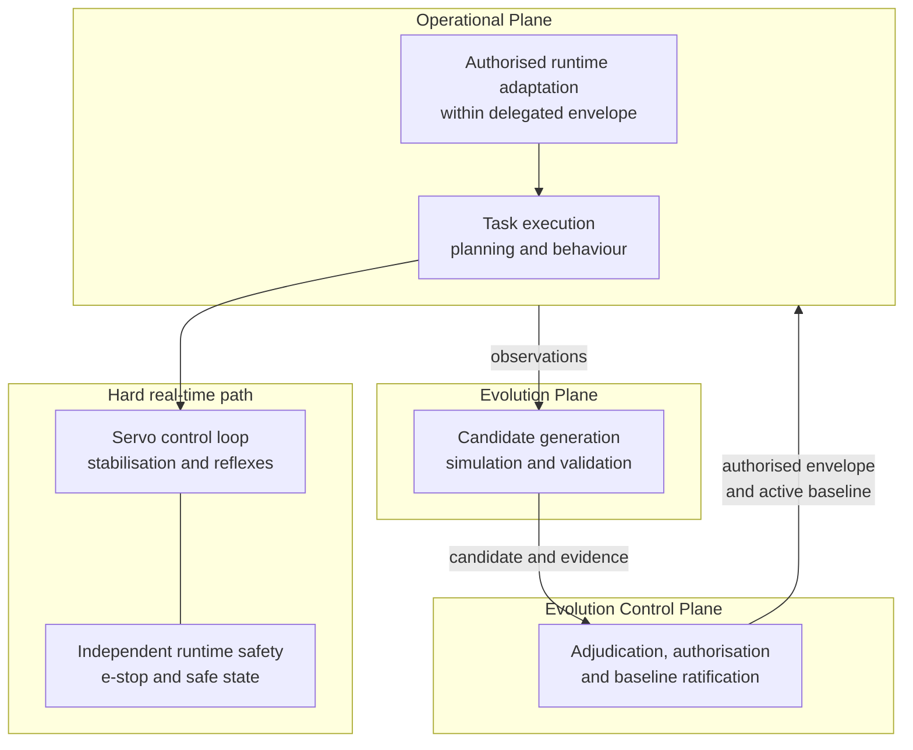

<!-- ages:authored — informative. This document does not define conformance requirements. -->

# Multi-Rate Autonomy

**Status:** Exploratory application profile · **Document class:** Informative · **Repository:** AGES

## 1. Conceptual relation

A robotic system operates across several characteristic timescales. As
a conceptual relation — not a prescription of universal timing values:

$$
\tau_{\mathrm{control}}
\ll
\tau_{\mathrm{operation}}
\ll
\tau_{\mathrm{adaptation}}
\ll
\tau_{\mathrm{governance}}
$$

* **Real-time control** ($\tau_{\mathrm{control}}$): servo loops,
  stabilisation, reflexive safety reactions.
* **Operational autonomy** ($\tau_{\mathrm{operation}}$): task
  execution, planning, behaviour selection under the active baseline.
* **Adaptation and learning** ($\tau_{\mathrm{adaptation}}$):
  bounded parameter adaptation, recalibration, learning within the
  delegated operational envelope.
* **Evolution governance** ($\tau_{\mathrm{governance}}$): candidate
  evaluation, adjudication, authorisation and ratification.

## 2. Placement of the Evolution Control Plane

> **The Evolution Control Plane must not normally be placed in the hard
> real-time control path.**

Real-time control operates inside an already authorised operational
envelope. The Evolution Control Plane governs:

* which controllers and models may be active;
* which parameters may adapt;
* permitted adaptation ranges;
* delegated runtime authority;
* when adaptation becomes a candidate change;
* when the resulting configuration may be ratified.

## 3. Multi-rate robotic architecture

The safety path remains independent: governance failure must not
disable hard safety limits.

## 4. Related material

[`../../models/multi-rate-autonomy-model.md`](../../models/multi-rate-autonomy-model.md) ·
[`05-delegated-operational-envelopes.md`](05-delegated-operational-envelopes.md) ·
[`../../rfcs/0014-multi-rate-autonomy.md`](../../rfcs/0014-multi-rate-autonomy.md).
