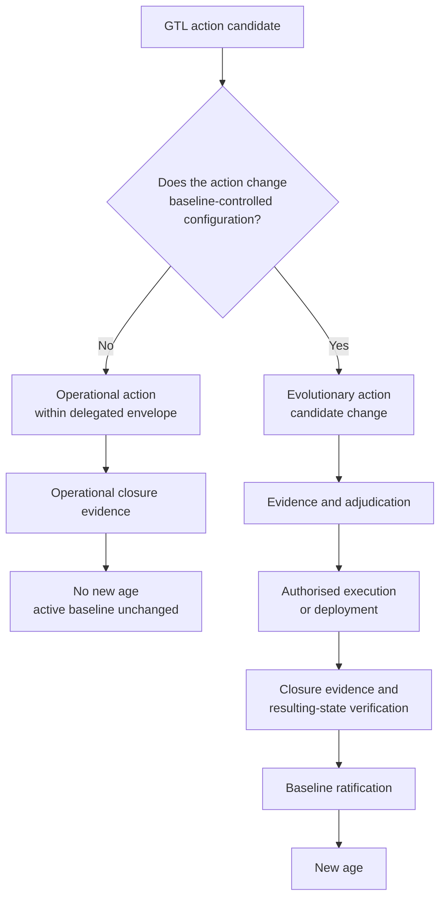

<!-- ages:authored — informative. This document does not define conformance requirements. -->

# GENTILE and GTL for Robotics

**Status:** Exploratory application profile · **Document class:** Informative · **Repository:** AGES

## 1. GENTILE in robotics

> **GENTILE — Generative Engine for Neural Transformation through
> Interactive Language Exchange**

GENTILE ([`../../architecture/06-GENTILE.md`](../../architecture/06-GENTILE.md))
is the interactive and co-constructive semantic engine between human or
system intent and structured robotic intent. In robotics it may
support: operator-instruction clarification, maintenance-procedure
co-construction, task-definition negotiation, mission requirement
formalisation, safety-constraint clarification, incident-report
structuring, candidate-change rationale and acceptance-criteria
definition.

### An ambiguous request

> "Move the container carefully near the operator."

GENTILE identifies or negotiates: which container is meant; the
destination; the relevant operator; the meaning of "carefully"; the
minimum separation from the operator; the maximum speed; payload
limits; the final pose; the acceptance criteria; and any ambiguity that
remains unresolved and is declared in the artefact.

GENTILE produces a semantic artefact. It does not authorise or execute
the action.

## 2. GTL in robotics

> **GTL — Generative Transitive Language**

GTL ([`../../architecture/07-GTL.md`](../../architecture/07-GTL.md)) is
a formal or semi-formal representation for grounded robotic action
candidates. A robotic GTL candidate should identify: executor,
transitive operation, direct object, target state, context,
preconditions, operational limits, safety invariants, expected effects,
failure conditions, abort conditions, safe state, compensation or
rollback, closure evidence, effectivity, authority reference and
provenance
([`../../schemas/examples/robotic-action-candidate.example.yaml`](../../schemas/examples/robotic-action-candidate.example.yaml)).

> **No transitive verb without an identified direct object; no grounded
> robotic operation without context, bounds, authority and closure
> evidence.**

A GTL candidate is **not** a motor-control signal, permission to
execute, an evolution transition, or a ratified baseline. It may be
translated through adapters into a behaviour tree, a task graph, a
motion-planning request, a deployment procedure, a configuration delta,
a service sequence, a controller update or a safe-state procedure.

## 3. GENTILE-to-GTL robotic action flow

```mermaid
flowchart LR
    INT["Human or system intent"] --> GEN["GENTILE<br/>interactive negotiation"]
    GEN --> SA["Structured semantic artefact"]
    SA --> CLS["Intent classification"]
    CLS --> GTL["GTL action candidate<br/>bounded and grounded"]
    GTL --> VAL["Validation execution"]
    VAL --> ADJ["Governance adjudication<br/>Evolution Control Plane"]
    ADJ --> AUTH["Authorisation"]
    AUTH --> EXE["Execution via adapters<br/>behaviour tree or task graph"]
    EXE --> CE["Digital–physical<br/>closure evidence"]
```

GTL candidates are produced before adjudication; adjudication and
authorisation decide whether the candidate may be executed. Semantic
agreement is not authorisation, and technical executability is not
permission to execute.

## 4. Operational versus evolutionary actions

The same GTL representation may support both operational and
evolutionary actions, but their lifecycle and authority requirements
differ.

**Operational action:** remains under the active baseline; remains
inside the delegated envelope; does not change canonical identity;
produces operational closure evidence; does not open a new age.

**Evolutionary action:** modifies a baseline-controlled component;
changes capability, policy, calibration, model, authority or
configuration; requires candidate-change classification; requires
evidence and governance adjudication; may produce a successor
baseline; opens a new age only after ratification.

## 5. Related material

[`../../architecture/08-gentile-gtl-integration.md`](../../architecture/08-gentile-gtl-integration.md) ·
[`../../examples/robotic-operational-inspection.md`](../../examples/robotic-operational-inspection.md) ·
[`../../examples/bounded-cyber-physical-action.md`](../../examples/bounded-cyber-physical-action.md).
