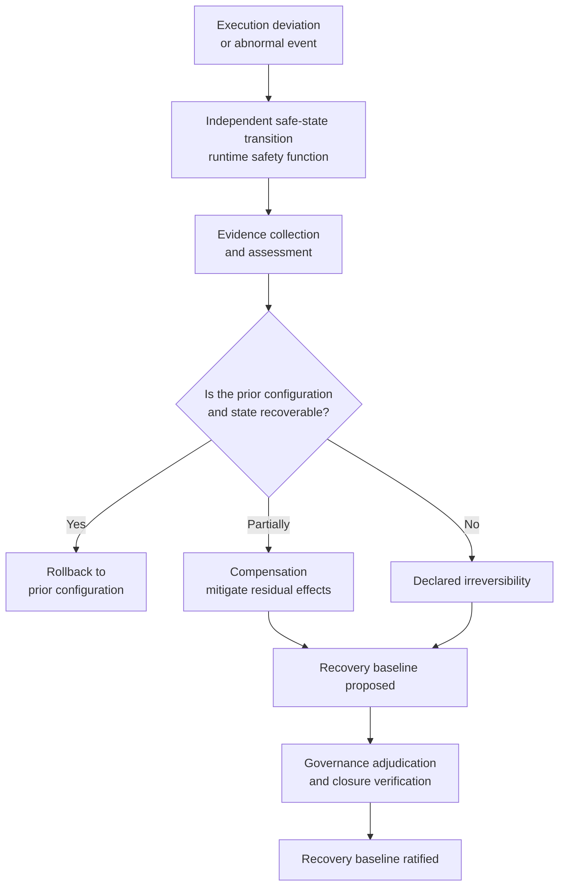

<!-- ages:authored — informative. This document does not define conformance requirements. -->

# Irreversibility and Recovery

**Status:** Exploratory application profile · **Document class:** Informative · **Repository:** AGES

## 1. Physical irreversibility

Physical irreversibility is a first-class concern of AGES-CPS.

> **In a cyber-physical system, rollback does not always mean
> restoration of the previous world state.**

A configuration may be restorable while its physical effects — a
machined part, a moved load, a consumed resource, a worn component —
are not.

## 2. Recovery modes

| Mode | Meaning |
|---|---|
| Rollback | Restore the recoverable prior configuration and state |
| Compensation | Mitigate or neutralise effects without recreating the exact prior state |
| Safe-state transition | Enter a bounded safe condition, possibly with degraded functionality |
| Containment | Prevent further propagation |
| Recovery baseline | Ratify a stable configuration after an abnormal or partially irreversible event |
| Declared irreversibility | Explicitly recognise that the prior physical state cannot be restored |

These modes are distinct; they are not interchangeable names for
"undo".

## 3. Declarations by candidate changes

Candidate changes should declare: reversibility class, rollback
feasibility, compensation strategy, safe-state target, irreversible
effects, recovery authority, and the evidence required before
execution. An illustrative recovery-baseline schema is provided in
[`../../schemas/examples/recovery-baseline.example.yaml`](../../schemas/examples/recovery-baseline.example.yaml).

## 4. Recovery flow

Ratification of a recovery baseline follows the same lifecycle order as
any other baseline: it occurs only after evidence collection and
closure verification, under appropriate recovery authority.

## 5. Related material

[`09-digital-physical-closure-evidence.md`](09-digital-physical-closure-evidence.md) ·
[`../../examples/robotic-operational-inspection.md`](../../examples/robotic-operational-inspection.md) ·
[`../../rfcs/0015-physical-irreversibility.md`](../../rfcs/0015-physical-irreversibility.md).
