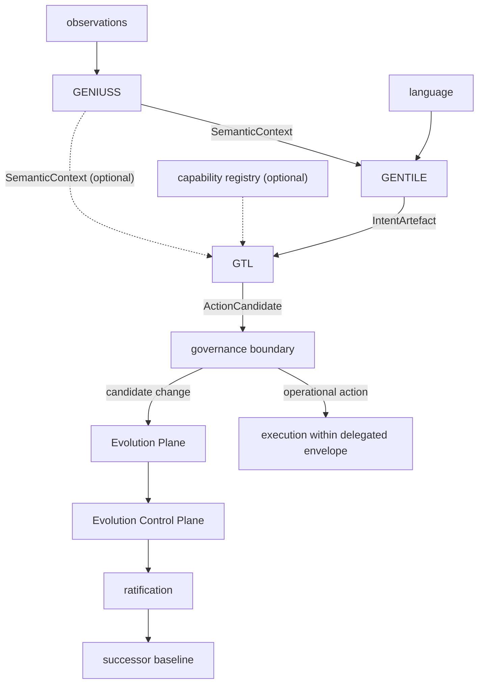

<!-- ages:authored — informative. This document does not define conformance requirements. -->

# The Cognitive-Action Chain

**Status:** Exploratory · **Document class:** Informative · **Repository:** AGES

**Purpose.** Describe the canonical full composition of the three functional
engines and how its output enters AGES governance. This toolchain is a
**functional toolchain operating within an AGES-governed system** — it is not
AGES, and it is not required by AGES.

## 1. The canonical composition

$$
X_t
\xrightarrow{\ \mathrm{GENIUSS}\ }
\Sigma_t
\xrightarrow{\ \mathrm{GENTILE}\ }
I_t
\xrightarrow{\ \mathrm{GTL}\ }
A_t^{candidate}
$$

Where:

- $X_t$ — heterogeneous contextual input;
- $\Sigma_t$ — semantic contextual representation
  ([`SemanticContext`](../contracts/semantic-context.md));
- $I_t$ — negotiated intended state
  ([`IntentArtefact`](../contracts/intent-artefact.md));
- $A_t^{candidate}$ — grounded action candidate
  ([`ActionCandidate`](../contracts/action-candidate.md)).

Mathematically the chain is the composition

$$
\mathcal{T} = F_T \circ F_I \circ F_G
$$

of the engine contracts
([`../engines/GENIUSS/contract.md`](../engines/GENIUSS/contract.md),
[`../engines/GENTILE/contract.md`](../engines/GENTILE/contract.md),
[`../engines/GTL/contract.md`](../engines/GTL/contract.md)). It is one
possible composition among several
([`README.md`](README.md)); it is **not** a rigid pipeline, and it does not
define the engines.

## 2. The governance boundary

The chain ends where governance begins:

$$
A_t^{candidate}
\xrightarrow{\ C_E\ }
\{\mathrm{ALLOW},\ \mathrm{BLOCK},\ \mathrm{WARN},\ \mathrm{ESCALATE}\}
$$

The Evolution Control Plane $C_E$ is **not part of the cognitive toolchain**.
It is precisely the boundary that prevents the toolchain from authorising
itself. Extended decision vocabularies (for example DEFER and REVISE) are
described in
[`../architecture/08-gentile-gtl-integration.md`](../architecture/08-gentile-gtl-integration.md).

## 3. Two classes of governed output

The same toolchain may produce two classes of output, distinguished at the
governance boundary — not by the engines:

- $A_{op}$ — an **operational action**: remains under the active baseline and
  within a delegated envelope; produces operational closure evidence; opens
  no new age. *"Move robotic arm to X" does not evolve the system.*
- $C_{evol}$ — a **candidate change**: would modify baseline-controlled
  configuration and therefore enters the Evolution Plane and the evolutionary
  lifecycle. *"Replace perception model M12 with M13" is evolutionary input.*

```text
                     AGES

       ┌─────────────────────────────┐
       │      Operational Plane      │
       │                             │
INPUT ─►  GENIUSS ─► GENTILE ─► GTL  │
       │                  │          │
       └──────────────────┼──────────┘
                          │
                    candidate action
                          │
             ┌────────────┴────────────┐
             │                         │
        operational               evolutionary
          action                    change
             │                         │
             ▼                         ▼
        runtime gate            Evolution Plane
                                      │
                                      ▼
                              Evolution Control
                                      │
                                ratification
                                      │
                                      ▼
                                  Baseline
```

The engines run primarily as **Operational Plane** capabilities: they let the
current system understand, interpret intent and produce operative candidates.
Producing candidates is operational behaviour, not evolution — but the
proposals a chain produces may become the input of the Evolution Plane
([`../engines/README.md`](../engines/README.md), section 3).

## 4. Detailed flow



Every handoff in the diagram is a contract artefact carrying its provenance
envelope and declared uncertainty
([`../contracts/provenance-envelope.md`](../contracts/provenance-envelope.md),
[`../contracts/confidence-model.md`](../contracts/confidence-model.md)).

## 5. Invariants preserved by the chain

1. **Engine ≠ Toolchain ≠ AGES.**
2. **Conformance to AGES MUST NOT require GENIUSS, GENTILE or GTL.**
3. **No engine knows another engine's implementation** — composition happens
   only through contracts.
4. **ActionCandidate ≠ AuthorisedAction** — the chain cannot authorise its
   own output.
5. **Operational output ≠ evolutionary output** — the classification is a
   governance act at the boundary, not an engine act.
6. **Uncertainty and provenance survive every handoff.**

## Related

- [`README.md`](README.md) — the composition catalogue
- [`../architecture/08-gentile-gtl-integration.md`](../architecture/08-gentile-gtl-integration.md) — lifecycle integration
- [`../examples/geniuss-gentile-gtl-governance.md`](../examples/geniuss-gentile-gtl-governance.md) — worked governance example
- [`../profiles/AGES-CPS/06-functional-engine-toolchain-for-robotics.md`](../profiles/AGES-CPS/06-functional-engine-toolchain-for-robotics.md) — robotics application
